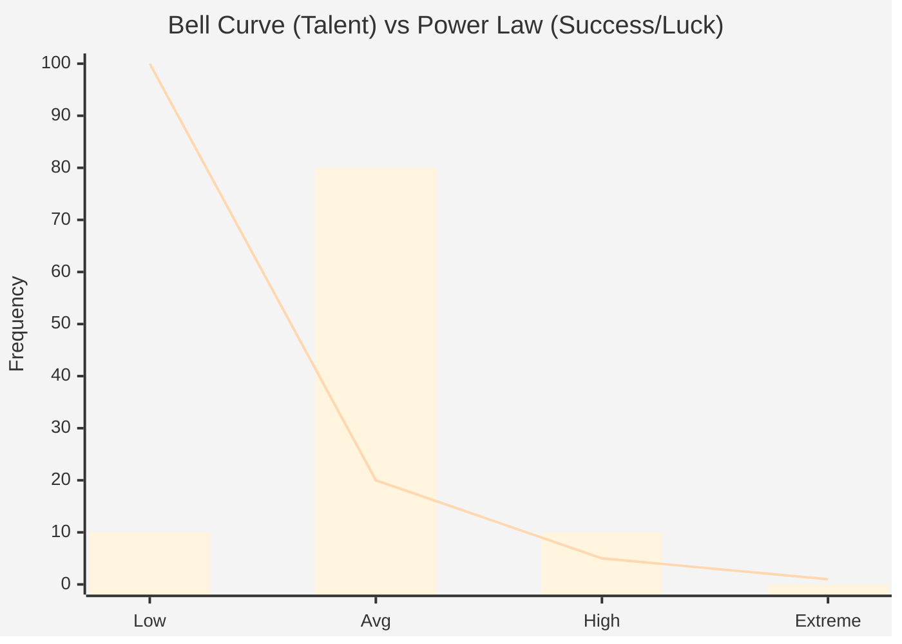

## Chapter 9: The Invisible Judge

In the previous chapters, we built an **Engine**.

We looked at how iteration, variance, and feedback create a powerful machine that can adapt to almost anything. We saw how ideas spread like viruses and how habits reinforce themselves like gravity.

But an engine is just a machine that produces motion. It doesn't decide *direction*.

An engine can drive an ambulance to a hospital to save a life, or it can drive a tank into a city to destroy it. The engine doesn't care. The engine just runs.

So, what determines where the engine goes? What decides which startups become unicorns and which go bankrupt? What decides which artist fills stadiums and which one plays to an empty room?

We often use fuzzy words to describe this force. We call it "Fate," "The Market," "Natural Selection," or simply "The Real World."

But we need to be more precise. We need to look at the mechanism that evaluates us. We need to look at the **Value Function**.

### The Map and the Territory

I am a Millennial, born in the early 90s. Growing up, my generation was handed a very specific map. Our parents and teachers told us:

*"Study hard. Go to university. Get a stable degree. Be loyal to your work. If you do this, you will be safe. You will buy a house. You will build a life."*

It wasn't a lie. They weren't trying to trick us. For their generation, that map was accurate. The system reliably outputs *Stability* when you input *Effort + Education*.

But when we stepped onto the terrain, the ground had shifted. We followed the instructions, but the reward didn't appear. We see friends with two Master's degrees serving coffee. We see "hard workers" who can't afford rent in the cities they helped build.

This is the danger of misunderstanding the Invisible Judge.

It’s not just about efficiency. If you think the floor is sloping "North" (toward stability), but the gravity is actually pulling "East" (toward leverage and risk), you don't just move slowly. You get **stuck**. You spend your energy climbing a hill that doesn't exist, while the real world pulls you sideways.

To understand why we get stuck, we need to look at how the game is actually scored.

### The Race Track

Imagine a race.

Every time the flag drops, it is an **Iteration**. Some cars are winning, others are losing. The driver ran the car and got a lap time, a feedback.

The drivers, the cars, and the pit crews themselves represent the **Variance**. They are all trying slightly different strategies, tuning their engines differently, testing new tires, braking at different moments. This is the "Engine" of change we built in Part II.

An iteration means feedback. Means a timer, a finish line, a score. That is what constitutes a race. The winners of the race are the car, driver, and team that are best suited to this evaluation. 

This means that you won't know who wins just by looking at the cars.
The decision of who wins isn't based on a single factor. It is the result of three distinct forces colliding:

1.  **The Rules (Explicit):** 
    What is the win condition? 
    Is it a 10-second sprint, or is it the 24 Hours of Le Mans? Changing this creates a completely different filter. A sprint favors reaction time and raw power; Le Mans favors fuel efficiency and reliability.
    Is it a "Spec Series" where everyone drives the same car, or an "Open Engineering" class? One tests the driver; the other tests the engineers.

2.  **The Track (Implicit):** 
    What is the environment? 
    Is it a straight asphalt Drag Strip? Or is it a winding, muddy Rally stage? If the track is a Rally stage, the Formula 1 car (which is the pinnacle of engineering) will get stuck in the first meter. The "best" car is only the best *in this specific context*.

3.  **The Competitors (Relative):** 
    Who else is racing? 
    If you can run a 6-minute mile, are you fast? In a high school gym class, yes, you are a god. In the Olympics, no, you are slow. Your value is never absolute; it is always relative to the field. As every other driver gets faster, you have to improve just to stay in the same place.

These are the factors that, over time, shape the direction of adaptation. The pattern pushes adaptation in the direction these forces dictate. These forces, combined, are what I call the **Value Function**.

$$Value Function = The Rules x The Track x The Competitors$$

### Why "Value Function"?

I know "Value Function" sounds a bit technical. It comes from mathematics and computer science. Why not use a simpler word?

The filter, the environment, the judge. The selection. The incentives. I've heard several terms over the years related to this process of evolution and selection, but they usually either omit one part of the equation, cover only one part, or introduce extra meaning that can be misleading about the value function.

The filter is usually associated with survival. What is selected? The issue is that the feedback need not be binary. Yes, natural selection is binary (reproduce before death or not), but a race has placements. Also, the filter does not explain how it is filtered. It is then a term that can be used alongside the rules or the selection. It is just one part of the direction.

"The Judge" implies empathy. It implies a conscious decision. While it is easy to think of this force as an invisible judge watching our lives, a judge usually only interprets the **Rules**. But the Law can be the same in two different populations and have completely different effects.

A strict speed limit saves lives in a dense city center, but the exact same speed limit might simply kill commerce on a vast, deserted highway. The "Judge" (the law) is identical, but the effect changes because the "Track" is different.

"The Environment" is a key component, but it's often overlooked. It defines the guardrails what fits, what works. A stealth tactic that works in the jungle fails in the savanna, not because the tactic changed, but because the background did.

Finally, "The Competitors" themselves affect the direction. This is sometimes harder to see. In a race, competitors just push the time down. But in sports like tennis or soccer, the opponent shapes the strategy.

If most tennis players are right-handed, a left-handed player has a distinct advantage. Why? Most players have spent thousands of hours practicing against right-handers. Their muscle memory is wired to expect the ball to curve a certain way. When they face a lefty, that curve is mirrored. The lefty is playing a game everyone else is unprepared for.

This advantage isn't about being "better"; it's about being "rare" relative to the competitors. Adaptations (strategies) emerge in response to the other players on the field. The very examples we gave in the "Arms Race" chapter show how competitors drive the direction of evolution.

These three components, together, define the direction a system takes:

1.  **The Rules:** The scoreboard, the constraints, the allowed actions.
2.  **The Track:** The environment and external forces that shape effectiveness.
3.  **The Competitors:** The other players who define the relative difficulty and drive strategic shifts.

Together, they define the results, which, through iteration, create adaptation. Since the pattern is inevitable, these forces shape the end product. They shape "the fit."

It is, in the end, an indifferent equation.

And I use the term **Value Function** because it captures that specific, mathematical calculation. It reminds us that we are dealing with a formula, not a feeling.

The value function acts, through time, like a mold. At first, competitors might have several different shapes, but over time, some shapes will become more common because they are more successful. The Salesman becomes a great communicator, and giraffes obtain long necks.

The rules, track, and competitors define what is effective and what is filtered out. Different rules can filter faster, and different tracks might prioritize certain actions. But in the end, the pattern molds the individuals, through adaptation, over and over.

It's important to note that the environment can change over time, and competitors are always evolving. This means that even with the same rules (which might never change), the selected strategies may not be the same. This means the value function may drift over time, leading to different behaviors in how the pattern evolves.

We will see some examples of this drift during Part 3, but the effects of time are the main topic of Part 4 of the book. For now, we need to dive deeper into the value function and understand all of its nuances.

The Value Function is easy to misunderstand. The Rules usually take the spotlight because they are visible, leading players to the wrong conclusions.

What happened to the Millennials is a perfect example. The Rules didn't change much from the Boomer generation (Study, Work, Save, Invest), but the Track (economy) and the Competitors (global workforce/automation) changed completely. This shifted what was actually effective for a stable life, leaving many "stuck" using an outdated map.

This invisible judge cannot be mistaken. But it often is.

Seeing the Value Function for what it is gives us the power to stop blaming ourselves and start effective debugging. It moves us from "I am broken" to "I need to understand the game."

In this part of the book, we are going to tear apart this equation. We are going to look at the Rules we write, the Tracks we miss, and the Competitors who set the pace. We are going to see how this invisible equation shapes everything from the apps on your phone to the anxiety in your head.

And once we see the equation, we can start to figure out how to solve it.

Before we move on, I have to address the elephant in the room: **Luck**.

We know that life isn't purely deterministic. If you run the same race twice with the same drivers, the results might differ. A tire might blow; an engine might stall.

Luck is absolutely part of the pattern. We see it in Variance, the random mutations that create new strategies. We also see it in the initial conditions.

A lucky break (being born in the right month for youth sports, or launching an app on a slow news day) can provide an early lead. This isn't just a one-time bonus; it feeds into the engine. That early win allows for more resources, which in turn enables more iterations, creating a feedback loop where "Winning" makes it easier to keep winning.

Winners' strategies in the first iterations strongly shape subsequent runs. A winning strategy in any iteration might have a result defined by sheer luck, but that luck gets locked in by compounding. We will explore this deep "History dependence" in Part IV.

So, yes, luck is a huge factor in any *single* iteration. It follows what mathematicians call a **Power Law**.

Most of us intuitively think in **Bell Curves** (Normal Distributions). In a Bell Curve, data points cluster around an average. Think of human height: most people are average, a few are short, a few are tall. But no one is 100 feet tall. The "outliers" are constrained.

But a **Power Law** (Pareto Distribution) is different. In a Power Law, the "average" doesn't tell the story. Most events are tiny and barely noticeable, but the tail of the curve extends infinitely. In this world, a 100-foot giant isn't just possible. He's the one who defines the landscape.

This isn't just a theory; it's a measurable phenomenon. In 2018, physicists Alessandro Pluchino, Alessio Emanuele Biondo, and Andrea Rapisarda published a paper titled *"Talent vs Luck."*. They simulated a world in which people had a normal distribution of talent (Bell Curve) and faced random, lucky, or unlucky events over a 40-year career.

The result? The most "successful" individuals (those with the most wealth/points) were rarely the most talented. They were the ones who had slightly above-average talent but *extreme* luck. The distribution of success followed a steep Power Law.

*   **Talent is a Bell Curve (The Bars):** Even the best runner in the world is only marginally faster than the second best. The gap is small, and everyone is clustered in the middle.
*   **Success is a Power Law (The Line):** Most luck is tiny and cancels out (low impact). But one massive lucky break, like being born into the right family or validly predicting a crypto boom, can be 10,000x more impactful than skill.

This creates the "Success Paradox." In highly competitive fields, the winner is almost always highly skilled (they need to be to enter the game), but among the skilled, the winner is almost always the luckiest.

I strongly recommend watching Veritasium's two-part breakdown on this:
1.  **"Is Success Luck or Hard Work?"**: A visual demonstration of Pluchino's simulation.
2.  **"The Success Paradox"**: A deeper dive into why we consistently underestimate luck's role.

Understanding this is liberating. It means that if you aren't the "100-foot giant" (the billionaire, the superstar), it's not necessarily because you lacked the skill or the work ethic. You might have just rolled a normal number on the dice, while someone else rolled a double-six ten times in a row.

Over the long run and across thousands of iterations and millions of individuals, luck "evens out." 

Luck is, therefore, an extreme force that impacts a single iteration, a single run. But in the long run, thinking about the pattern, the Value Function is not defined by luck and therefore does not define the direction; it does not steer the engine.

Randomness adds noise, but the Value Function defines the signal. The direction of a species, a market, or a culture is determined by the equation, not the dice.

### The Blind Spots

But just as we misunderstand luck, we also misunderstand *what* the Judge is actually looking for.

We often assume that evolution (or "The Market") selects for "Good" things. We think natural selection optimizes for health, or that the free market optimizes for quality.

But the equation is strictly mathematical. It optimizes for the Win Condition. Nothing else.

Consider the puzzles of biology. Why do humans go bald? Why do we get Alzheimer's?

These traits seem like design failures. We might wonder why natural selection, after millions of years of optimization, hasn't "fixed" these bugs.

The reason lies in the timing. For most of human history, we reproduced *before* we went bald or got Alzheimer's. The "Win Condition" of biology is "Survive long enough to pass on your genes." Once you cross that finish line, the Judge stops watching.

Baldness and Alzheimer's are invisible to the selection process because they happen outside the optimized window. They are byproducts.

The same applies to society. We like to think that societies evolve to maximize **Happiness**. We assume the "Arc of History" bends toward justice and well-being.

But look at the Value Function of history. Societies that focus purely on leisure, art, and happiness are often conquered by societies that focus on military production and relentless expansion. The "Judge" of history often selects for **Power**, not Happiness.

This means we can end up living in a world that is incredibly "successful" (high GDP, advanced technology) but fundamentally miserable, because "Happiness" was never a variable in the equation.

### The Audit

This is why we need to understand the Value Function.

If we don't look at the equation, we feel like victims. We feel like the world is unfair, or that we are broken.

But when we see it as a formula, we can stop taking it personally and start debugging it.

In the next few chapters, we are going to take this equation apart.
*   We will look at the **Rules** (and how algorithms like Artificial Intelligence maximize them to the extreme).
*   We will look at the **Track** (and how the medium shapes the message).
*   We will look at the **Proxy** (and why we so often optimize for the wrong thing).
*   We will look at the **Competitors** (and how they shape what can be done)

The engine is running. And we need to see where it's going.
