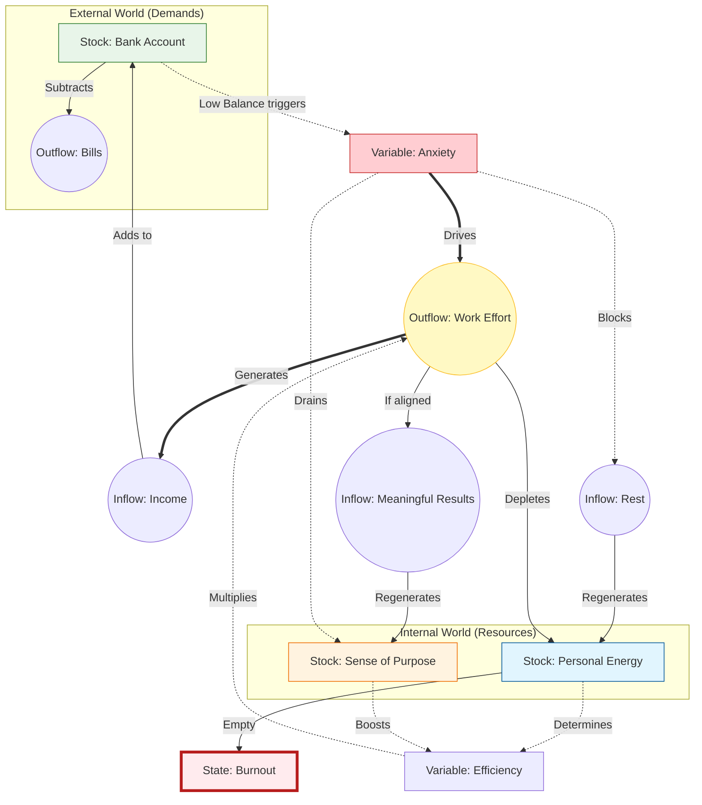

## Chapter 26: Mapping the Machine

<strong>Chapter Outline & Blocking</strong>

**Status:** Draft
**Goal:** Introduce Systems Theory (Meadows) as the method for applying the Game Designer's tools. Explain Stocks, Flows, Loops, and Leverage Points.

---

### 1. The Blind Men and the Elephant
*   **The Parable:** Six blind men touching an elephant. One says it's a snake (trunk), one says it's a wall (side). They are all right, but they are all wrong.
*   **The Problem:** We look at the world in snapshots. We see "Inflation" or "Polarization" as isolated events.
*   **The Solution:** We need to see the *whole animal*. We need a Map.

### 2. The Bathtub (Stocks and Flows)
*   **The Metaphor:** Donella Meadows' core concept.
*   **Stock:** The water in the tub. (Wealth, Trust, Carbon in the atmosphere).
*   **Inflow:** The faucet. (Income, Good actions, Emissions).
*   **Outflow:** The drain. (Expenses, Betrayals, Carbon sinks).
*   **The Lesson:** You cannot understand the Stock just by looking at the Faucet. You must see the whole flow.

### 3. The Loops (The Engine of Compounding)
*   **Reinforcing Loops (The Snowball):**
    *   *Concept:* Input -> More Stock -> More Input.
    *   *Example:* Viral content. Views -> Shares -> More Views.
    *   *Result:* Exponential growth (or collapse). This is where "The Pattern" (Iteration) runs wild.
*   **Balancing Loops (The Thermostat):**
    *   *Concept:* Input -> Change -> Resistance -> Stability.
    *   *Example:* Hunger. Eat -> Full -> Stop Eating.
    *   *Result:* Stability. This is why systems resist change.

### 4. Finding the Leverage Points
*   **The Hierarchy of Intervention:** Not all levers are equal.
*   **Level 1: Parameters (The Numbers):** Changing the tax rate by 1%. Changing the damage of a sword by 5%.
    *   *Impact:* Low. The system adjusts.
*   **Level 2: Feedback Loops (The Rules):** Adding a new information flow. (e.g., Publishing pollution data publicly).
    *   *Impact:* Medium. Behavior changes to fit the new rule.
*   **Level 3: The Goal (The Purpose):** Changing what the system optimizes for. (e.g., GDP vs. Happiness).
    *   *Impact:* High. The entire system reorganizes.

### 5. The Practice
*   **The Assignment:** Before we fix the world (next chapter), we must map it.
*   **The Warning:** Beware of "Policy Resistance." If you push a system without understanding the Balancing Loops, it will push back.

---

### Draft

In the ancient parable, six blind men encounter an elephant. 

The first touches the trunk and says, "This creature is like a snake." 
The second touches the ear and says, "No, it is like a fan." 
The third touches the side and says, "You are both wrong; it is like a wall."

They are all right. And they are all wrong. 

They are wrong because they are looking at the parts, not the whole. They are analyzing the *events* (the trunk moving, the ear flapping) rather than the *system* (the elephant).

This is how most of us look at the world. We see "Inflation" and think it’s a greedy shopkeeper. We see "Polarization" and think it’s a loud politician. We treat these as isolated problems to be solved one by one. 

But a Game Designer—and a Systems Thinker—knows that these are not isolated events. They are connected parts of a single machine. And you cannot fix the machine until you have the blueprint.

To draw that blueprint, we can borrow from the work of **Donella Meadows**, the pioneer of Systems Thinking. In her seminal book *Thinking in Systems*, she gives us a language to describe how things work. 

It starts with a bathtub.

### The Bathtub (Stocks and Flows)

Imagine a bathtub. 

The water inside is the **Stock**. This is the accumulation of something—money in a bank account, trust in a relationship, carbon in the atmosphere, or anger in a population. 

The faucet is the **Inflow**. It adds to the stock. 
The drain is the **Outflow**. It subtracts from the stock. 

This sounds childishly simple, but it explains almost every failure in policy and business. 

We often focus entirely on the Inflow. We think, "If I just make more money (Inflow), I will be rich (Stock)." But if your spending (Outflow) is higher than your income, the tub will never fill. You don't have an income problem; you have a drain problem.

In the "Exam Trap" (Chapter 14), the Stock is "Knowledge." The School System tries to increase the Inflow (more classes, more homework). But the Outflow (forgetting after the test) is massive because the students aren't retaining anything. The tub is leaking, and we are just turning up the faucet.

### The Loops (The Engine)

But a tub doesn't fill itself. Something turns the faucet.

In a complex system, the Stock itself often controls the Faucet. This creates a **Feedback Loop**. 

A Feedback Loop is the structure that allows **Iteration** to happen. It connects the output back to the input. Without this connection, the system cannot learn, and it cannot evolve.

There are two types of loops, and understanding the difference is the key to understanding why the world feels so extreme.

#### 1. Reinforcing Loops (The Snowball)
*   *The Rule:* The more you have, the more you get.
*   *The Example:* Compound Interest. The more money you have, the more interest you earn, which gives you even more money. 
*   *The Result:* Exponential Growth (or Collapse).

This is the engine of **Compounding**. It pushes systems away from the average and toward the extremes. This is why the rich get richer. This is why a viral video explodes (more views = more shares = more views). This is why a panic sells off a market (price drops = fear rises = more selling = price drops further). 

#### 2. Balancing Loops (The Thermostat)
*   *The Rule:* If you go too far, pull back.
*   *The Example:* Your body temperature. If you get too hot, you sweat to cool down. If you get too cold, you shiver to warm up.
*   *The Result:* Stability.

This is the engine of **Stability**. It resists the extremes and forces the system to converge on a stable state. Balancing loops are why change is so hard. If you try to change a company culture, the "immune system" of the old culture will fight back. "We've always done it this way," they will say. That is a balancing loop trying to maintain the status quo.

### The Boundaries (The Model)

There is one final step to drawing the map. You have to decide where the map ends.

The real world is infinite. Everything is connected to everything else. But you cannot draw a map of the universe just to fix a leaky faucet. You have to draw a **Boundary**.

You have to create a **Model**.

A model is a simplification of the truth. It is not the territory; it is a tool for navigating it. When we draw our map, we are choosing what to include and what to ignore.

*   If you are mapping a traffic jam, do you include the weather? (Maybe).
*   Do you include the price of oil in Saudi Arabia? (Probably not).
*   Do you include the timing of the traffic lights? (Definitely).

Every map is "wrong" because it is incomplete. But a good map is "useful" because it captures the essential loops that are driving the behavior.

### How to Build a Model (Mapping Work-Life Balance)

To understand how to do this yourself, let's walk through the process of mapping a system. We will use a relatable example: **The Work-Life Balance System**.

Note that we are not mapping "Burnout." Burnout is just one possible state of this system. We are mapping the machinery that governs your daily life.

#### Step 1: Identify the Stocks (The Bathtubs)

What is accumulating (or draining) in the system?

*   **Stock A: Money.** This is the resource required for survival (Rent, Food).
*   **Stock B: Energy.** This is your internal battery. It is renewable, but finite.
*   **Stock C: Purpose.** This is your motivation. It determines *why* you spend the energy.

#### Step 2: Identify the Flows (The Pipes)

What fills and drains the stocks?

*   **Inflow to Money:** *Income* (Generated by Work).
*   **Outflow from Money:** *Expenses* (Rent, Bills).
*   **Inflow to Energy:** *Rest* (Sleep, Leisure).
*   **Outflow from Energy:** *Work Effort* (The cost of generating Income).
*   **Inflow to Purpose:** *Meaningful Results* (Feeling useful, creative expression).

#### Step 3: Identify the Goal and the Conflict

Every system has a goal.

*   **The Survival Goal:** Pay Rent. This requires *Money*.
*   **The Sustainability Goal:** Stay Healthy. This requires *Energy*.

#### Step 4: Find the Trap (The Compounding Loop)

Here is where the system breaks. To satisfy the **Survival Goal** (Pay Rent), you must increase **Work Effort**. Increasing Work Effort drains **Energy**.

As Energy drops, you become less efficient. You have to work *longer* to get the same result. This leaves less time for **Rest**.

Let's look at the map.

### Reading the System

Once the map is drawn, we can stop looking at the "events" (I am tired) and start looking at the "machine." We can apply our core concepts to see why this system fails.

#### 1. The Pattern (What is being iterated?)
The core iteration here is **Work $\rightarrow$ Money $\rightarrow$ Relief**.
This is the dominant loop because the feedback is concrete and immediate. You work, you get paid, the rent is paid. The system naturally optimizes for this loop because the signal is strong.

#### 2. The Feedback Gap (Why we ignore health)
Compare the feedback from **Money** vs. **Energy**.
*   **Money Feedback:** If you miss rent, the feedback is instant (Eviction notice, late fees). It is loud.
*   **Energy Feedback:** If you miss sleep, the feedback is delayed and subtle (Brain fog, irritability). It is quiet.
Because the "Survival Signal" is louder than the "Health Signal," the system prioritizes paying rent over sleeping.

#### 3. The Compounding Trap (Unwanted Optimization)
This is where the "Death Spiral" happens.
*   **The Trigger:** Anxiety rises (Need Money).
*   **The Action:** Work Harder.
*   **The Cost:** Skip Rest.
*   **The Result:** Energy drops $\rightarrow$ Efficiency drops.
*   **The Compound:** Because Efficiency is low, you must work *even more hours* to get the same income. This creates *more* Anxiety and *less* Rest. The loop tightens.

#### 4. The Breakpoint (System Crash)
Systems don't decline linearly; they crash.
In our map, **Burnout** is not a mood; it is a **Threshold**. It is the moment the *Energy Stock* hits zero. When this happens, the entire machine stops. The "Efficiency" variable hits zero, meaning no amount of "Work Effort" can produce "Income."

### The Map Before The Fix

We have now successfully mapped the problem. We see that "trying harder" is actually the input that is breaking the machine.

In the next chapter, we will open the **Game Designer's Toolkit** to see exactly *how* we can intervene in a system like this. We will learn how to adjust the Parameters, install Constraints, and rewrite the Value Function.

(Note: For those who want to master this art, I highly recommend reading *Thinking in Systems* by Donella Meadows. It is the bible of this mindset.)

Let's open the toolkit.
