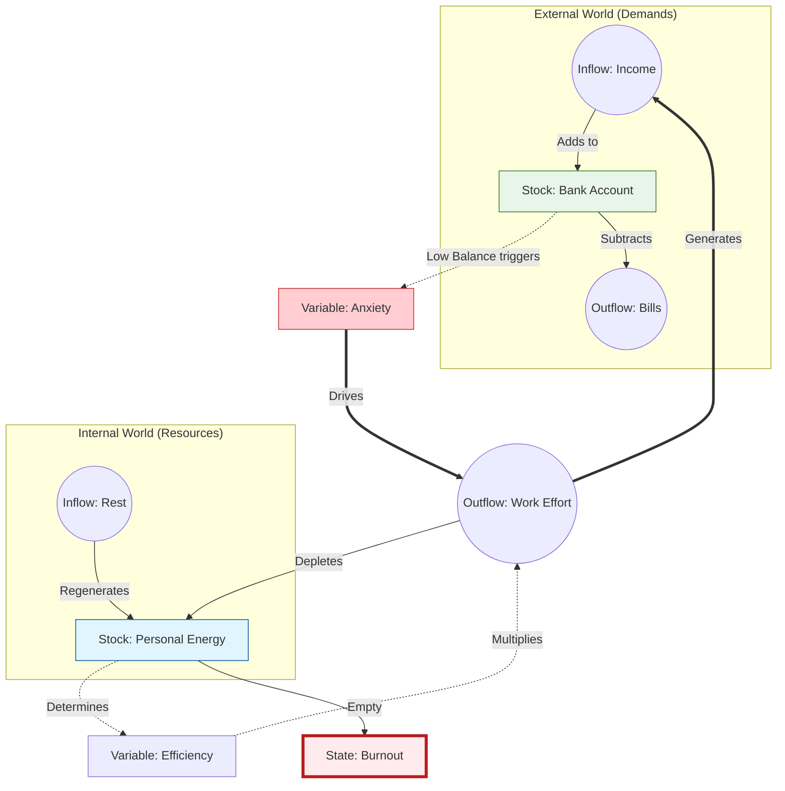

## Chapter 29: Mapping the Machine

---

In the ancient parable, six blind men encounter an elephant. 

The first touches the trunk and says, "This creature is like a snake." The second touches the ear and says, "No, it is like a fan." The third touches the side and says, "You are both wrong; it is like a wall."

They are all right. And they are all wrong. 

They are wrong because they are looking at the parts, not the whole. They are analyzing the *events* (the trunk moving, the ear flapping) rather than the *system* (the elephant).

This is exactly how most of us look at the world. We see "Inflation" and think it’s just a greedy shopkeeper. We see "Polarization" and think it’s just a loud politician. We see "Burnout" and think it’s just a bad week at work. We treat these as isolated problems to be "defeated" one by one. 

But a System Designer knows that these are not isolated events. They are the visible outputs of an invisible machine. If you want to change the output, you have to stop yelling at the machine and start looking at the blueprint.

To draw that blueprint, we need a language. And for that, we turn to the work of **Donella Meadows**, the pioneer of Systems Thinking. It starts, surprisingly enough, with a bathtub.

### The Bathtub (Stocks and Flows)

Consider a bathtub. 

The water inside is the **Stock**. This is the accumulation of something over time: money in your bank account, trust in a relationship, carbon in the atmosphere, or even the level of frustration in a population. 

The faucet is the **Inflow**. It adds to the stock (Income, kind words, emissions).  
The drain is the **Outflow**. It subtracts from the stock (Expenses, betrayals, carbon sinks).

This sounds simple, but it is where most human logic fails. Heck, it's where most *governments* fail.

We often focus entirely on the **Faucet**. We think, "If I just make more money (Inflow), I will be wealthy (Stock)." But if your spending (Outflow) is higher than your income, the tub will never fill. You don't have an income problem; you have a drain problem.

Think back to the **Exam Trap** (Chapter 13). The school system tries to increase the Inflow of "Knowledge" (more classes, more homework). But the Outflow (the rate at which students forget information after the test) is massive. The tub is leaking, and we are just turning up the faucet.

### The Loops (The Engine)

In a complex system, the "Stock" itself often controls the "Faucet." This creates a **Feedback Loop**. 

A Feedback Loop is the structure that allows **Iteration** to happen. It connects the output back to the input. There are only two types of loops in the universe, and understanding the difference is the key to understanding why the world feels so extreme.

#### 1. Reinforcing Loops (The Snowball)
The rule is simple: *The more you have, the more you get.*
Think of compound interest or a viral video. The more people watch, the more it gets shared, which leads to even more people watching. 

This is the engine of **Compounding**. It is what pushes systems away from the average and toward the extremes. It’s what turns a small "Head Start" into a canyon of inequality.

#### 2. Balancing Loops (The Thermostat)
The rule is: *If you go too far, pull back.*
Think of your body temperature. If you get too hot, you sweat to cool down. If you get too cold, you shiver to warm up. 

This is the engine of **Stability**. It is what maintains the status quo. Balancing loops are why systems resist change. If you try to fix a slow corporate process, the "immune system" of the old culture (the Balancing Loop) will fight to bring things back to the way they’ve always been.

### How to Build a Model (The Work-Life Trap)

To see how this works in practice, let's map something universal: **The Work-Life Balance System.**

We aren't mapping "Burnout." Burnout is just what happens when the machine breaks. We are mapping the machinery itself.

**Step 1: Identify the Stocks.** What is accumulating?
*   **Money:** Required for survival.
*   **Energy:** Your internal battery.

**Step 2: Identify the Flows.** 
*   **Income** fills Money. **Work Effort** fills Income.
*   **Work Effort** drains Energy. **Rest** fills Energy.

**Step 3: Find the Goal.** 
The primary goal is "Pay the Bills." This requires a certain level of Money.

**Step 4: Find the Hidden Loop.**
Here is where the "Pattern" turns into a "Trap." 

Wait, look at that loop. 

When you feel **Anxiety** about lack of Money, your brain triggers a Reinforcing Loop: "Work Harder -> Get More Money -> Feel Less Anxiety." 

But there’s a cost. Increasing **Work Effort** drains your **Energy**. As Energy drops, your **Efficiency** drops. You become slower, more distracted, and more prone to errors. 

Because you are now less efficient, you have to work *more hours* to get the same amount of work done. This drains your Energy even faster. Eventually, the Energy tub hits zero.

That is **Burnout**. It isn't a mood. It’s a **Breakpoint**. It’s the moment the system can no longer sustain the loop. Trying to "work harder" at this point is like trying to drive a car with no fuel by yelling at the engine.

### Finding the Leverage Points

Once you have a map like this, you can stop guessing and start **Designing**. You can see that there are different places to intervene, and they aren't all equal. Donella Meadows called these **Leverage Points**.

1.  **Parameters (The Numbers):** This is where most people start. "I’ll just work 10% more." Or, "I’ll try to save 5% on my bills." 
    *   *Effect:* Low. The system usually just adjusts to the new number without changing its behavior.
2.  **Information Flows (The Rules):** What if you install a visible "Energy Meter" that tells you exactly how drained you are before you feel it?
    *   *Effect:* Medium. Changing the information changes how the "Player" makes decisions within the system.
3.  **The Goal (The Mindset):** What if you change the goal of the system from "Maximize Income" to "Maximize Energy-Adjusted Profit"?
    *   *Effect:* High. When the goal changes, the entire machine reorganizes itself to fit the new purpose.

### The Map Before the Fix

We have spent our lives as players, reacting to the "events" of the world. We feel tired, so we drink coffee. We feel poor, so we work overtime. We feel angry, so we yell.

But when you map the machine, you realize that most of our "solutions" are actually inputs that make the loops tighter. We are trying to outrun a pattern that we are inadvertently fueling.

To fix the world (or even just to fix your own life) you have to move from the faucet to the blueprint. You have to stop being the water and start being the architect of the tub.

***

We have our map. We see the loops. We understand the stocks. Now, it’s time to move from theory to **The Toolkit**.
