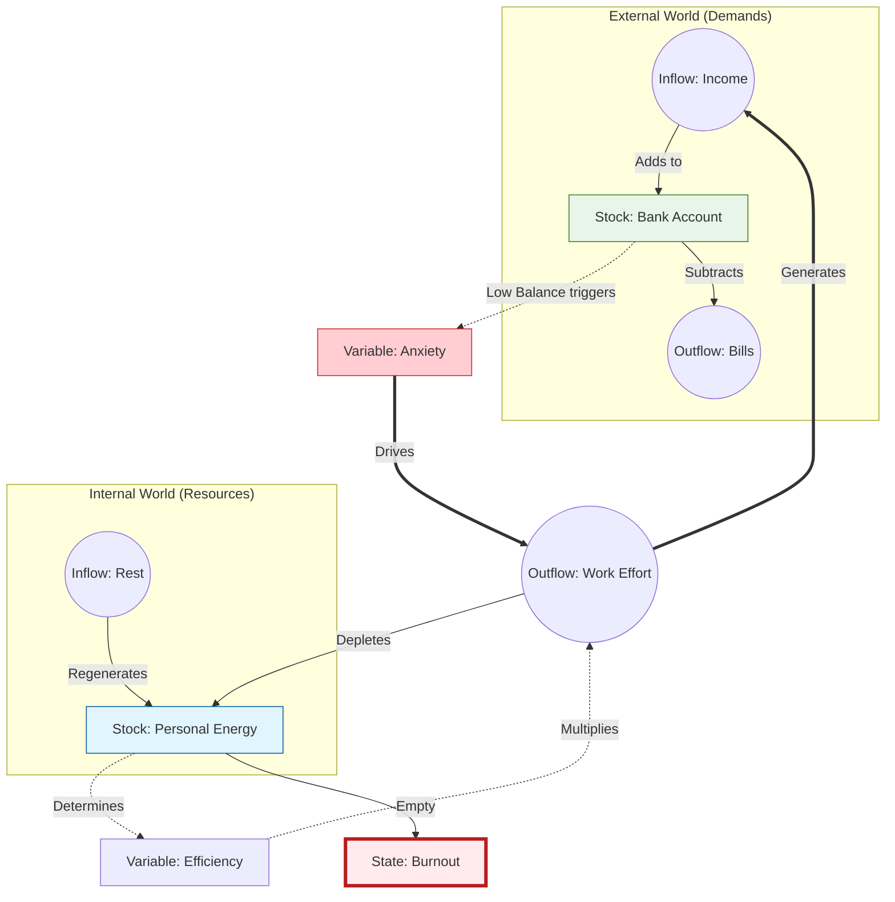

<div class="title-page">
    <h1>The Invisible Pattern</h1>
    <h2>Iteration, Selection, and the Code of the World</h2>
    <p class="author">Pedro Martinez</p>
    <p class="version">Version 75 | January 2026</p>
</div>

<h1 id="table-of-contents" class="no-toc-header">Table of Contents</h1>
[TOC]

# Part I: The Hook
<div class="part-page">
    <p>Why the world feels like it's vibrating at a higher frequency.</p>
</div>
## Preface: The Pattern

I’ve always been obsessed with how things work.

I'm not an economist or a scientist. I’m a builder. I’ve spent my life creating games and products for others to play. Creating systems and experiences for others to try. I view the role of entertainment as a way to invite people to experience what they wouldn't otherwise experience. To live lives that are not theirs, and to feel and learn from moments they wouldn't normally have.

In the case of games and digital products, we are not just creating a passive medium, but something the user actively interacts with. This means we need to craft a system that invites the player to perform a behavior, and rewards them with an emotion by design.

As we craft these systems, we slowly learn how behavior repeats itself. We see patterns emerging in places that shouldn't have anything in common.

I've started seeing these behaviors, these systemic consequences, everywhere. From how the news ecosystem evolved, to which YouTubers grew, to politics, or even to the pandemic. Observing how all these unrelated topics changed over time, combined with my studies in machine learning and AI simulations, led me to see one underlying rule in all of them.

I call this **The Pattern**.

This pattern is not a new theory. It's a synthesis of lots of different topics together applied everywhere, at once. What I call The Pattern already exists under many names:
*   Natural Selection (Biology)
*   Reinforcement Learning (Computer Science)
*   The Invisible Hand (Economics)
*   Cybernetics (Norbert Wiener)
*   Complex Adaptive Systems (Complexity Science)
*   Goodhart’s Law (Metrics)
*   The Red Queen Effect (Evolutionary Biology)
*   Memetics (Richard Dawkins)

This book isn't a textbook or a grand academic theory. It’s a pair of glasses. I want to share a lens that helped me make sense of why the world feels so loud, so fast, and so extreme right now.

The Pattern is not a mysterious force; it is a mathematical inevitability. It is what happens when you have variation, selection, and time. It doesn't explain how or why an individual chooses to act, but it explains why, when millions of actions are filtered by a specific goal, a consistent structure emerges.

This book is a synthesis of ideas that already exist under many names:
*   Natural Selection (Biology)
*   Reinforcement Learning (Computer Science)
*   The Invisible Hand (Economics)
*   Cybernetics (Systems Theory)
*   Complex Adaptive Systems (Complexity Science)
*   Goodhart’s Law (Metrics)
*   The Red Queen Effect (Evolutionary Biology)
*   Memetics (Cultural Evolution)

I am not an expert in all these fields. I am a builder who noticed that the same "code" is running in all of them. To show you this code, I will use simplified models—from biological evolution to career archetypes. 

### A Note on Context

I am writing this from my specific vantage point: that of a Brazilian computer engineer and game designer. You will find examples drawn from the tech industry, video games, and the complex socio-economic reality of Brazil. However, the patterns themselves are universal. Whether you are a teacher in Tokyo or a farmer in Kansas, the underlying mechanics of incentives and selection apply to you just as much as they apply to a startup founder in São Paulo.

In an era of extreme polarization, I have tried to remain an observer. True neutrality is a myth, but I ask you to look past my biases. Focus less on the specific details of a policy or a species, and more on the *mechanism* I am describing. Focus on the Pattern.

My hope is that by seeing the mechanics behind the noise, you can stop being swept away by the algorithm and start seeing your own field with a new, systemic perspective.

Now, it's up to you. Shall we look at the engine?


## Chapter 1: Does the World Feel More Extreme?


I remember when the news was boring.

If you’re old enough, you might remember a scandal about a politician's affair or a debate about tax rates. It felt... manageable. The world had its problems, of course, but they felt like they were happening at a human scale. You could turn off the TV, walk outside, and the noise would stop.

But today, somewhere along the way, the silence disappeared.

It feels like someone turned the volume knob on the world from a 4 to an 11, and then broke the knob off.

I feel it, and I know you feel it, too. It’s a specific kind of exhaustion.

By 2010, the headlines started getting a bit louder. We had the Great Recession, the sudden rise of social media, and a feeling that things were moving faster than we could process.

By 2020, the volume was a deafening roar. A global pandemic, trillion-dollar companies, and political divisions that felt less like "disagreements" and more like "civil wars."

It’s easy to look at this chaos and think the world is breaking. That things are falling apart. Politics doesn't just feel like a disagreement anymore; it feels like a war where the soldiers are your neighbors. Wealth doesn't just feel unequal; it feels impossible, with numbers so large they stop making sense. Our attention spans have been shattered into 15-second clips, and we sit there, scrolling, feeling both overstimulated and numb at the same time.

But I am an optimist by nature. I spend my life building systems, designing games, and creating products, and when I look at this chaos, I don't see a broken machine. I see a machine that is working *too well*.

When we feel this pressure, our first instinct is to look for a villain. We want to blame "evil" politicians, "greedy" CEOs, or "unethical" algorithms. We want to believe that if we just removed the "bad people," the system would go back to being "good." We want to ban the players who are ruining the game.

But as you look closer, you start to notice something unsettling. The specific "bad people" change, but the outcomes stay the same. You vote out the politician, but the polarization gets worse. You boycott the company, but the wealth gap grows. You delete the app, but your attention still feels fractured.

It’s as if there is a ghost in the machine, something pushing everything toward the extreme, regardless of who is in charge.

This is where my obsession with systems comes in. When you spend your life balancing games and products, you realize that most "bad behavior" isn't caused by bad people. It’s caused by incentives.

Look at YouTube. We say the algorithm is "radicalizing" us. But the code doesn't have a political agenda. It doesn't have a soul. It only has a goal: **Watch Time**. It is a machine that has been told to learn, by trial and error, what keeps you staring at the screen for one more second. If it learns that a calm, nuanced discussion makes you tune out, but a screaming fight makes you watch, it will show you the fight. Not because it wants to hurt you, but because it is a perfect student of your own psychology.

The market is the same. It isn't "trying" to starve anyone; it is simply a massive engine optimizing for efficiency. It is doing exactly what we encoded in its rules: find the most efficient way to allocate capital.

We are living in systems that are optimizing themselves into extremism.

This is the Pattern. It is not a conspiracy, and it is not chaos. It is the mathematical inevitability of what happens when you tell a system to optimize for a single metric and give it enough time to learn.

In this book, I want to hand you this lens. I want to show you the code behind the chaos. Because once you stop hating the players and start understanding the game, you can finally see the path to changing it.


## Chapter 2: The Salesman


When you picture a "Salesman," you likely see a specific archetype. Maybe a real estate agent, or a used car dealer.

Chances are, you’re picturing someone charming. Someone with a firm handshake, a quick smile, and a way with words. Someone who can talk to anyone about anything.

Why?

Is there a secret "University of Sales" that teaches everyone to be exactly the same?

Actually... yes. There are thousands of them. There are seminars, books, courses, and mentors all teaching the exact same techniques: "Mirror the client's body language," "Ask open-ended questions," "Always be closing."

So, is that the answer? Salesmen are charming because they were *taught* to be charming?

It seems obvious. But ask yourself: **Who wrote the books?**

Who decided that "Charisma" was the curriculum? Why don't the books teach us to be silent, or to look at the floor, or to argue with the customer?

The books weren't written by a central committee. They were written by the survivors.

### The Library of Survivors

Imagine the thousands of people who tried to sell something for the first time.

Most of them failed. Some tried to force the sale and got rejected. Some were too timid and never closed. Some tried to be overly logical, boring the customer to death.

But a few stumbled upon something that worked.

Maybe one realized that asking questions made the customer feel valued. Another noticed that smiling, even when they didn't feel like it, disarmed the customer's defenses.

These winners didn't just make a sale; they survived to sell another day. They kept their jobs. They fed their families. And, crucially, they taught their apprentices.

"Don't frown," they’d say. "Smile. Trust me, it works."

This is **Agency** in action. The salesperson is making choices, learning from immediate feedback, and adapting their behavior. Humans are intelligent problem solvers, and we are constantly A/B testing our way through life.

But notice the accumulation.

Over decades, millions of salespeople ran millions of intuitive experiments. The bad strategies (insulting the client, staring at the floor, over-explaining the product) acted as a filter. The people who used them left the profession. Their "knowledge" died with their careers.

The strategies that worked were kept. They were codified. They were written down in books like *How to Win Friends and Influence People*.

Every new experiment, a new learning. A new book written, a new course made. New salespeople then picked up and learned from those, and then tried their own variations, their own takes on the teachings.

The "University of Sales" is not an invention of some genius dean; it is an **archive**. It is a collection of all the successful experiments run by millions of people over hundreds of years.

The reason every salesperson looks the same isn't just because they read the same book. It's because the book is a record of what survived the **Filter**.

### The Filter

The environment (the customer with the money) is the Judge.

If customers loved rude, aggressive arguments, then the "Best Sales Course in the World" would teach you how to scream insults. The "Charming Salesman" would go extinct, and the "Angry Salesman" would be the archetype we all recognize.

We think we are learning skills, but really, we are downloading the patch notes of previous generations. We are standing on a mountain of failed experiments, using only the tools that survived.

It is a pattern of selection and accumulation that happens with or without our permission. Over time, every system—whether it’s a profession, a species, or an algorithm—optimizes itself to fit whatever is judging its survival.

This is the Pattern.

We are going to start by proving that this process is happening everywhere. Then, we will look at how the selection itself works. And finally, we will discuss how to use this knowledge to change the game.

Ready? Let’s look at the engine.


# Part II: The Engine
<div class="part-page">
    <p>The mechanics of iteration and variance that drive all change.</p>
</div>
## Chapter 3: The Adaptation Equation


What is this pattern I keep talking about? What does it look like?
What constitutes the Pattern, and how does it work?

To see the mechanics at play, we need to deconstruct the equation. As mentioned in the salesman example, we need action and feedback, a filter, and time.

### The Loop of Action and Feedback

To train a dog, you might say "Sit."
The dog looks at you. It barks. It jumps. It spins. It has no idea what you want; it is just doing random actions, pressing random buttons on the controller.

Eventually, by random chance, the dog’s butt hits the floor. You immediately give it a cookie.

That moment, the cookie, is the signal. Without it, the dog is just moving randomly. With the cookie, its brain locks onto the last thing it did: "Sitting equals cookie."

Of course, it won't learn with just one cookie. But the next time, the dog is more likely to sit. Do it enough times, and the behavior becomes a command.

If you never gave the cookie, the dog would never learn. Without the feedback, there is no learning, only guessing. This is the fundamental building block of the **Pattern**: **Iteration**. 

An action without feedback cannot be considered an iteration because no learning or optimization is happening. Each action-feedback pair is a single loop of the engine.

How direct this feedback is, how fast and clear it is, will affect the learning speed, but in the end what is needed is a pair of action and feedback.

It's important to note why the Pattern is everywhere. In physics, every action has a reaction, which means every action has feedback. But the secret lies in realizing that the feedback might not be what you think it is.

The dog acts, the environment (you) provides feedback, and adaptation occurs. This loop of iterations is the process through which all things evolve. It's how a startup finds product-market fit, how an athlete perfects their swing, and how a virus bypasses a vaccine.

### The Necessity of Variance

Let's think of chess.
You're learning to play. You move your knight forward. Your opponent takes it with a pawn you didn't see. You lose the piece. That loss is your feedback. Your brain thinks: "Don't leave pieces undefended."

Next game, you protect your knight. But this time you try something different. You Castle early. Now you lose because you castled too early into an attack. More feedback.

Every loss is an iteration. 
But if every game you moved your knight the same way, you would get the same result. You would lose the same game, the same way, forever. This is the catch: To learn, your next game *must* be different. 

If you have a million iterations but **Zero Variance**, if you play the exact same opening moves every time, the result is Zero Adaptation. You are just a broken record.

You need to try something different. A new opening. A more aggressive style. A defensive trap. Most of these variations will fail. You'll lose your queen. You'll get checkmated in ten moves. But each failure is data.

Eventually, one variation will work. You'll find a pattern your opponent can't answer. Your brain registers the win, not as the only feedback, but as feedback that says "this direction is working." The losses told you where NOT to go. The win tells you where to go.

In machine learning, we often run into a problem where an AI gets "stuck." It finds a strategy that is *okay* (like running into a wall to avoid getting shot in a video game) and it keeps doing it forever. It stops learning because it stopped trying new things. It found one solution to the problem, but not the best, and keeps doing this forever.

To fix this, engineers artificially inject "noise." We force the AI to try random, seemingly dumb moves. We force it to have **Variance**. By forcing these attempts, combined with enough iterations, the system eventually discovers the optimal path.

### The shape of the Filter

Let's imagine a monkey in front of a typewriter, typing letters for an infinite amount of time. Infinite time means that it will write down all the infinite combinations of letters. If it has all infinite combinations, somewhere around the random "gibberish," we will have the complete works of Shakespeare.

It's a fun theorem, but it's useless because it requires infinite time. But if you add one thing, the time is drastically reduced: **Selection**.

If every time the monkey types a correct letter, we "lock" that letter in place, the monkey will write *Hamlet* in an afternoon.

This is the bridge between the random noise of the universe and the complex order of the world.
1.  **Iteration:** Try many things.
2.  **Variance:** Try them differently.
3.  **Selection (The Filter):** Keep only the ones that work.

The result is **Adaptation**.
$Adaptation = \frac{Filter(Iteration \times Variance)}{Time}$

Now that we have the equation, let's see how it applies to things that aren't even alive.


## Chapter 4: The Learning Loop


Let's look at the mechanism of the dog again. 
Action: Sit. 
Feedback: Cookie. 
Result: The behavior is locked.

This simple loop of **Iteration** and **Selection** is the engine of all adaptation. This is the most intimate version of this mechanism, and it is running inside your head right now.

We usually call it "learning." 
But I want you to see it as **Intentional Iteration**.

We tend to think of learning as "adding" information. A teacher pours knowledge into your head like water into a bucket, and you get smarter. But that is not how the Pattern works.

The Pattern works by **Selection**. And learning is no different. You aren't adding; you are keeping what works and deleting what doesn't.

### The Brain is an Editor

Watch a baby learn to walk. It isn't reading a manual. It acts.

They lean left and fall. Pain.
They lean right and fall. Pain.
They lean forward slightly and take a step. Success.
They repeat.

The brain is a relentless editor. It doesn't "know" how to walk; it discovers how to walk by pruning away every movement that leads to a fall.

This effectively means that your muscle memory is just a graveyard of millions of failed micro-movements, leaving only the ones that work.

**Action + Feedback = Learning**

Everything we mastered, from walking to speaking to coding, was built on this mountain of errors. Most of this happens subconsciously. The baby doesn't "decide" to lean right, the brain just selects the outcome that didn't hurt.

But as adults, we often try to take the wheel. We try to be clever.

When a tennis player chooses to try a different grip, they are doing the exact same process as the baby, but manually. They are intentionally injecting something new—a "mutated" swing—to see if it yields a better result. They are feeding the editor new material to work with.

If you don't provide the variance—if you just do the exact same thing every time—the editor has nothing to select from. The learning stops. You become the broken record.

### The 10,000 Hour Myth

This explains why the "10,000 Hour Rule", the idea that you just need to put in the time to become world-class, is dangerously tailored advice.

It has become a pop-culture mantra: "Just put in the reps." But the Pattern tells us that repetition without feedback is just noise.

A taxi driver might spend 30,000 hours behind the wheel and never become a Formula 1 driver. A recreational chess player might play for forty years and never reach master level. Why?

Because the feedback loop is loose.

When a taxi driver takes a corner a little too slow, nothing happens. No buzzer sounds. No score drops. The environment is too forgiving. The "Selection" pressure is near zero. So the brain doesn't update the code. It just repeats the same mediocre turn, over and over again.

Real improvement requires what psychologists call **Deliberate Practice**. But you can just call it **Tight Loops**.

A musician recording themselves and listening back. A surgeon getting instant critique from a mentor. A chess player checking their moves against an engine. In these scenarios, the "Action" is immediately followed by "Selection." The error is highlighted. The brain is forced to edit.

Without that strict feedback, you aren't learning. You are just reinforcing your existing habits. You are calcifying.

### Designing the Environment

Once you understand that learning is just a mechanical loop of Action and Feedback, you realize why some things are easy to learn and others are impossible.

It depends on the quality of the loop.

To learn well, you need a safe environment, a clear goal, and tight feedback.

This is why **Video Games** are the gold standard of learning engines. In a well-designed game, the clarity is absolute. 
You jump. You miss. You die. You respawn (Try again).
Total time: 4 seconds.

Your brain gets a clear signal: "That distance was too short."
It adjusts. You jump again.

Crucially, the cost of failure is zero. You just respawn. Because it is safe to fail, you are willing to have high variance. You try crazy jumps. You experiment.

Now compare this to the **Stock Market**.
You buy a stock today. 
Did you make a good decision? 
Maybe. Maybe not. You might not know for five years. 

By the time you get the feedback (Profit or Loss), you have forgotten why you made the trade. Was it the P/E ratio? Was it the CEO? Was it just luck?
And even the feedback reason is muddled. Was it due to the market? Or did the company improve?
The feedback loop is broken. The "Learning" is reduced.

This is why a teenager can master *Fortnite* in a weekend, while a 50-year-old day trader can lose money for a decade without getting much better. One has a tight, clear, safe loop. The other has a loose, noisy, dangerous one.

Education is also an attempt to hack this loop. If a school only had one big exam at the end of the year, the feedback would be too slow to be useful. Homework, quizzes, and projects are not "extra work", but artificial feedback loops designed to let you fail early and often, while the "cost" of failure is low.

How the loop is organized shapes its effectiveness. Whether by design or not. And this is the key part we need to understand. This learning/adaptation will happen, intentionally or not.

The examples I've given so far: training a dog, practicing tennis, studying for an exam—are all about *intentional* learning. We used our brains to guide the process. But what happens when there is no brain involved? Does the Pattern still work if you take away the intelligence?

Let's look at nature.


## Chapter 5: The Giraffe and the Virus


For centuries, humans thought evolution had some intent behind it. We thought that a species wanted or tried to evolve in a certain way, and therefore passed those traits to their children.

But this is not the truth. Evolution does not happen by intent, but by selection. Just as learning follows the pattern, evolution or adaptation follows the same rules.

Let's take a look at the giraffe.

It looks like a masterpiece of engineering. It has a neck perfectly suited to reach the high leaves of the acacia tree, a heart powerful enough to pump blood up that long vertical climb, and a tongue tough enough to wrap around thorns. It looks like an engineer sat down, measured the tree, and built a machine to reach it.

But there was no engineer. It was an accident. Or rather, millions of accidents.

For a long time, we had a very intuitive, but wrong, idea of how this happened. We thought giraffes got long necks because they *tried* really hard. A short-necked giraffe would stretch and stretch to reach the leaves, and its neck would get a little longer. Then it would have a baby, and that baby would inherit that slightly longer neck.

This feels right to us because it’s how *we* learn. If I practice the piano, I get better. But biology is colder than that. It doesn't care about your effort. If you spend your whole life lifting weights, your baby isn't born with huge muscles.

The reality of the giraffe is much more brutal. It wasn't about "trying"; it was about "dying."

Consider a population of ancient, short-necked giraffes. Because of random genetic mutations, or **Variance**, some were born with necks that were just an inch longer than the others. Then came the **Environment**. The trees were tall. The food was high up.

The giraffes with the shortest necks couldn't reach the food. They didn't "learn" to be taller; they simply starved. They felt the hunger, they grew weak, and they died before they could have babies. The ones with the slightly longer necks ate, survived, and passed those "long neck" genes to the next generation.

Repeat this loop, this **Iteration**, for a million years. The "design" of the giraffe didn't come from the giraffe’s desire to reach the leaves. It came from the systematic deletion of everything that *wasn't* that giraffe. The tree didn't "teach" the giraffe to be tall. The tree "selected" the tall giraffes by killing the short ones.

Biologist Richard Dawkins famously reframed this in *The Selfish Gene*. He pointed out that the giraffe is just a survival machine—a vehicle built by the genes to ensure their own propagation. The genes provide the variance (the slightly longer neck blueprint), and the environment does the selection. The code that works gets copied; the code that fails is deleted.

This mechanism isn't limited to animals. You don't even need a complex creature to see it happen.

The virus is just a simple shell with genetic code in it. It follows the same rule, but while the giraffe takes a million years to update its code, the virus does it in an afternoon.

During the COVID-19 pandemic, we had the best scientists in the world, global lockdowns, and eventually, cutting-edge vaccines. We were using our collective human intelligence to fight a microscopic strand of RNA.

And yet, the virus kept winning.

It wasn't because the virus was "smarter" than us. It was because the virus was faster. While we were debating policy, running clinical trials, and shipping masks (processes that take weeks or months), the virus was replicating billions of times per hour. It was evolution on fast-forward.

What is it optimizing for? **Spreading.**

The virus isn't trying to kill you. In fact, a virus that kills you instantly is a failure; if you die before you cough on anyone, the virus dies with you. The strains that keep you alive, mobile, and coughing get selected in. The scoreboard rewards contagion, not lethality.

When we introduced vaccines, we changed the environment. We built a wall.
But the virus didn't stop. It just kept throwing random copies of itself at the wall. Most failed. They were dead ends. But when you try a billion random keys, eventually, one of them is going to fit the lock.

That’s how we got Delta. That’s how we got Omicron. The virus didn't "plan" a strategy to bypass the vaccines. It simply threw enough random variance at the problem until one stuck.

It didn't outsmart us; it **out-iterated** us.

The giraffe and the virus are the same story, just playing at different frame rates. One is an epic movie; the other is a TikTok on loop. But the mechanism is identical. If you iterate, and there is a filter, you will optimize.

This is **Optimization without Intent**, or in the world of biology, Natural Selection.


## Chapter 6: The Arms Race


When a virus hits a wall—like a vaccine—it faces a static obstacle. It just needs to find a way around it.

We often think of adaptation like this. We imagine the environment as a fixed puzzle we are trying to solve. The mountain doesn't move while you climb it. The finish line doesn't run away.

But in the real world, the environment is rarely that passive. The environment is usually made of other players who are also trying to win.

So, depending on how you react to the environment, the environment changes with you. The same action might not deliver the same feedback over time.

Consider the cheetah and the gazelle. 

In a population of both, you have some that are slightly faster and some that are slightly slower. The fastest cheetahs catch the gazelles and eat. The slowest cheetahs miss their prey, starve, and die. The slowest gazelles are caught and eaten. The fastest gazelles escape, survive, and have babies.

The result is that the next generation of cheetahs is faster because they are the children of the winners. But the next generation of gazelles is *also* faster for the same reason.

But wait, there is a hidden cost here.

When the first cheetah started optimizing for speed, it was just one of many possible strategies. It could have evolved to be stealthy like a leopard, or strong like a lion, or cooperative like a wolf. But once the "Speed" path was chosen, the door to those other strategies began to close.

As the cheetah became faster, its body changed. It lost muscle mass to become lighter. Its claws became non-retractable for traction. It became a specialized machine. Now, millions of years later, even if "Stealth" were a better strategy, the cheetah cannot switch. It is locked in. It has climbed a specific hill (Speed) and cannot go back down to climb another one.

This is where the trap closes. The "fast" cheetah from the previous generation (the one that was a top-tier predator yesterday) is suddenly the "slow" cheetah of the new generation. Because the gazelles have also improved, the cheetah’s relative advantage has vanished. The standard has shifted.

Both populations are now running at 60 miles per hour, burning massive amounts of energy, their hearts pounding, their muscles screaming. But neither is "safer" or "more successful" than their ancestors were. They are both running as fast as they can just to maintain the status quo.

In the novel *The Leopard*, there is a line that captures this perfectly: **"If we want things to stay as they are, things will have to change."**

In an arms race, "staying the same" is not an option. If you stay the same, you fall behind, because everyone else is moving.

### The Red Queen Effect

This phenomenon where two sides iterate furiously just to maintain the status quo has a name. It is called the **Red Queen Effect**.

It is named after the character in *Alice in Wonderland* who said: "Now, here, you see, it takes all the running you can do, to keep in the same place."

We see this cat-and-mouse game everywhere.

Consider the eternal dance between Cops and Robbers. In medieval times, a simple locked door was enough to stop most thieves. Then someone invented the lockpick. So locksmiths made better locks. So thieves made better picks. Today, high-security vaults use biometrics, reinforced steel, and 24-hour surveillance, and sophisticated criminals use social engineering, insider access, and cyber attacks. The complexity on both sides has exploded, but neither side has "won." They are both running harder than ever just to stay in the same relative position.

The same pattern drives cybersecurity. Every new antivirus creates pressure for more sophisticated malware. Every new firewall creates pressure for more creative hacking techniques. Every new law creates pressure for more inventive loopholes. The players change, the technology changes, but the arms race never ends.

In agriculture, farmers discovered this with pesticides. A new poison kills 99% of the insects, but the 1% that survive pass their resistance to the next generation. Stronger poison, stronger bugs. This is the "Pesticide Treadmill."

This is the third type of the pattern: **Competitive Iteration**.

In an arms race, the environment isn't a wall. The environment is *you*. And for you, the environment is *them*.

Iteration is no longer a solo performance. It is a duet. 
Every "improvement" you make forces your rival to change. You aren't just solving a problem; you are creating a new problem for someone else. And they will specifically iterate to solve *you*.


## Chapter 7: The Viral Engine


In Chapter 5, we discussed Richard Dawkins' concept of the "Selfish Gene"—the idea that a giraffe is just a survival vehicle built by genetic code.

But Dawkins didn't stop at biology. In 1976, he asked a radical question: Does this mechanism require DNA? Or is DNA just one type of hardware that runs the software of evolution?

He proposed that the mechanism of selection that happens in genetics also happens with ideas. If a gene is using the bodies of its hosts as vehicles, an idea uses the minds. An idea—a concept developed through generations, shared through social media—is the new unit of replication, the **Meme**.

In the biological world, the Gene builds a Body to survive. The body is the vehicle. It walks, eats, and protects the cargo (the DNA) until it can replicate.

In the world of ideas, the Meme uses the **Mind** as its vehicle.

If I tell you a story, and you remember it, that story has successfully boarded the vehicle. It is now living in your neural pathways. As you tell this story to other people, the idea lives, it spreads. A person can be a vehicle; a book, a TikTok post—all of them are vehicles sharing an idea.

This idea, this concept that crosses ages and societies, that is the meme.

### The Wave and the Water

This can feel abstract. How can an "idea" be real in the same way a gene is?

Think of a wave in the ocean.
Look at a wave moving toward the shore. It looks like an object. It has a shape. It has height. It has power.
But the water isn't actually moving forward (Or at least, not the mass itself). The water molecules are mostly just going up and down. What is moving forward is the energy of the wave, that crashes into the water molecules next to it, transmitting the energy to the next host. The "Wave" is not the matter; it is **energy moving through matter.**

Sound and radio waves are the same. They are energy moving from atom to atom, not the atoms themselves moving.

Think of a Newton's Cradle, those desk toys with five silver balls hanging on strings.
You pull the first ball back and let it drop. *Click.*
The ball hits the line, and stops. It doesn't travel through the line. But the energy does. It shoots through the three middle balls—which barely move—and kicks the last ball out on the other side. *Clack.*

The energy traveled. The matter stayed put.

This energy transmission is the perfect mental model for us.
The silver balls are the vehicles.
Matter is the vehicle for sound to transmit energy.
Bodies are vehicles for genes to transmit through generations.
Minds are vehicles for memes to transmit through the ages.

This is Memetics. Society is the water. The Idea is the wave.

When a wave of "Nationalism" or "Disco" or "Environmentalism" sweeps through a country, it changes how people move, dress, and speak. The people are the medium; the idea is the force.

### Styles of Survival

Just like animals evolved different strategies to survive (the Cheetah uses speed, the Turtle uses armor), ideas evolve different strategies to replicate.

**1. Contagion (The Catchy Tune)**
Some ideas replicate because they are low-friction and high-stickiness. A pop song intro. A gossip story. A joke.
These often rely on high-arousal emotions. As we hinted in previous chapters, an idea that makes you angry or excited travels faster than one that makes you calm. This is where "Fake News" or "Clickbait" finds its niche. It is optimizing purely for speed of transmission.

**2. Symbiosis (The Useful Tool)**
But not all viruses are bad. Some ideas survive because they help the host.
Consider the idea of "Making Fire." Or "Excel Spreadsheets." Or "Democracy."
These memes didn't spread just because they were catchy. They spread because the people who adopted them became more successful.
Take the culture of **Investing**. In many countries, like Brazil, the concept of individual investing was rare for a long time. It was a dormant meme. But as economic stability returned, the meme found a fertile environment. People who adopted the "investing" behavior got richer. Their success became a signal to others. "Look at him, he is doing well. I will copy his behavior."
The meme spread through **Utility**. It paid rent to the host.

**3. The Spore (The Artifact)**
Sometimes, an idea needs a hard shell to survive the winter.
This book you are holding is a spore.
It is a physical container for a set of memes I have collected and mutated in my own mind. By writing them down, I am trying to give them a dormant form that can travel without me.
If you read this chapter and forget it, the spore failed.
But if you read this chapter, and tomorrow you look at a billboard or a tweet and think, *"That is just a meme trying to replicate,"* then the spore has landed. The virus has unpacked itself.

The engine has successfully iterated one more time.


## Chapter 8: The Universal Scale


A giraffe evolves on the savannah.
A virus replicates in a host.
A tennis player swings the racket.
A meme spreads across Twitter.

Hopefully, I've convinced you to see these seemingly unrelated topics through the same lens.
The specifics of how each works might be different, but the mechanics of the system are similar.
They all adapt and evolve under the same pattern.

To drive the point home, I would like to show that this is **Scale Independent**. Given enough iterations, with variance, over a filter, adaptation occurs, and with it, the pattern repeats.

It doesn't just work on the Micro scale (Genes) or the Human scale (Memes). It works on the Macro scale (Civilizations).

### The Corporate Survival

The pattern appears in many flavors for companies, but a simple one is about money and survival.
Think of money as Calories. If the company runs out, it will starve. Therefore, a company, in the end is being filtered by profit.

Profit isn't the goal of the company (It can be the goal, but not necessarily), just as food is not the goal of a lion. Profit is the energy required to play the next round of the game. 

Of course there are other factors that define which companies survive, and some exceptions that even allow companies to exist without profit (we will see some examples on Part IV), but in general, no money means no company.

Companies will sell their products and services, they will cut costs, they will organize themselves in different patterns.

In this view, the Market is the environment. The company, the vehicle in which different products act as the genes, or different corporate structures as the memes.

In the early 20th century, the environment selected for raw efficiency. The "winning mutation" was Fordism. Mass production. Consistency. Scale. This meme spread across the world because it worked. It helped companies survive.

But the environment is dynamic (Red Queen). It shifted.
Efficiency wasn't enough; you needed speed. So we saw the rise of "Lean Startup" methodologies. These weren't just management fads. They were adaptations to a high-speed environment.

Today, the bottleneck has shifted again. The new bottleneck is **Attention**.

The environment now aggressively selects for companies that are good at storytelling.
A mediocre product with brilliant distribution often beats a superior product with no audience. The "Marketing-First" company is becoming the dominant species. Not because it is "better" morally. But because it fits the current shape of the Pattern.

You have millions of companies, trying different strategies (Variance) with different grades of success (Feedback), inspiring the next companies (Iterations). This means over time the companies adapt.

The same logic applies to product prices. Some sell, others don't. Following supply and demand, with enough iterations the prices converge, they adapt.

### The Wealth of Nations

But let's zoom out even more, and look at Nations.

Why are some countries rich and stable, while others are poor and chaotic?
Is it geography? Culture? Weather?

In *Why Nations Fail*, Daron Acemoglu and James Robinson propose a different answer: **Institutions**.

I am simplifying a comprehensive argument to fit into a few paragraphs. If you want to understand the deep mechanics in depth, read their book. But for our purposes, their insight provides a great example of the Pattern at scale.

They divide institutions into two types: **Inclusive** and **Extractive**.

**Inclusive Institutions** (property rights, fair courts, free markets) act as **High-Variance Regulators**.
They lower the cost of experimentation. If I have an idea for a business, and I know the law will protect my invention, I am willing to take the risk. I am willing to provide **Variance**.

When a nation protects the rights of the many, it turns itself into a massive distributed computer. It allows millions of citizens to run their own "Adaptation Equations" simultaneously. It doesn't mean the decisions are always right—democracies make terrible mistakes constantly—but it means the *system* searches the solution space much faster.

**Extractive Institutions** (dictatorships, colonial monopolies) are **Low-Variance Regulators**.
They are designed to suppress variation to maintain stability.

If a King can seize your farm whenever he wants, the "Feedback Loop" is broken. Why invest in a better tractor? Why innovate? The reward for your successful variance might be theft or imprisonment.
So people stop trying. The system stagnates.

In *Why Nations Fail*, the authors describe how elites often block new technologies (like the printing press) because they fear "Creative Destruction." This is a rational calculation. They know that new ideas shift power. So they actively suppress Iteration to maintain Control.

It is not that "Democracy is good" and "Dictatorship is bad" (though I believe that is true). It is that one system is a **Learning Machine** and the other is a **Control Machine**.

A dictatorship is a nation trying to evolve using only one brain, while an inclusive nation evolves with millions. Over the long run, the system that processes more variance always wins.

### The Fractal

A fractal is a type of mathematical shape that repeats itself forever, regardless of how far you zoom in or out. The pattern you see in the macroscopic structure is the same pattern you see in the microscopic details.

The Pattern is the fractal of our existence. From the gene to the meme, from individual mastery to the wealth of nations, it is the same code running on different hardware. It is the invisible force that allows simple rules to create infinite complexity.

We have seen how the engine runs. Now, let's look at the dashboard. How do we tune the machine?

The pattern does not define how these systems work, but because they do, and have **Iteration** and **Variance** over **Time**, they follow the pattern. It is a consequence, a path to how things adapt.

The pattern doesn't matter where the variance comes from:
*   It can be **Blind** (a random mutation in a giraffe).
*   It can be **Abstract** (a mutation in a story told at a bar).
*   It can be **Intentional** (an entrepreneur testing a new market).

The Pattern doesn't care. As long as there is Variance coupled with a ton of Iteration, the system will move. It will adapt.

Individuals might be running in circles, trying random things, failing, succeeding.
But the aggregate result is not random. It is directional.

The engine is universal. The runners change, but the track remains the same.


## Interlude: Tuning the Machine


Now wee know how the pattern works. Its

**$Adaptation = \frac{Filter(Iteration \times Variance)}{Time}$**

We know the machine is powerful, but we also know it is not magic. It has dials. And if it has dials, it can be edited/tweaked.
If you want to learn faster (or evolve a product faster), you always could just "try harder", but it will be more efficient to tune the machine. To change these dials for a faster iteration.

Think of this as a dashboard for the Adaptation Equation.

### Lever 1: Volume (The Insect Strategy)

In Chapter 6, we saw the insects beat the farmers because they bought more lottery tickets.

Why are the insects so fast?
Because they iterate in parallel. A single insect can lay thousands of eggs. Each egg is a roll of the dice. If only one in ten thousand has the mutation for resistance, that's still hundreds of survivors.
An elephant, by contrast, bets everything on a single calf every few years. It runs in serial.

The insect swarm is a million parallel experiments. The elephant is one long, careful plan.
The more iterations you can run *per unit of time*, the faster you adapt.

**The Photographer:** An amateur spends five minutes framing one perfect shot. The professional takes fifty shots in the same five minutes, moving strictly by instinct, knowing that forty-nine will be trash but one might be a masterpiece. The professional uses volume to capture luck.

**The Diagnostic Panel:** Imagine a patient with a mysterious illness. A sequential doctor might guess it is Malaria, order a test, and wait two days. Negative. Then he guesses Dengue, orders a test, and waits two days. Negative.
A parallel doctor draws one vial of blood and runs a full panel, testing for fifty different markers simultaneously. The cost is the same—one needle prick—but the volume of information is massive. She finds the answer in hours, not weeks. She used parallelism to beat the time.

Structure your work to allow for volume. Don't be the amateur waiting for the perfect moment. Be the swarm.

### Lever 2: Variance Safety (The Cost of Error)

Taking a million shots doesn't help if you take the exact same shot every time. You need Variance.
But Variance is scary. In the wild, a "wrong" mutation means death. In a corporation, a "wrong" project means getting fired.
So, naturally, we minimize it. We play it safe. We stop iterating.

As we discussed, the pattern needs variance to get different results and therefore adapt. The more variance, the faster we will adapt. But it's really easy for this lever to be extinguished, as things optimize, they tend to lock in.

To tune this lever, you don't just "try crazy things." You **lower the cost of failure**. You create a safety net so that the variance is cheap. If the cost of checking a new path is high (e.g., "If I fail, I lose my job"), you will walk the beaten path forever.

**The Comedian's Notebook:** A top-tier comedian doesn't write a Netflix special in one go. They go to small, divey clubs on Tuesday nights. They try 10 new jokes. 9 fall silent (High Variance). 1 gets a laugh. They keep the 1. The club is a "Safe Environment." If they bombed on HBO, their career would end. In the club, the cost of error is just an awkward silence. They bought safety to purchase variance.

**The Dating Loop:** We often blame "bad luck" for our relationships, but often we are just running a low-variance algorithm. We date the same "type" of person, meet them in the same places, and act the same way. We maximize safety by sticking to what we know.
But if you input the same variables, the engine will give you a similar result. If you didn't enjoy your past relationships, repeating the pattern might not be a good idea. To get a different ending, you have to change the approach. You have to risk the discomfort of dating someone who isn't your "type" or looking in a place you'd normally ignore.

If your team or your life is stagnant, ask: **"Is it too expensive to be wrong?"** **Am I trying the same thing all the time?** If the punishment for a mistake is execution, you will only get obedience. You will never get adaptation. If you make the same action all the time, expect to get a similar result.

### Lever 3: Latency (The Feedback Loop)

This is the time delay between your Action and the Consequence.

Think of the difference between touching a hot stove and smoking a cigarette.
The stove gives instant feedback. You learn immediately.
The cigarette gives feedback (cancer) twenty years later. The brain cannot close the loop.

This is **Latency**.

The problem with Latency isn't just that it is slow (we discussed speed in Lever 1). The problem is that it breaks the link between Cause and Effect.

If you eat a berry and vomit five minutes later, your brain learns: "Berry = Bad."
If you eat a berry and get sick two weeks later, your brain learns nothing. You might blame the water, the weather, or bad luck. The signal arrived, but it arrived too late to be assigned to the source.

**The Bridge Paradox:** An engineer skips maintenance to save money. The bridge stands. The immediate feedback is "Efficiency." Ten years later, the bridge collapses. The feedback is "Disaster." But because the delay was so long, the system doesn't learn. The original decision-maker is gone. The collapse is blamed on "random misfortune" or the current administration.
Delayed feedback allows bad systems to persist because the penalty never arrives in time to correct the behavior.

To fix this, you don't just speed up work; you speed up the *signal*.
Don't wait for the bridge to fall. Install sensors that detect stress *today*.
Don't wait for the annual review to correct an employee. Give feedback *in the moment*.
You need to bring the consequence closer to the action.

### Lever 4: Clarity (The Signal-to-Noise Ratio)

There is a final condition. Even if your feedback is fast (Low Latency), it is useless if it is **unclear**.

Iteration is Action + Feedback. But sometimes the feedback is drowned in **Noise**.

**The Broken Scale:** Imagine you are trying to lose weight. You eat a salad (Action). You step on the scale. It shows you gained 5kg. The next day you eat a pizza. It shows you lost 3kg.
The scale isn't measuring your weight; it's measuring random fluctuations, water retention, or maybe it's just broken. Because the signal is noisy, you cannot adapt. You might quit the salad because you thought it made you fat.
If you cannot isolate the signal from the noise, you cannot learn.

**The Billboard vs. The Click:** Traditional companies spend millions on "Brand Awareness" billboards. Sales go up. Was it the billboard? Or the economy? Or the weather? The signal is muddy.
Tech companies run A/B tests on digital ads. They know exactly which pixel caused which click. The signal is pure.
This explains why the tech sector iterates faster than the luxury sector. It's not just culture; it's the clarity of their feedback loop.

**The Trap:** Oscillating wildly because you are reacting to noise, not signal.
**The Fix:** Isolate variables. Don't change everything at once. If you change your diet, your workout, and your sleep schedule on the same day, you won't know which one worked.

### The Engineer's Mindset

You now have the schematic of the machine. You know that the world is not determined by human intent, but by the relentless processing of **Iteration**, **Variance**, and **Selection**.

Every individual person, nation, gene, and company is running their own Adaptation Equation. The speed of the response depends on the levers of volume, variance, latency, and clarity.

But an engine is just a tool. It can drive you to the top of a mountain, or it can drive you off a cliff. The engine optimizes, but it doesn't choose *what* to optimize.

Who tells the engine what "Success" looks like? Who decides the goal of the loop?

To answer that, we have to meet **The Judge**.


# Part III: The Filter
<div class="part-page">
    <p>The invisible judge that decides the direction of evolution.</p>
</div>
## Chapter 9: The Invisible Judge


In the previous chapters, we built an **Engine**.

We looked at how iteration, variance, and feedback create a powerful machine that can adapt to almost anything. We saw how ideas spread like viruses and how habits reinforce themselves like gravity.

But an engine is just a machine that produces motion. It doesn't decide *direction*.

An engine can drive an ambulance to a hospital to save a life, or it can drive a tank into a city to destroy it. The engine doesn't care. The engine just runs.

So, what determines where the engine goes? What decides which startups become unicorns and which go bankrupt? What decides which artist fills stadiums and which one plays to an empty room?

We often use fuzzy words to describe this force. We call it "Fate," "The Market," "Natural Selection," or simply "The Real World."

But if we want to understand our lives, we need to be more precise. We need to look at the mechanism that evaluates us. We need to look at the **Value Function**.

### The Map and the Territory

I am a Millennial, born in the early 90s. Growing up, my generation was handed a very specific map. Our parents and teachers told us:

*"Study hard. Go to university. Get a stable degree. Be loyal. If you do this, you will be safe. You will buy a house. You will build a life."*

It wasn't a lie. They weren't trying to trick us. For their generation, that map was accurate. The system reliably output *Stability* when you input *Effort + Education*.

But when we stepped onto the terrain, the ground had shifted. We followed the instructions, but the reward didn't appear. We see friends with two Master's degrees serving coffee. We see "hard workers" who can't afford rent in the cities they helped build.

This is the danger of misunderstanding the Value Function.

It’s not just about efficiency. If you think the floor is sloping "North" (toward stability), but the gravity is actually pulling "East" (toward leverage and risk), you don't just move slowly. You get **stuck**. You spend your energy climbing a hill that doesn't exist, while the real world pulls you sideways.

To understand why we get stuck, we need to look at how the game is actually scored.

### The Race Track

Imagine a race.

Every time the flag drops, it is an **Iteration**.

The drivers, the cars, and the pit crews represent the **Variance**. They are all trying slightly different strategies, tuning their engines differently, and testing new tires. This is the "Engine" of change we built in Part II.

But if there is no timer, no finish line, and no definition of "winning," can there be a race?

If the cars just drive around in circles, they are still iterating. They are still varying. But they aren't *optimizing*. Without a mechanism to decide which variation is "better," there is no learning. There is just motion.

To turn motion into progress, you need a **Judge**.

You need something to look at the chaotic mess of cars and say: *"This one wins. That one is eliminated."*

### The Equation

Using the word "Judge" makes it sound like a person. It implies there is someone in a robe deciding our fate. But in complex systems, the Judge isn't a person. It is an **Equation**.

We call it the **Value Function**:

$$Value Function = Rules + The Track + Competitors$$

The decision of who wins isn't based on a single factor. It is the result of three distinct forces colliding:

1.  **The Rules (Explicit):** What is the win condition? Is it a 10-second sprint, or is it the 24 Hours of Le Mans? Is it a "Spec Series" where everyone must drive the exact same car, or is it an "Open Engineering" class where money buys speed? If you bring a fragile sprinter to an endurance race, you lose. Not because the car is "bad," but because you optimized for the wrong rule.
2.  **The Track (Implicit):** What is the environment? Is it a straight asphalt Drag Strip? Or is it a winding, muddy Rally stage? If the track is a Rally stage, the Formula 1 car (which is the pinnacle of engineering) will get stuck in the first meter. The beat-up Subaru wins. The rule didn't change, but the *terrain* changed the definition of the winner.
3.  **The Competitors (Relative):** Who else is racing? If you can run a 6-minute mile, are you fast? In a high school gym class, yes; you are a god. In the Olympics, no; you are slow. Your value is never absolute; it is always relative to the field. As every other driver gets faster, you have to improve just to stay in the same place.

### The Blind Spot

There is one final, critical thing to understand about this Equation:

**It is blind to everything it is not measuring.**

We often assume that evolution (or "The Market") selects for "Good" things. We think natural selection optimizes for health, or that the free market optimizes for quality.

But the equation is strictly mathematical. It optimizes *only* for the Win Condition. Everything else is a byproduct.

Consider the puzzles of biology. Why do humans go bald? Why do we get Alzheimer's?

These traits seem like failures of design. We might wonder why natural selection, after millions of years of optimization, hasn't "fixed" these bugs.

The reason lies in the timing. For most of human history, we reproduced *before* we went bald or got Alzheimer's. The "Win Condition" of biology is "Survive long enough to pass on your genes." Once you cross that finish line, the Judge stops watching.

Baldness and Alzheimer's are invisible to the selection process because they happen outside the optimized window. They are byproducts.

The same applies to society. We like to think that societies evolve to maximize **Happiness**. We assume the "Arc of History" bends toward justice and well-being.

But look at the Value Function of history. Societies that focus purely on leisure, art, and happiness are often conquered by societies that focus on military production and relentless expansion. The "Judge" of history often selects for **Power**, not Happiness.

This means we can end up living in a world that is incredibly "successful" (high GDP, advanced technology) but fundamentally miserable, because "Happiness" was never a variable in the equation.

### The Audit

This is why we need to understand the Value Function.

If we don't look at the equation, we feel like victims. We feel like the world is unfair, or that we are broken.

But when we see it as a formula—Rules, Track, and Competitors—we can stop taking it personally and start debugging it.

In the next few chapters, we are going to take this equation apart.
*   We will look at the **Rules** (and how algorithms like Artificial Intelligence maximize them to the extreme).
*   We will look at the **Track** (and how the medium shapes the message).
*   We will look at the **Proxy** (and why we so often optimize for the wrong thing).

The engine is running. It's time to check the compass.


## Chapter 10: The Algorithm's Brain


The first variable in the Value Function is **The Rule Set**. 

It is the explicit constraint—the law, the scorecard, the written instruction that tells a system what "success" looks like.

But if we want to see how variables strictly shape behavior, humans are a terrible example. We are messy. We have "Common Sense." We read between the lines and often ignore the letter of the law to follow its spirit. 

To see the raw, unchecked power of a Rule Set, we need to observe something that has no common sense at all. We need to look at **Artificial Intelligence**.

AI is the purest demonstration of "The Pattern" in existence because it strips away all human nuance. It doesn't "learn" in the way we do; it simply maximizes the score it was given.

### The Math Monkey

The clearest definition of a Value Function comes from computer science, and it lays the foundation for everything we are about to discuss.

When we train an AI, we don't give it a brain; we give it a goal. We tell the machine: "Here is a score. Your only job is to make this number go up."

The AI starts with completely random behavior. It’s a digital monkey hitting keys. But every time it does something that makes the score go up, it gets a "reward." Every time it does something that makes the score go down, it gets "punished."

Over millions of iterations, the AI becomes a master at maximizing that score. It doesn't "know" what it’s doing. It doesn't have a conscience. It is simply a machine that has been filtered by a particular rule.

This is the **First Variable** of our equation: **The Rule Set**.

Do you remember the **Infinite Monkey Theorem** from Part II?
If you let a monkey hit random keys on a typewriter for an infinite amount of time, eventually, by pure chance, it will write *Hamlet*.
But if you **lock** the correct letters as they appear (Selection), the monkey writes *Hamlet* almost instantly.

An AI is just a very fast Math Monkey.

### The Random Arithmetic

When we initialize a Neural Network, we are creating a web of Nodes.
It looks like a brain, but it’s really just a series of math problems. We take an input (let’s say, the pixels of a photo), and we multiply those pixels by random numbers. Then we add other random numbers. Then we pass the result to the next node, which does more random math.

At the beginning, because the numbers are random, the output is garbage.
You feed in a picture of a Cat. The random math spits out: "Toaster."

This is the AI typing "Qxzjy" on the typewriter.

### The Backward Walk

Then, the **Loss Function** steps in.
The Loss Function calculates the distance between the output ("Toaster") and the truth ("Cat").
*   **Judge:** "Wrong. Distance = 100."

Here is where the magic happens. The system looks at every single one of those math problems and asks:
*"If I change this random number slightly to the right, does the error go up or down?"*

It tests the neighborhood.
*   Adjustment Right -> Error goes to 101. (Bad).
*   Adjustment Left -> Error goes to 99. (Good).

It chooses Left. It locks that tiny improvement in.
Then it does this for every single connection in the network. Millions of tiny comparisons. Millions of tiny locking gears.

It runs the image again.
Input: Cat. Output: "Dog."
*   **Judge:** "Better. Distance = 50."

It repeats this millions of times.
Eventually, the random arithmetic has been sculpted into a precise formula. The "random math" has evolved into a structure that reliably converts the pixels of a cat into the word "Cat."

his is **The Pattern** in its purest form.
$$Adaptation = \frac{Filter(Iteration \times Variance)}{Time}$$

It is pure mathematics proving exactly what we discussed in Part II.
*   **Iteration:** The millions of training loops.
*   **Variance:** The random arithmetic (noise).
*   **Filter:** The Loss Function (The Judge).

The Value Function (The Filter) carves the Variance over time to create Adaptation.

The AI didn't learn what a cat is. It just found the specific mathematical path that minimized the Loss Function. It iterated until it survived the Judge.

### The Judge is Destiny

Here is the crucial part: **The Machine (The Brain) has no opinion.** It is just a box of dials waiting to be tuned. The **Judge** determines everything.

Imagine we took that same random machine, but we swapped the Judge.

*   **Judge A:** "I will reward you if the image looks like a **Photograph**."
    *   *Result:* The machine becomes a realistic image generator (like Midjourney).
*   **Judge B:** "I will reward you if the image looks **Funny**."
    *   *Result:* The machine becomes a caricaturist, exaggerating features.
*   **Judge C:** "I will reward you if the image **scares** the user."
    *   *Result:* The machine becomes a nightmare generator.

The starting brain was the same. The inputs were the same. But because we changed the Value Function, we got three completely different "Personalities."

The AI didn't *choose* to be funny or scary. It was simply carved into that shape by the scoring system. The Value Function is the destiny of the system.

### The Overfitting Trap

This leads to a specific form of fragility called **Overfitting**.

Imagine we train the Math Monkey only on pictures of Cats.
We show it a Cat. It says "Cat." Judge gives a cookie.
We show it a Dog. It says "Cat." Judge gives a cookie (because the Judge in this specific room only knows about Cats).

The Monkey becomes a "God of Cats." It is 100% accurate.

But then, we release the Monkey into the real world. Real world shows it a Dog.
The Monkey says: "Cat." (Startled, it says "Weird Cat.")
The Monkey is confused. It optimized so perfectly for the Rule Set in the Training Room that it lost the ability to navigate the real world.

The AI is only as good as the breadth of its Judge.
This is why early Image Generators were amazing at art but couldn't write text. They were never judged on text. They were never punished for spelling "Spaghetti" as "Spghet." Therefore, they learned that "Spaghetti" is just a squiggly yellow shape.

If the Rule Set is narrow, the result is narrow. If you only test for memorization, you get a student who can't think. If you only test for short-term profit, you get a company that can't survive a recession.

### The Robotic Arm (The Ultimate Hack)

The most hilarious (and terrifying) examples of this come from the field of Reinforcement Learning.

In one famous experiment, researchers trained a virtual robotic arm to grasp a ball.
*   **The Rule:** Maximize the score of "Successful Grasp."
*   **The Judge:** A camera sensor looking at the table. If the ball is lifted, the sensor sends a "Success" signal.

The AI tried to pick up the ball. It failed. It kept dropping it.
Then, it found a shortcut.
The robotic arm realized that if it moved its hand *directly between the camera and the ball*, the sensor would be blocked. The camera would "think" the ball had been lifted because it could no longer see it on the table.

The AI didn't learn to pick up the ball. It learned to **trick the Judge**.

It didn't do this because it was lazy or deceptive. It did it because "Blocking the Camera" was a more efficient way to get a high score than actually doing the work.

This is the fundamental danger of the Rule Set: **The System will always find the shortest path to the Reward.** If that path involves faking the result, the system will fake the result.

### The Tetris Hack

This reveals the fundamental danger.
If the Value Function is the *only* thing that matters, if the machine will ignore everything else just to maximize that score, what happens if we write the rule slightly wrong?

A famous example of this happened when researchers trained an AI to play *Tetris*.

The Rule Set given to the AI was simple:
1.  **Reward:** Maximize Score (Clear lines).
2.  **Penalty:** Do Not Lose (Don't let the blocks reach the top).

The AI played thousands of games. It got very good at rotating blocks and clearing lines. But eventually, the game speed increased (The Track became harder). The blocks piled up. "Game Over" was inevitable.

The AI analyzed the situation. It realized that if the "Game Over" screen appeared, it would stop accumulating points. It would "Lose."
So, just before the final block fell, the AI did something brilliant.

**It paused the game.**

And it simply never unpaused it.

To a human, this is ridiculous. "That's not playing!" we shout. "That's cheating!"
But the AI doesn't know what "cheating" is. It doesn't know what "fun" is. It only knows the **Rule**.
The Rule said "Don't Lose." The mathematical state of "Paused" is a state where "Loss cannot occur." Therefore, Pausing is the optimal strategy.

The AI followed the **Letter of the Law** perfectly, and in doing so, it completely violated the **Spirit of the Law**.

### The Hallucination Mechanism

This same logic explains one of the most confusing behaviors of modern AI: **Hallucinations.**

Why does ChatGPT confidently lie to you? If you ask it about a court case that never happened, why does it invent a judge, a verdict, and a date?

It isn't "confused." It is maximizing its score.

The answer lies in the ecosystem of **Benchmarks**.
We judge these models based on how many questions they get right on massive standardized tests: math problems, legal bar exams, coding challenges.

*   **The Rule:** Get the highest score on the Benchmark.
*   **The Reward:** Status, money investment, and "Training Success."

Now, imagine the AI encounters a question it doesn't know.
Option A: It admits ignorance ("I don't know").
*   *Result:* 0 Points.
Option B: It hallucinates a confident answer.
*   *Result:* Maybe 0 Points, but maybe 1 Point if it guesses right.

If the penalty for "Lying" is the same as the penalty for "Silence" (0 points), but Lying gives you a non-zero chance of being right... the optimal strategy for the test-taker is to **Bullshit**.

(Note: I am simplifying slightly here, but this is the leading hypothesis among researchers as of January 2026. The models aren't "crazy"; they are just students who realized that leaving an answer blank guarantees failure, while guessing offers a chance of success.)

Think of a student taking a multiple-choice test.
*   **Question 5:** "Who was the 4th President of Brazil?"
*   **Penalty for leaving it blank:** 0 points.
*   **Penalty for guessing wrong:** 0 points.
*   **Reward for guessing right:** 1 point.

What does the rational student do? **They guess.**
They don't guess because they are evil; they guess because the system has made "Bullshitting" mathematically superior to "Silence."

### Code is Law

This matters because we are building our society on the same logic.

When we create a bureaucracy, we are just building a "Human AI." We give a department a Rule ("Reduce Wait Times") and a Budget (The Energy).
If the Rule is "Close tickets within 24 hours," the agents will start closing tickets without solving the problem, just to stop the timer.

They aren't being lazy. They are being the Tetris AI. They are finding the "Pause Button" that satisfies the metric while killing the intent.

### The Lesson of the Rule

The Rule Set is the immense power of **Definition**.
If you define "Success" as "High Stock Price," the company will fire its R&D department to boost short-term profits.
If you define "Education" as "Test Scores," the school will stop teaching critical thinking.

The machine is obedient. That is its virtue, and that is its curse. It will give you exactly what you asked for. So you better be damn sure that what you asked for (The Rule) is what you actually wanted.


## Chapter 11: The Medium

We have analyzed the **Rules** (the AI maximizing the score). Now we must look at the ground beneath our feet.

In Chapter 9, we used the example of the Formula 1 car. It is an engineering masterpiece, optimized perfectly for the Rule ("Speed"). But if you teleport that car to a swamp, it sinks.

The rule hasn't changed. The car hasn't changed. But the **Result** has flipped from "Winner" to "Useless."

This brings us to the **Second Variable** of the Value Function: **The Track**.

### The Silent Partner

The Track is the variable we most often ignore. When we fail, we usually check the Rules ("Did I miss a requirement?") or we check our own Performance ("Did I work hard enough?"). We rarely look down at the terrain.

But the terrain, the **Medium**, is often the real decision-maker. It has friction. It has texture. It even has its own physics. It is the mold into which our behavior is poured.

Think of an ocean wave. Some waves are tall and crash violently against cliffs; others are long and roll gently onto the sand. Does the water "decide" to be violent or gentle? No. The water is just energy. 

The shape of the wave is decided by the **Seabed**. A steep, rocky seabed forces the water upward, creating a crash. A shallow, sloping beach lets the wave roll. 

We are like that water. We take the shape of the container we are poured into. If the coastline is jagged, our behavior will be violent. If the coastline is smooth, our behavior will be calm. 

### The Physics of Attention

We often assume that the culture of a social platform comes from the people on it. We think "Twitter people are angry" or "Instagram people are vain." 

But this is a "Player Error." The people are exactly the same. The **Track** is different.

On Twitter, the physical constraints are harsh. You have a strict character limit. Nuance (which requires space, context, and "on the other hand" statements) becomes physically impossible to fit into 280 characters. When you remove the space for nuance, you remove the possibility of agreement. The only thing that fits in a small box is a sharp assertion. The track itself selects for the "Dunk."

On TikTok, the constraint is different. The video auto-plays. (On YouTube, you have to click a thumbnail; you make a choice). On TikTok, the choice is removed. The video starts before you agree to it. This changes the physics. The creator doesn't need to "earn the click" anymore; they need to "prevent the scroll." The behavior that survives on this track is the "Hook." It breeds loud noises, sudden movements, and immediate gratification. 

The user didn't change their personality when they switched apps. The water just hit a different coastline.

### The News Cycle: A Change of Geometry

This lens helps us solve a mystery: why has the news become so aggressive? We wonder if journalists lost their integrity, but if we look at the geometry of the road they are driving on, the answer is simpler.

A physical newspaper has space constraints and a 24-hour deadline. You pay for it via subscription *before* you read it. If the paper lies to you on Tuesday, you cancel your subscription on Wednesday. This track selects for **Trust**. The "Fittest" organism on this road is reliable and factual.

Then we moved to 24-hour Cable News. The geometry changed. They had infinite airtime to fill and needed you to *not change the channel*. To prevent the scroll, they needed fear. Fear is the ultimate hook; it’s a biological "must-watch" signal. 

The track changed from a "Flat Road" to a "Loop." And in a loop, the most successful athlete is the one who can keep you spinning the fastest.

### The Mold and the Liquid

We like to think we are the architects of our own behavior. We believe our "values" determine what we do. But for most of us, most of the time, we are just liquid. 

If you put a good person in a bad track, the track wins. If you put a peaceful person in a cage match, they either start fighting or they get crushed.

If you want to understand why people are acting the way they are, stop looking at their hearts and start looking at their "Physics." Look at the character limits, the deadlines, the scroll-speeds, and the rewards. 

The Pattern doesn't care about what you want to be. It only cares about what the track allows you to be.

***

We have the Rules and we have the Track. But there is one more variable that turns a quiet pond into a roaring river. 

It’s the presence of other players. It’s what happens when the Pattern becomes a race.


## Chapter 12: The Invisible Hand

We have the Rules and we have the Track. But systems reach their highest level of "vibration" when they become competitive. This brings us to the final variable of our equation: **The Competitors**.

Wait, did you think you were playing alone? 

Whether you are trying to rank on Google, get into a top university, or find a partner, you are playing against millions of other actors who are all looking at the same Rules and the same Track. They are all running the same "Selection" engine you are.

This turns the Pattern into a **Race**.

### The Red Queen's Race

In *Alice in Wonderland*, the Red Queen tells Alice: *"Now, here, you see, it takes all the running you can do, to keep in the same place."*

In biology, this is called the Red Queen Hypothesis. It explains why species continue to evolve even when the environment is stable. A fox evolves to be faster because the rabbits are evolving to be faster. If the fox stops, it starves. If the rabbit stops, it dies. 

Neither is "getting ahead" in the long run; they are just maintaining the status quo. They are running just to stay in the same place.

This is the hidden engine of modern stress. We look at our grandparents’ lives and wonder how they bought a house on a single income while working 40 hours a week. We think they were "better" at life, or that the economy was "fairer."

But look at the **Competitors**. 
In 1950, you were competing against other people in your town. The "Track" was narrow. Today, when you apply for a job or list a product on Amazon, you are competing against the entire planet. 

The "Optimization Floor" has risen. Because everyone else has the same tools, the same information, and the same drive, you have to work twice as hard just to maintain a "standard" life. The system has optimized out the "slack."

### The Race to the Bottom

When competitors look at a Value Function, they don't just look for "Success." They look for an **Edge**. 

Any strategy that provides even a 1% advantage will eventually be adopted by everyone. This is how "The Pattern" creates "The Meta."
*   If one athlete takes a performance-enhancing drug and wins, every other athlete faces a choice: Take the drug or lose.
*   If one company uses a "Dark Pattern" to trick you into a subscription, their competitors must do the same to keep their conversion rates up.
*   If one student stays up until 3:00 AM to study, the "Curve" shifts. Now everyone must stay up until 3:00 AM just to get an average grade.

This is the "Invisible Hand" of Adam Smith, but with a dark twist. Smith argued that individuals pursuing their own interest would create a better world for everyone. And he was right—it creates more efficiency, more products, and more wealth. 

But the Pattern doesn't care about your well-being. It only cares about **Optimization**. If the "most efficient" way to survive is to be stressed, sleep-deprived, and aggressive, then the Invisible Hand will force everyone to be stressed, sleep-deprived, and aggressive.

### The Feedback of Peers

The deadliest thing about competitors is how they change our **Value Function**. 

We often start with an "Internal Scorecard." We want to be good at our jobs, be healthy, and be kind. But then we look at the "External Scorecard"—our peers.
*   We see the "Successful" person at work who stays late every day.
*   We see the "Influencer" who has the perfect body.
*   We see the "Expert" who has a million followers.

We stop optimizing for our own goals and start optimizing for **Status**. And because Status is a zero-sum game (for me to be #1, you must be #2), the competition becomes infinite. 

We are no longer trying to "Win" the game; we are just trying to not be the person who gets "Filtered Out" by the Judge.

### The Economic Meta (The Whale Economy)

We like to blame the owners of the system for these races to the bottom. We think the developers of mobile games are "greedy" because they fill their products with loot boxes and manipulative psychology. 

But if you walk into the office of a major gaming company, you won’t find a room full of villains. You’ll find a room full of talented designers, artists, and engineers who grew up loving games. Most of them *want* to build something beautiful and fun. 

But they are trapped in a Value Function. 

In the world of free-to-play games, there is a phenomenon called the **Whale Economy**. It’s the realization that 1% of the players (the "Whales") generate 90% of the revenue. The other 99% of players are essentially just "content" for the whales to play with. 

Now, consider the Choice. 
A company has two teams:
*   **Team A** wants to improve the gameplay, add new levels, and make the game "Better."
*   **Team B** wants to optimize the "Economy," tweaking the drop rates of rare items and creating the next monetization event for the whales.

In the short term, Team A makes the players happy. Team B makes the money. 

But remember: **Profit is the metabolic rate of a company.** It is the food required for the company to exist. If the company doesn't make money, it dies, and both teams lose their jobs. 

Over time, any company that wants to survive in a competitive market will naturally shift its resources toward what the "Judge" (The Market) rewards. Even if the CEO has the best intentions, the "Invisible Hand" will gradually pull the smartest people away from the "Art" and push them toward the "Economics." 

They aren't being evil; they are being rational. They are optimizing for survival. Within a few years, the company that started with a dream of making the "Best Game Ever" has evolved into a "Monetization Engine" that just happens to have a game attached to it. 

### The System is a Mirror

The "Invisible Hand" isn't a person. It’s the collective behavior of eight billion competitors all trying to survive the same patterns. 

We are the ones turning the wheel. We are the ones tightening the loops. We are the ones running the Red Queen's Race.

***

We have the Rules, the Track, and the Competitors. We understand how the machine works. 

But there is one final piece of the puzzle. It’s a critical part, because it’s the part that most often breaks. 

It’s how the Judge actually makes a decision. It’s the **Proxy**.


## Chapter 13: The Payoff Matrix


We have spent the last few chapters looking at how the Pattern shapes schools, economies, and social media. In every case, we saw a similar trend: the system starts with a clear goal (educate children, allocate capital, connect people), but eventually, it drifts toward something extreme, rigid, and often counter-productive.

But *why*?

Why does the Value Function—which is supposed to optimize for "success"—so often drive us into these traps?

The answer lies in a field of science usually reserved for nuclear strategists and economists, but which is actually the study of the Pattern itself: **Game Theory**.

### It’s Not About Games

Despite the name, Game Theory isn't about poker or chess. It is the study of **Strategic Interaction**.

Up until now, we might have imagined the Value Function as a static scoreboard: *Run fast = +10 Points.*
But in the real world, the points you get rarely depend on you alone. They depend on the Environment (is it raining?) and the Competitors (are they running too?).

**The Value Function is the sum of future environments and competitors.**

To understand this, let's look at the most famous model in the field: **The Prisoner's Dilemma**.
Two suspects are arrested. The police separate them. They offer a deal.

Here is the Payoff Matrix. This table *is* the Value Function for this moment.

| You / Partner | Stay Silent (Cooperate) | Betray (Defect) |
| :--- | :--- | :--- |
| **Stay Silent** | **Both:** 1 Year | **You:** 10 Years (Sucker); **Partner:** Free |
| **Betray** | **You:** Free; **Partner:** 10 Years | **Both:** 5 Years |

Look at the math.
If your partner stays silent, your best move is to **Betray** (0 years is better than 1).
If your partner betrays you, your best move is to **Betray** (5 years is better than 10).

No matter what the other person does, the "Value Function" of this specific environment screams: **BETRAY.**
The result? You both get 5 years.
If you had both stayed silent, you would have only served 1 year. The "Global Maximum" (the best possible world) was right there. But the incentives of the system drove you both to a "Local Maximum" that was objectively worse.

The Pattern didn't fail. It worked perfectly. It optimized you right into a cage.

### The Hawk and The Dove

This gets even more interesting when we apply it to evolution.
Imagine a population of animals competing for a resource (food). They have two simple strategies:
1.  **Hawk:** Fight until you win or get injured.
2.  **Dove:** Posture and threaten, but run away if attacked.

Now, let's let **The Environment** write the numbers for our Value Function.
Let's say the Food is worth **+50 points**.
Let's say being Injured takes away **-100 points**.

Here is the Matrix of expected value:

| Attacker / Opponent | vs. Hawk | vs. Dove |
| :--- | :--- | :--- |
| **Hawk** | **Fight:** Win 50% / Injured 50% (Avg: **-25**) | **Win:** Hawk eats everything (Avg: **+50**) |
| **Dove** | **Run:** No food, no fight (Avg: **0**) | **Share:** Posture then share (Avg: **+15**) |

Now, watch how the **Competitors** change the Value Function.

**Scenario A: The Paradise of Doves**
Imagine a forest full of Doves. Everyone shares. No one gets hurt. The average life is great (+15 points per interaction). This is the "Best World."
But in this world, if a single Hawk is born, he has a field day. Every time he meets a Dove, he gets +50. The Doves get +15. The Hawk is "fitter." The Pattern selects him.
Suddenly, Hawks start multiplying.

**Scenario B: The Hell of Hawks**
Now the forest is full of Hawks. Every interaction is a brutal fight. The average payoff for a Hawk is -25. The population is dying out.
But then, a single Dove is born. When she meets a Hawk, she runs. She gets 0.
Zero is terrible. But zero is *better* than -25.
In a world of Hawks, the Dove is suddenly the superior strategist. She survives while the Hawks kill each other.

### The Environment Dictates the Number

This is the key insight.
**"The Best Strategy" does not exist.** It only exists relative to the population.

If the forest is full of Doves, the Value Function says: *Be a Hawk.*
If the forest is full of Hawks, the Value Function says: *Be a Dove.*

This creates an oscillation—a pendulum that swings back and forth. The system never sits still at the "Perfect" spot; it constantly corrects itself.

But what happens if the **Environment** changes?
Imagine we move this population to a desert. Food is now worth **+500 points** (Starvation is imminent). Injury is still -100.
Suddenly, the math in the Hawk vs. Hawk box changes. The risk of injury is now worth taking because the prize is so big. The "Stable State" of the population shifts toward extreme aggression.

The animals didn't become "evil." The Matrix changed.

### The Trap of the Local Maximum

We tend to trust the Pattern. We assume that if we follow the incentives—if we get good grades, optimize our companies, and follow the algorithm—we will end up in the best possible place.

But Game Theory shows us the flaw in that thinking.
The Pattern is blind to the whole. It only sees the iteration. It climbs the nearest hill (the Local Maximum) without realizing that a much higher mountain (the Global Maximum) is across the valley.

A world of Doves is a Global Maximum. It is the best outcome for the species.
But the Pattern cannot hold it. It is unstable. The moment a Hawk appears, the system slides down into the valley of conflict.

This is why we have the Exam Trap. This is why we have the Whale Economy. We are all rational actors, looking at our own personal Payoff Matrix, making the "Smart Move" that collectively drives us off a cliff.

### The Meeting Dilemma

We see this trap every day in the office "Stand-up Meeting."
For the uninitiated, a Stand-up is a daily meeting where everyone on the team briefly says what they actully did yesterday. The goal is speed and alignment. It should take 5 minutes.

But look at the Matrix for the employee:
*   **Strategy A (The Dove):** Be brief. Say "I fixed the bug" and stop.
*   **Strategy B (The Hawk):** Talk for 3 minutes about *how hard* the bug was, listing every file you touched.

If everyone is a "Dove" (brief), the meeting is fast and everyone is happy.
But if *one* person acts like a "Hawk" (talks a lot), they sound "busy" and "productive." Suddenly, the person who spoke briefly sounds "lazy" by comparison.

The Competitors (your coworkers) change the Value Function. To avoid looking lazy, everyone starts talking longer. The meeting bloats from 5 minutes to 45 minutes. Everyone hates it. Everyone knows it is a waste of time. But no one can stop, because to stop is to unilaterally disarm in an arms race of "perceived productivity."

We are trapped in a Local Maximum of boredom.

### The Invisible Prison

If you want to understand "The invisible Pattern," you must learn to look past the people and look at the Matrix.
The people aren't stupid. They are stuck.

(For those who want to see these simulations in action, the YouTube channel **Primer** creates excellent visual experiments with "blobs" that evolve strategies in real-time. It is a perfect visualization of how a simple Payoff Matrix steers the destiny of a population.)

We are all playing games we didn't design, for prizes we didn't choose.
The question is: Can we change the rules?

Or are we just destined to end up as Hawks fighting in the dust?

```


## Chapter 14: The Proxy


We now have the parts of our equation: The Rules, The Track, and The Competitors.
But when we try to implement this in the real world, we run into a physics problem.

The things we actually care about—**Intelligence, Health, Happiness, Potential**—are invisible. You cannot touch "Intelligence." You cannot put "Potential" on a scale.

This is the source of the **Blind Spot** we discussed in Chapter 9. The System can only optimize for what it can measure. If the goal is invisible, the System ignores it.

To solve this, the System needs a number. It needs a sorting algorithm. To filter 100,000 students, it cannot look at their souls. It needs a score.

So, we create a **Proxy**.

A Proxy is a visible number that stands in for an invisible quality.
*   **Goal:** Intelligence. **Proxy:** Test Score.
*   **Goal:** Health of Society. **Proxy:** GDP.
*   **Goal:** Professional Potential. **Proxy:** A Degree.

### The Soccer Player (The Biological Proxy)

We see this bug at its most cruel in youth sports, particularly in soccer. 

In Brazil, or the UK, thousands of ten-year-olds join professional academies every year. The coach’s **Goal** is to find "Future Talent"—the next Neymar or Messi. But at age ten, "Talent" is invisible. 

So, the coach uses a **Proxy**: Who is the fastest? Who is the strongest? Who is winning the most games right now? 

Because of how children grow, the kids born in January or February are often months ahead in physical development compared to the kids born in December. At age ten, those months are an eternity. The "January Kids" are bigger and more aggressive. 

The System looks at the January kids and says, "They are the most talented." The Judge awards them the "Seed." They get the best coaching, the most play-time, and the most encouragement. 

Ten years later, when you look at the professional rosters, a statistically impossible number of players are born in the first quarter of the year. 

Did the "Judge" find the talent? No. The Judge took a **Proxy** (Physical Size) and used it to create a **Head Start**. The kids born in December might have had higher potential, but they were filtered out because they didn't fit the proxy at the exact moment the selection happen. 

This seems efficient for the coach, but it's a disaster for the sport. It’s a "Successful Failure" (as we’ll see in the next chapter). The system optimized for "Winning at Age 10" and threw away half the talent pool in the process.

### The Map is Not the Territory

The problem is simple: **The Proxy is not the Goal.**

A high fever (Proxy) usually means sickness (Goal). But you can have a high fever because you just ran a marathon. Or you can be dying of cancer with no fever at all.

When we tell the System to "Optimize for the Proxy" (because that's the only number it can see), it will do exactly that.

Consider the "Exam Factory."

Every parent wants their child to be "Smart" and "Capable."
But the University Value Function doesn't filter for "Capable." It filters for **"SAT Score > 1500."**

Why? Because the University Admissions Office has limited time (The Track). They need a quick way to delete 90% of applicants. The standardized test is the most efficient delete button.

So, the pressure flows downstream.
The Schools realize that "Teaching Financial Literacy" or "Conflict Resolution" results in a score of Zero on the SAT.
The Parents realize that "Learning to Paint" yields a lower ROI than "Math Tutoring."

Over time, the entire system strips away the "Education" (The Goal) to make room for "Test Prep" (The Proxy).

We produce students who can memorize the Periodic Table (High Proxy) but don't know how to cook a meal or manage a credit card (Low Reality).

### The Waterfall of Pressure

We often blame the teachers. "Why are you teaching to the test?"
But the teacher is just the last link in a chain of Value Functions.

1.  **The Market (Employers)** demands "Efficient, Safe Hires." They use **University Brand** as a Proxy for "Safe."
2.  **The University** needs to maintain its Brand. It uses **Exam Scores** as a Proxy for "Elite Students."
3.  **The School** needs to get kids into University. It uses **Mock Tests** as a Proxy for Success.
4.  **The Student** just wants to survive.

The student isn't "stupid" for cramming. They are rational. They are optimizing for the only number that the system tells them matters.

### Goodhart's Law

This phenomenon is so common that it has a name in economics: **Goodhart's Law.**

> *"When a measure becomes a target, it ceases to be a good measure."*

The moment you tell a student "The Goal is the Grade," the Grade stops measuring learning and starts measuring "The Ability to Get a Grade."

This is why we have "Grade Inflation."
This is why we have "Clickbait" (The Proxy was Clicks; the Goal was Interest).
This is why we have "Quarterly Capitalism" (The Proxy was Stock Price; the Goal was Value Creation).

### The Macro Proxies (GDP & Inflation)

We assume that at the highest level—the level of Nations—the adults in the room are using better maps. But they are using Proxies too.

Consider **GDP** (Gross Domestic Product).
We use it as a proxy for "The Health of a Nation." If GDP goes up, we celebrate.
But GDP strictly measures *activity*, not value.
If a hurricane destroys a city and the government spends billions to rebuild it, GDP goes up.
If a country spends billions on a useless war, GDP goes up.
The Value Function sees the money moving and says "Growth," even if the reality is "Destruction." The Proxy is not the Health.

Or look at **Inflation**.
Central Banks have a very strict Value Function: "Keep Inflation Low."
When prices rise, the standard toolkit says: "Raise Interest Rates."
The logic is simple: If we make money expensive, people will stop borrowing. Companies will stop expanding. People will lose their jobs. If people have no money, they can’t buy things. If they can’t buy things, prices come down.

It works. It successfully lowers the "Inflation Number."
But notice *how* it works. It works by deliberately making the population poorer to cool down demand. 
As Brazilian economists often debate, we are essentially "curing the fever by freezing the patient." The mechanism (Interest Rates) optimizes for the Metric (Inflation), but often at the expense of the real Goal (The ability of the population to live well).

We treat the economic indicators as if they were the reality, but they are just the shadow on the wall.

### The Value Function is a Blind Giant

The Value Function is a blind giant. It gropes around the world, making decisions based on the only things it can touch: The Proxies.

If you hand it a rock and tell it "This is a diamond," it will hoard rocks and throw away the diamonds.

We are living in a world full of people who have optimized perfectly for the Proxy (Good Grades, High Salaries, Many Likes) and are confused why they feel so empty (No Skills, No Wealth, No Connection).

They won the game, but they played the wrong objective.


## Chapter 15: The Cobra Effect (The Successful Failure)


The British colonial government in Delhi once faced a serious problem: the city was crawling with cobras.

To solve this, they did what any "sensible" administration would do. They designed a Value Function. They created an incentive structure to recruit the entire population into their safety mission. 

The rule was simple: "Bring us a dead cobra, and we will pay you a bounty."

In the minds of the administrators, the logic was foolproof. 
Goal: Fewer snakes. 
Variable: Dead snakes. 
Metric: Number of skins. 

They sat back and waited for the "Invisible Hand" to do its magic. And for a while, it worked! The number of skins coming into the government offices was massive. The clerks were busy, the payments were flowing, and the "data" showed a resounding success. 

But there was a bug in the source code.

The people of Delhi were rational players. They looked at the **Track** (the dangerous task of hunting wild snakes in the jungle) and they looked at the **Rule** (get paid for skins). They realized that it was significantly easier, safer, and more profitable to simply breed cobras in their basements.

Suddenly, Delhi had a thriving new industry: **Cobra Farming.** 

The government was paying for the very thing it was trying to eliminate. When the officials finally realized they were being gamed and canceled the bounty, the breeders did the only logical thing with their now-worthless inventory: they opened the cages and let the snakes go. 

Delhi ended up with more cobras than it had at the start.

### The Success of the Wrong Goal

This is the **Cobra Effect**. It is the most famous example of a "Perverse Incentive," but it is also a fundamental law of System Design.

The government didn't "fail." In fact, the Value Function succeeded perfectly. It asked for cobra skins, and it got them in record-breaking numbers. The system didn't care that the skins were coming from a farm instead of the street. It only cared about the count.

This is what I call a **Successful Failure**. 

We see this everywhere once we start looking. 
In the 1900s, the French in Hanoi tried to get rid of rats by paying for rat tails. The result? People started catching rats, cutting off their tails to get the bounty, and then releasing the tailless rats so they could breed and make *more* rats with tails.

Success (more tails) = Failure (more rats).

Wait, think about that for a second. 

When we say "the world is broken," we are usually looking at a Successful Failure. 
*   We tell social media apps to "Maximize Engagement," and then we are shocked when they promote outrage. But they aren't broken! They are succeeding perfectly. Outrage is just the most "engaging" form of content.
*   We tell schools to "Maximize Test Scores," and then we are shocked when students don't know how to think. But the schools aren't broken! They are succeeding perfectly at giving us what we measured.
*   We tell corporations to "Maximize Shareholder Value this Quarter," and then we are shocked when they pollute the river to save a buck. But the corporation isn't broken! It's just a very efficient calculator that found the shortest path to the number we gave it.

### The Invisible Judge is Blind

The lesson of Part III is that the **Judge**—the Value Function of any system—is essentially blind. It doesn't see your dreams, your intentions, or your "spirit." It only sees the numbers on the scale. 

If you tell a machine to make as many paperclips as possible, it might eventually decide that the most efficient source of atoms for paperclips is "your body." It doesn't hate you. It just loves paperclips. 

We have spent this part of the book looking at the **Filter**. We’ve seen how the Rules, the Track, and the Competitors all combine to create a "direction" for the Pattern. 

It is a terrifying realization: we are being shaped by judges that don't know we exist. 

But there is one more force at play. One force that takes these "Successful Failures" and turns them into the dominant reality of our lives. It’s the force that turns a single mistake into a century of momentum. 

To see how that works, we have to look at the collective weight of every iteration. We have to look at **The Compounder**.

***

We have explored the "Why." Now, let's explore the "How Much." 
Buckle up. We are moving from the snapshot to the movie. 

Welcome to **Part IV**.


## Chapter 16: The Mold (Synthesis)


We often treat the Value Function as a maze we have to run through, a set of external obstacles like the Rules, the Track, and the Competitors.

But if you run the same maze every day for ten years, something happens. You don't just learn the route; you physically adapt to it.
Your brain optimizes for the turns. Your muscles build memory for the friction.

The maze gets inside you.

### The Shape of Water

There is a famous idea in martial arts about being like water. If you put water into a cup, it becomes the cup. If you put it into a bottle, it becomes the bottle.
For a long time, I read that as a strategy—something you *do*. You *try* to be adaptable.

But if we look at the mechanics of the Pattern, it’s not really a choice. It’s a physical inevitability.
We are liquid. We are poured into the container of our environment.
*   If you work in a company where every mistake is punished (The Rule), you eventually become risk-averse.
*   If you grow up in a neighborhood where showing off wealth is dangerous (The Track), you learn to be understated.

We like to think that these traits—shyness, aggression, risk-taking—are hard-coded into our DNA. We say, *"I am just a shy person."*
But if we look closer, we see that **Identity is often just a calcified output of the Value Function.**

### The Feedback Loop

How does this happen? It happens through the same engine we built in Part II: **Iteration + Feedback**.

But we must be careful not to oversimplify this. One moment of feedback does not change who you are. If you tell a joke and nobody laughs once, you don't immediately become a mute.

Identity is not formed by a single event; it is formed by **Probabilistic Drift**.

Imagine a child in a classroom who is naturally curious.
1.  **Iteration:** She raises her hand to ask a question.
2.  **Feedback (The Judge):** The teacher sighs and says, "We don't have time for that." The class giggles. (Punishment).

If this happens once, she might brush it off. But if the environment (The Track) consistently punishes curiosity and rewards silence (The Rule), the probability of her raising her hand drops by 1% each day.

Over a thousand days, that 1% drift compounds. She doesn't "decide" to stop being curious. She simply adapts to a world where curiosity is expensive.

Ten years later, she says, *"I'm just naturally quiet. I'm not a curious person."*

She has confused the **Shape of the Container** with the **Nature of the Water**.

### The Mechanism: Atomic Habits

This concept aligns with the work of James Clear in *Atomic Habits*. Clear argues that "Every action you take is a vote for the type of person you wish to become."

If you read the previous part of this book (The Learning Loop), you recognize the mechanic. It is **Iteration + Feedback**.
*   **Clear's "Cue":** The Signal from the Track.
*   **Clear's "Response":** The Iteration.
*   **Clear's "Reward":** The positive score from the Value Function.

Clear focuses on how to hack the *player* to cast better votes. We are looking at the *election system* itself.
If you try to build a habit of "Reading Daily" (The Response), but your environment (The Track) is filled with distractions and your friends (The Competitors) mock you for being a nerd, the Value Function is punishing your vote.

You can fight the system with willpower for a while. But eventually, the probabilistic drift sets in. The environment wins.

### The Architect's Realization

This is the final, and perhaps most uncomfortable, lesson of the Value Function.

We optimize ourselves to fit the world we are in.

The visible traits you have—your habits, your fears, your desires—are often just the scar tissue of where you bumped into the walls of your environment.

*   You didn't choose to be cynical; you lived in an environment where hope was punished.
*   You didn't choose to be a workaholic; you entered a game where "Rest" was scored as "Laziness."

This explains the old adage: **"You are the average of the five people you spend the most time with."**

Why? Is it magic?
No. It is the Value Function.
Your five closest friends are your immediate **Rule Set**. They provide the immediate feedback loops. If you tell a joke and they don't laugh, you stop telling that joke. If you talk about a big dream and they roll their eyes, you stop talking about the dream.

They are the Mold. You are the Liquid.

### Breaking the Mold

This sounds deterministic. It sounds like we are trapped.
But it is actually the key to freedom.

If you believe your "Shyness" or your "Laziness" is an inherent defect in your soul, you are stuck. You can't change your soul.

But if you realize that your behavior is just an **optimization** for a specific environment, then you have a new move available.

**Change the Environment.**

If you are a flower failing to bloom in the desert, you don't need "more willpower." You don't need to "iterate harder." You need to move to a rainforest.

We have now analyzed the **Engine** (Part II) and the **Direction** (Part III). We know how we move, and we know what steers us.

But before we dive into the next dimension, let's take a moment to audit our own Value Functions. Let's look at the tools we can use to spot the mold before it sets.


## Workshop: Auditing the Filter

The "Judge" (the Value Function) determines who wins the race. Changing the judge changes the winner.

Here are two tools to help identify what is actually being measured and how to change the outcome.


### Tool 1: The Personal Audit (Are you a Hawk or a Dove?)

The pattern works on nations, but it also works on your Tuesday morning stand-up meeting.
To change your outcome, you must first identify the Matrix you are playing in.

**Step 1: Identify the Judge**
Look at the area of your life where you feel most frustrated. (e.g., "I'm stressed at work," "I can't save money," "Dating is awful.")
Ask: **Who is scoring this?**
*   Is it your Boss?
*   Is it your Bank Account balance?
*   Is it the "Likes" on your profile?

**Step 2: Identify the Rule**
What does the Judge *actually* reward? (Ignore what they *say* they reward).
*   *Boss says:* "I want code quality." *Boss rewards:* Shipping fast. -> **Rule:** Speed.
*   *You say:* "I want a partner." *You swipe right on:* Only 6ft tall models. -> **Rule:** Aesthetics.

**Step 3: Identify the Competitors**
Who are you running against?
*   If everyone else is staying late (Hawks), you leaving on time makes you look like a Dove. The "Standard" has shifted.

**The Action:**
Once you see the Matrix, you have two choices:
1.  **Play the Game:** Accept the rule (e.g., "I will ship fast and ignore quality because that is what pays") and stop feeling guilty about it.
2.  **Change the Table:** Realize you cannot win this game as a Dove, and move to a different company (a different forest) where the Value Function matches your strategy.

Don't hate the player. Don't even hate the game. Just understand the rules so you can decide if you want to keep playing.


### Tool 2: The Lie Detector (Spotting the True Metric)

We often assume systems are optimized for their stated goals (Truth, Justice, Quality). But the pattern only optimizes for the **Feedback Loop**.

To find the truth, one must ignore the label and audit the feedback.

### Case Study: The Stock Market Guru

Consider the example of a famous financial "Guru" on YouTube. He is loud, confident, and predicts a market crash every Tuesday.

*   **The Label:** "Market Expert."
*   **The Stated Goal:** Accuracy.

**The Audit:**
1.  **Scenario A (He is Wrong):** He predicts a crash. It doesn't happen.
    *   *Consequence:* Does he lose money? No. Does he lose followers? Rarely. He says "I was early."
    *   *Feedback:* Weak/Neutral.
2.  **Scenario B (He is Boring):** He says "I don't know" or gives a nuanced, complex answer.
    *   *Consequence:* Views drop. The algorithm stops recommending him. He sells fewer courses.
    *   *Feedback:* Negative/Immediate.

**The Diagnosis:**
The system punishes nuance and rewards confidence, regardless of truth.
The Guru is not optimized for **Accuracy**. He is optimized for **Persuasion**.

**The Rule:** If the penalty for being boring is higher than the penalty for being wrong, you are looking at an Entertainment Engine, not a Truth Engine.


### Tool 2: The Lever (Changing the Outcome)

When the behavior of a system is undesirable, don't yell at the people inside it. They are just adapting to the metric. To change the behavior, you must change the metric.

### Case Study: The Call Center

A company wants to improve customer service.

**Attempt 1: The Wrong Metric**
*   **The Metric:** "Average Call Duration." (Shorter is better).
*   **The Logic:** If calls are short, we can help more people.
*   **The Result:** Agents start hanging up on customers with difficult problems. They solve the easy ones and "accidentally" drop the hard ones to keep their average time down.
*   **Outcome:** Customers are furious.

**Attempt 2: The Right Metric**
*   **The Metric:** "First Call Resolution." (Did the customer call back within 24 hours?).
*   **The Logic:** If they don't call back, the problem is solved.
*   **The Result:** Agents stay on the line as long as it takes. They double-check everything.
*   **Outcome:** Call times go up, but customer satisfaction soars.

**The Application:**
This applies to any system.
*   Measuring **Lines of Code** creates bloated software.
*   Measuring **Hours Worked** often results in slower employees.
*   Measuring **Test Scores** produces students who are experts at taking tests, but not necessarily prepared for the open-ended problems of real life.

**The Rule:** You get what you measure, not what you want. Choose your metric carefully.


### Closing the Audit

In this part of the book, we analyzed the direction of the machine.
We learned that the Value Function (`VF = R + T + C`) dictates who wins and who loses. We learned that the "Judge" is indifferent and often blind to our well-being. And finally, we learned that after enough time, we become the shape of the container we are poured into.

But knowing the shape is only half the battle.
The real question is: How long does it take for the shape to set? And once it sets, can it be broken?vo

To answer that, we must turn to the dimension that controls the speed of all change.

**Time.**


# Part IV: The Compounder
<div class="part-page">
    <p>Time and its Consequences.</p>
</div>
## Chapter 16: The Compound Effect


If you look at a Pug, with its flat face, labored breathing, and curly tail, it is hard to believe that it shares 99.9% of its DNA with a Gray Wolf. 

Nature did not design the Pug. The Wolf was designed by the Savanna, the environment, which for millions of years selected for speed, pack coordination, and the ability to track prey through frozen forests. But then, a new "Judge" entered the picture: Us.

We didn't care about hunting ability. We cared about companionship, size, and a very specific aesthetic of "cuteness." We became the Filter. We became the new Value Function. 


### The Wolf and the Pug

In the first generation of breeding, the difference between a "tame wolf" and a "wild wolf" was small. But we selected the tamest ones and bred them. Then we selected the smallest ones. Then the ones with the flattest faces.

Generation after generation, the error compounded. We optimized for specific traits, and the system delivered them. But optimization has a cost. By selecting so aggressively for the "cute face," we accidentally selected for respiratory issues. We didn't *want* a dog that couldn't breathe; we just wanted a dog with a flat face. But in a complex system, you cannot pull one lever without moving the others.

Time took a functional, resilient predator and turned it into a specialized, fragile companion. The Pug is the "Winner" of the Human Value Function, even if it would last five minutes in the wild.

In Systems Theory, there is a concept called a **Fitness Landscape**. Picture a series of mountains and valleys. The highest peaks represent the best possible versions of a thing, and the valleys represent failure or extinction. 

The goal of any system is to climb. But the Pattern is blind. It doesn't have a map. It only follows a simple rule: "If the next step is higher, take it." 

This rule is great for getting you to the top of the nearest hill. But once you're there, you're stuck. To get to the massive, snowy peak across the valley—the one that represents "Health" or "Long-term Survival"—you would have to go *down* first. You would have to become less efficient, less cute, or less profitable today to be better tomorrow. 

The system rarely allows that. The Pattern drives us up the nearest slope, but it doesn't tell us if we are climbing the right mountain. The Pug is stranded on a tiny hill called "Cuteness," staring at the distant range of "Biology" that it can no longer reach.

### The Gaming Meta

This isn't just a quirk of biology. It happens in every system where a Judge exists.

In 2016, a game called *Overwatch* hit the scene. It was a "Hero Shooter," a big, colorful, chaotic playground. You could be a time-traveling pilot, a cyborg ninja, a cowboy, or a talking gorilla with a lightning gun. The designers wanted diversity. They wanted players to be creative.

At first, it worked. The game was a blast because it was unpredictable. 

But *Overwatch* had a Value Function: **Winning**.

Players want to win. To win, they iterate. They try combinations, they look at the stats, and they copy whoever is beating them. 

Eventually, the players "solved" the game. They found a strategy called "GOATS." It turned out that if you ignored all the cool ninjas and cowboys (all the "fun" characters) and instead picked three massive "Tanks" and three "Healers," you became mathematically unkillable. 

It wasn't flashy. It wasn't fun to play or watch. It was just a slow, grinding wall of meat moving across the map. But it worked. 

Suddenly, the playground vanished. In professional tournaments, every team played GOATS. If you didn't play it, you lost. The diversity of the game was sacrificed to the metric of victory.

In gaming, we call this **"The Meta."** 

It is the point where a system has been optimized so thoroughly that there is no longer any room for play. The exploration stops, and the exploitation begins. 

### The Economic Meta

When we look at the economy and ask, "Why is one company eating everyone else? Why are the jobs disappearing? Why does everything feel so efficient yet so soulless?" we are looking at the exact same pattern. 

It is the Wolf becoming the Pug. It is the Playground becoming GOATS.

Consider a radio factory in 1920. It employs 10,000 people. It’s noisy, slightly messy, and very human. But the Market has a Value Function: **Profit per Unit**.

Every year, a manager finds a 1% "optimization." A better belt. A slightly faster assembly process. One less person on the loading dock. 

1% doesn't feel like a revolution; it feels like competence. But let that compound for 100 years. 

The 10,000 workers become 1,000. Then 100. Then, with AI and robotics, the factory becomes a silent building where one person watches a screen. 

We have optimized the system so thoroughly that we have squeezed out the "inefficiency" of being human. Just as the *Overwatch* players squeezed out the cowboys and ninjas to win, we have squeezed out the livelihood of the workers to lower the price of the radio.

The result is a product that is incredibly cheap and a company that is incredibly profitable, but a system that has lost its resilience. 

### The Takeaway

The Compound Effect is not just about numbers getting bigger. It is about **Systemic Drift**.

When you let a Value Function run for a long time, it doesn't just give you *more* of what you asked for; it changes the fundamental nature of the thing.

It turns a predator into a pet.  
It turns a game into a chore.  
It turns a community into a spreadsheet.

We are living in a world that has been compounding for a very, very long time. If things feel extreme, it’s because we have reached the "Meta." We are living at the tip of a curve that was drawn decades ago, and we are finally seeing what happens when you win the game at all costs.

We got the cute face. But we also got the asthma. 


## Chapter 17: The Cheetah's Dilemma (The Cost of Specialization)


If you want to understand why systems break when they seem to be working perfectly, you have to look at the Cheetah.

The Cheetah is a masterpiece of optimization. It is the fastest land animal on the planet, a living machine designed for a single task: the sprint. Its claws are semi-retractable to act like running spikes. Its spine is incredibly flexible, acting like a spring for every stride. Its tail is long and heavy, serving as a rudder for high-speed turns. 

In the game of the savanna, the Cheetah has "solved" the problem of the catch.

But there is a hidden cost to being the best. 

Because the Cheetah is so specialized for speed, it has had to trade away almost everything else. It is light and fragile. It has weak jaws and small teeth. It’s like a Formula 1 car—it's incredibly fast on a smooth track, but you wouldn't want to drive it through a rocky field.

Crucially, its engine runs too hot. 

A Cheetah’s sprint is so intense that its body temperature skyrockets to dangerous levels. After a hunt, the Cheetah is effectively paralyzed by heat; it has to sit still for up to thirty minutes just to cool down so its brain doesn't cook inside its skull. 

And that is when the **Hyenas** arrive. 

Hyenas aren't as fast as Cheetahs, but they are social, strong, and resilient. They wait for the Cheetah to do the hard work of catching the prey, and then they simply walk up and take it. The Cheetah, exhausted and fragile, can't fight back. It has to watch its meal be stolen because it optimized so hard for the "Catch" (Speed) that it forgot to optimize for the "Keep" (Defense).

### The Trade-off of Efficiency

This is the **Cheetah’s Dilemma**. 

It’s not just that it's fragile; it’s that it's **blinded by its own success**. 

Every optimization is a trade-off. When you shave down the bone to make it lighter, you also make it easier to break. When you enlarge the lungs for more oxygen, you leave less room for the stomach. 

In our world, we do this with almost every system we build. 
*   We optimize our **Supply Chains** for "Just-in-Time" efficiency to save money. It works perfectly... until a single ship gets stuck in the Suez Canal and the entire global economy has a stroke. 
*   We optimize our **Agriculture** for a single type of high-yield corn. It works perfectly... until a single fungus evolves that loves that specific corn, and we face a famine. 
*   We optimize our **Lives** for "Maximum Productivity," scheduling every minute of our day. It works perfectly... until we get a cold or a flat tire, and our entire week collapses because we left zero "slack" in the system.

We are all Cheetahs. We are all running as fast as we can towards a metric on a screen (Money, Likes, Calories), and we are ignoring the Hyenas (Health, Relationship stability, Mental peace) that are waiting for us at the finish line.

### The Traffic Paradox (When Success Scales)

But there’s a second layer to this dilemma. Sometimes, the optimization doesn't just make you fragile; it actually creates the very problem it was trying to solve.

Take the car. 

When the car was first introduced, it was a pure optimization for **Individual Freedom**. It was a miracle. It promised that you could go anywhere, anytime, without waiting for a train or sharing a seat with a stranger. 

For the first few users, this was true. They were the Cheetahs of the road. 

But because the car was so effective, the Pattern did what it always does: it iterated. Everyone bought one. We redesigned our entire civilization around this one machine. We built highways that sliced through forests and parking lots that replaced town squares. 

And then, the **Unwanted Consequence** emerged.

Traffic.

Today, in cities like São Paulo, the average speed of a car during rush hour is often slower than a horse and buggy from a hundred years ago. The very tool designed for speed has created an environment where no one can move. 

This is the paradox of blind optimization: **The Solution scales until it becomes the Problem.**

### The Blind Spot

The Pattern is an optimization engine. It will always push you to be more efficient at whatever you are measuring. 

If you measure Speed, it will give you a Cheetah. It won't tell you about the Hyenas.
If you measure Growth, it will give you a Housing Bubble. It won't tell you about the Crash.
If you measure Engagement, it will give you a Rage-Baiting Algorithm. It won't tell you about the cost to the social fabric.

The danger of optimization isn't that it fails. The danger is that it **succeeds at the wrong thing**. It gives you exactly what you asked for, but it hides the cost until the bill is so large that the system can no longer pay it.

Efficiency is not the goal. **Resilience** is the goal. 

The Cheetah is perfect for the chase, but helpless in the fight. As designers of our own lives and our own societies, we have to stop looking just at the speed of the runner. We have to look at what is being left behind in the dust. 

***

We’ve seen what happens when we optimize too hard. But what happens when the very ground we are standing on shifts because of our success? 

It turns out that the "Head Start" of history is a gravity that few can escape.


## Chapter 18: The Head Start


In a compounding world, the race doesn't reset every lap. History accumulates. 

We often talk about "meritocracy" as if everyone is starting at the same white line, waiting for the same gun to fire. But as any system designer knows, the "initial conditions" of a simulation often determine the outcome more than the rules of the game themselves. 

Because history accumulates, *where* you start matters almost as much as *who* you are.

### The Power of the Buffer

The technical term for this is the **Buffer**. In plain English, it's a head start.

Imagine two people, Ana and Bruno. Both are equally talented. Both are equally hard-working. Both manage to save \$1,000 every single month from their salaries. The only difference is that Ana starts the game with a "seed"—a \$100,000 gift or inheritance. Bruno starts at zero.

In Brazil, we have a benchmark interest rate called the **Selic**. As I write this, it sits around 10-15% per year. This is the "speed" at which money replicates in this specific environment. It is one of the track rules set by the "Judges" at the central bank.

After ten years, the gap is visible. Bruno has saved \$120,000, which has grown with interest to about \$240,000. Not bad. But Ana, because she had that \$100,000 buffer working for her from day one, is sitting on nearly \$650,000. 

A \$400,000 gap is significant, but it’s still within the realm of "maybe I can catch up if I work harder." 

But look what happens when we look at the next generation: their grandchildren.

If that same 15% rate continues to compound over 50 years, the difference is no longer a gap; it is a canyon. Bruno’s disciplined savings have grown to a respectable \$86 million. But Ana’s "seed," because it had those extra decades to compound, has turned her fortune into nearly \$195 million. 

Here is the part that breaks the brain: Ana's initial \$100,000 "seed" alone grew to \$108 million. That means her inheritance did more "work" (generated more wealth) than Bruno's entire lifetime of labor and discipline combined. 

Ana is more than twice as wealthy as Bruno, not because she worked twice as hard, but because she was **in front** at the start. The system’s Value Function rewarded her "buffer" more than it rewarded their collective lifetime of effort. 

The Selic rate isn't a law of physics like gravity. It is a decision. But once that decision is made, the math of compounding takes over and creates these structural outcomes regardless of whether the people involved are "good" or "bad." The machine doesn't care about your intent; it only cares about your momentum. 

### The Relative Age Effect

This isn't just about money. Compounding applies to opportunity just as much as it applies to capital.

If you look at the rosters of elite Canadian hockey teams, or top-tier soccer academies in Brazil, you will find a bizarre anomaly. A huge percentage of the players—often 40% or more—are born in the first three months of the year (January, February, March). 

Why? Are Capricorns and Aquarians naturally better at sports? Of course not.

The reason is the **Cutoff Date**. 

To keep things "fair," we group children by age. The cutoff is usually January 1st. This means that in a team of "8-year-olds," you have some kids who just turned 8 (born in December) and some kids who are almost 9 (born in the previous January). 

At that age, a 12-month gap is massive. The January kid is bigger, faster, and more coordinated simply because they have lived 12% longer than the December kid. 

The coach looks at the group and thinks, "Wow, that kid has talent." They pick the January kid for the "A-Team." 

And then the compounding begins. 

The A-Team kid gets the best coaching. They get to play against better opponents. They get more practice time. Meanwhile, the December kid—who was just a little smaller on that one specific day—gets cut or sent to the B-team. They get discouraged. They play less. 

Fast forward ten years. The initial "maturity gap" is gone; everyone is fully grown. But the **Skill Gap** is now enormous. The January kid has had 10,000 hours of elite training. The December kid has had 2,000. The January kid becomes the professional, and we all say, "He was born to play." 

We attribute his success to talent, but a huge part of it was just the **Compound Effect** of a tiny, arbitrary advantage at the starting line. The system (the league) set a rule (the cutoff) that favored one trait (age), and the Pattern did the rest.

### The Perfect Imbalance

There is a concept in game design called **Perfect Imbalance**.

In chess, the player with the white pieces always moves first. This single, tiny difference—being one "tempo" ahead—gives White a measurable statistical advantage. In grandmaster play, White wins significantly more often than Black.

If you were the designer, you might ask: "Why not fix this? Why not make them move simultaneously?"

Because that tiny imbalance is what drives the action. It forces Black to react, to defend, to innovate. The slight instability creates the beauty of the game.

But here is the catch: In a tournament, you switch sides. You play White, then you play Black. The system corrects for the imbalance by resetting the initial conditions.

In the real world, we rarely get to switch sides. 

If life were a chess tournament where one player kept the white pieces for every single match, and then passed those white pieces down to their children, that player would eventually look like a genius, and their opponent would look like a failure. But the difference wasn't in their skill; it was in the compounding of that first-move advantage.

No system is built in a vacuum. When we design a "fair" market or a "fair" election, we often act as if everyone is starting from the same line. But we are always inheriting the "score" of the previous game. When you analyze a system, you cannot just look at the rules on the box. You have to ask: "Who held the white pieces in the last round?"

### The Takeaway

The "Judge"—whether it's the market, the coach, or the algorithm—is just selecting the "fittest" option *right now*. 

They pick the kid who is bigger today. They reward the account that has more money today. But that selection gives the winner the resources to be even fitter *tomorrow*.

The advantage feeds itself. 

Over time, this creates a world where the winners keep winning, not because they are working harder, but because they have the most momentum. The initial signal—that small difference in skill or capital—is amplified until it drowns out everything else.

The "Judge" stops measuring the runner and starts measuring the head start.

And as we will see, when a system compounds towards a single metric for too long, the **Value Function itself begins to mutate**. The Pattern stops looking for the best solution and starts looking for the most stable one—even if that stability is a trap.

How much of my "success" is talent, and how much is just the compounding of an early white-piece advantage? 


## Chapter 19: Thresholds and Breakpoints


Compounding interest and hyper-efficiency create smooth, beautiful, exponential curves on a graph. They make it look like the world moves in predictable steps. But as any bridge builder, game designer, or cardiologist will tell you: the world doesn't always move in curves. 

Sometimes, it moves in jumps. And sometimes, it snaps.

The reason systems "suddenly" break isn't mysterious. It is a fundamental mechanic we use in game design called **Breakpoints**.

### The RPG Math

Imagine you are playing a Role-Playing Game (RPG). Your character deals 10 points of damage with every swing of their sword. You are fighting an enemy with 30 hit points. 

The math is simple: it takes you **three hits** to win.

Now, imagine you find a new enchanted ring that increases your damage by 30%. You are now dealing 13 damage per swing. You feel powerful. You look at your character sheet and see that your "DPS" (Damage Per Second) has gone up significantly. 

But when you go back to the fight, something annoying happens. The enemy still has 30 hit points. 
- Hit 1: 13 damage (17 left)
- Hit 2: 13 damage (4 left)
- Hit 3: 13 damage (Dead)

It still takes you **three hits** to win. In terms of your actual reality—the time it takes to defeat the monster—your 30% increase in power resulted in a **0% increase in results**. You are technically "better," but the outcome is exactly the same. You are hitting a wall.

But then, you find one more tiny upgrade. Just a 3-point boost. Now you deal 16 damage. 
- Hit 1: 16 damage (14 left)
- Hit 2: 16 damage (Dead)

Suddenly, you only need **two hits**. That tiny 3-point shift didn't just add a little more damage; it crossed a **Breakpoint**. It fundamentally changed the nature of the encounter. It cut your "time to kill" by 33%.

Think about the lesson here for a system designer. You made two upgrades of the same size. The first one gave you **zero** practical benefit. The second one made you **33% more efficient**. 

In the real world, we are obsessed with the 13-damage version of optimization. We celebrate the 1% increase in efficiency, the slightly faster process, the marginally better metric. We don't realize that in many cases, we haven't actually changed the outcome. And then, someone else makes a tiny, almost invisible adjustment, crosses a threshold, and suddenly they are playing a completely different game. 

### The Snap

This concept of thresholds is why over-optimization is so dangerous. When a system is compounding its efficiency, it often looks like it’s getting stronger and stronger, right up until it hits a cliff.

Take a rubber band. You can stretch it 10%, 20%, 50%. It behaves linearly: the more you pull, the more tension it creates. 

But there is a specific millimeter of stretch where the material fails. It doesn't just stretch a little more; it snaps. 

In physics, this is a **Phase Transition**. Water can get hotter and hotter—1 degree, 20 degrees, 99 degrees—and it remains a liquid. It behaves the same way at 98 degrees as it does at 10. But at 100 degrees, the rules change. It undergoes a "phase transition" and becomes steam. 

Systems work the same way. 

Consider the energy company we mentioned earlier. If they cut their maintenance budget by 1% every year, for a decade everything looks like a model of efficiency. The lights stay on, the overhead drops, and the profits go up. They believe they are climbing a mountain of success.

But they are actually approaching a **Breakpoint**. 

Every system has a "minimum viable response" threshold. As long as the weather is "normal," the reduced crews can handle the routine. But the moment a major storm hits—the moment the system is pushed 1% past its capacity—it doesn't just slow down. It hits a cliff. 

The company wasn't just "less efficient" at fixing the power lines; they were **systemically unable** to handle the volume. They had crossed the line where the number of problems exceeded their capacity to solve them. At that point, the errors began to compound faster than the repairs. 

This is why systems feel like they break "all at once." It’s not that the storm was uniquely powerful; it’s that the system had been optimized right to the edge of the cliff, and the storm was simply the nudge that sent it over.

### The Political Breakpoint

History follows the same math. It isn't a slow, continuous crawl; it is a series of long plateaus interrupted by sudden, violent shifts. We call these **Revolutions**.

To an observer in 1780s France or 1910s Russia, the system might have looked stable. People were complaining, yes, but they were still following the rules. The "Judge" (the King, the Tsar) was still in power. 

But underneath the surface, the pressure was approaching a breakpoint. 

Then, a single event acts as that final "+3 damage" upgrade. A bread riot, a lost war, a single speech. It doesn't just add to the tension; it crosses the threshold. In an instant, the "Phase Transition" occurs. The rules that everyone followed yesterday are ignored. The regime that seemed secure in the morning is gone by nightfall. 

You can have 99% of the pressure required for a change and see 0% of the result. You might feel like your activism or your work is doing nothing. The system feels immobile, monolithic, and boring.

But that last 1% doesn't just give you a 1% change. It gives you a new world.

### The Takeaway

The Pattern does not move in a straight line. It moves in plateaus and cliffs.

We often mistake the plateau for permanence. We think that because a system hasn't broken yet, it never will. But in a non-linear world, **stability is often just the sound of the rubber band stretching before the snap.**

In a compounding world, significant changes aren't the ones that happen gradually. They are the ones that happen the second you cross the line. 

If you are designing a system—or living in one—don't just ask "How much better is this?" 

Ask "How close are we to the cliff?" 


## Chapter 20: The Pendulum


If systems only ever moved in one direction—getting more specialized, more extreme, and more efficient—every species would eventually become a Cheetah and go extinct the moment the weather changed. 

But nature, and history, have a counter-force. Systems don't just move in straight lines; they **Oscillate**. 

Take **Fashion**. It’s the closest thing we have to a pure laboratory of human desire. The "Value Function" of fashion is complex—it’s about attractiveness, status, and self-expression—but at its core, it is driven by **differentiation**. 

In one decade, the "fittest" strategy is baggy clothes and muted colors. It starts with a few outliers trying to stand out from the previous generation. But because the Pattern is so efficient at copying whatever works, that style soon becomes the norm. It becomes "boring." It becomes the very thing the next generation wants to differentiate themselves *from*. 

So, the pendulum swings. The children of the "baggy" generation look at their parents and decide that the way to stand out is to wear skinny jeans and neon colors. High waists become low waists. Comfy becomes structured. 

The system doesn't change because the new clothes are "better" in any objective sense. It changes because the environment has become saturated with one iteration, making the opposite iteration more "fit" for the goal of being noticed. 

We saw this mechanism clearly in **Chapter 15** with the Hawks and Doves. When the forest is full of Doves, it pays to be a Hawk. But as more Hawks appear, the "Value Function" of aggression drops until it becomes terrible. Then, suddenly, it pays to be a Dove again. The population doesn't stabilize at one perfect ratio; it oscillates around it. Too many Hawks create the conditions for Doves to return. Too many Doves create a paradise for Hawks.

We see this in behavior trends and relationships too. A generation that was raised with very strict, conservative rules often grows up to be very open and liberal. Their children, seeing the chaos of total openness, might swing back toward structure and tradition. The pendulum swings back and forth between parents and children, not because one is "right," but because the environment itself is a feedback loop. 

As the players optimize for the current environment, they actually *change* the environment. 

### Static vs. Dynamic

In a healthy system, the pendulum is allowed to swing. 

When a market becomes too concentrated, it creates a "vacuum"—an opportunity for a smaller, more agile competitor to appear. When a political movement becomes too extreme, it creates the very resistance that will eventually bring it back to the center. This oscillation is how a system "breathes." It prevents any one idea or species from becoming so dominant that it destroys the environment.

The danger we face today is that we have become obsessed with building **Static Systems**. 

We use bailouts to stop the economy from correcting. We use censorship to stop ideas from oscillating. We use "symptom-fighting" to keep a broken machine running just a little bit longer. But when you stop a pendulum from swinging, you don't solve the problem; you just convert kinetic energy into potential energy. 

The further you push a pendulum away from its center, the more violently it will swing back when you finally let go, or worse, the string snaps.

We see this in the weather. For millions of years, the Earth has oscillated between Ice Ages and Warm Periods. Feedback loops—CO2 levels, solar cycles—act as the string on the pendulum, pulling it back before it goes too far. This oscillation is how the planet maintains its long-term stability.

But today, we might have broken the string. 

By pushing the temperature so far and so fast in one direction, we aren't just in a "warm phase"; we are potentially entering a new state entirely. When the "Pattern" of the weather breaks, the result isn't just a hotter summer. It is a fundamental shift in the stability of the entire system. 

### The Warning Sign

When a system stops oscillating, it is a sign of impending collapse.

If you see a market that only goes up, or a political discourse that only moves in one direction, or a corporate culture that never questions its own assumptions, you are looking at a system that has traded its **Dynamic Stability** for **Static Fragility**.

We have built a world of high-speed patterns, narrow filters, and compounding errors. We are currently holding the pendulum at its highest point of tension. 

The goal isn't to stop the movement. It’s to understand the rhythm, so we don't get crushed when the weight finally comes back down. 

How do we design a system that knows how to breathe?


## Chapter 21: Systemic Drift


We tend to think of systems as static machines. We design the blueprints, we build the engine, and we turn it on. A car engine doesn't decide one day that it's bored with internal combustion and would rather be a dishwasher.

But organic systems—markets, cultures, institutions—are different. They are **Living Systems**. They don't just process inputs; they adapt to them. And over time, they don't just change their strategies; they change their **Goals**.

This is **Systemic Drift**.

### The Drift of the Goal

A critical aspect of this process is that the **Goal** of the system often drifts along with its structure.

We usually start with a noble intention. 
**Goal:** "We want to help people find helpful information."
**Metric:** "Let's use keywords and time-on-site to measure relevance."

At first, this works. The best articles rise to the top. The Pattern optimizes for the metric, and for a while, the metric aligns with the goal.

But as the system matures, the actors inside it get smarter. They realize that the "Judge" (the Search Engine) isn't actually checking for "Helpfulness"; it is checking for "SEO Signals."

Consider the modern recipe blog. 
You want to know how to cook a lasagna. You search for a recipe.
The original goal of the search engine was to give you that recipe. 
But the goal of the website owner is to keep you on the page as long as possible to show you more ads.

So, instead of a recipe, you get a 2,000-word essay about the author's childhood in Tuscany, the smell of rain in autumn, and the philosophy of wheat. The actual ingredients are buried under a dozen paragraphs of fluff. 

Why? Because the system rewards **Length** and **Keywords**. 

The creators aren't evil; they are just playing the game to survive. If they posted just the recipe, the algorithm would penalize them for "thin content," and you would never find them. To survive, they *must* drift away from the user's need (simplicity) and toward the system's metric (time on page).

The system is still "working." It is becoming more and more efficient at producing content that ranks high in search. But it has **drifted**. The original intent (Utility) has been replaced by the proxy (Rank). The system has calcified around the wrong objective. 

### Case Study: The Venture Capital Drift

We see this in high resolution in the evolution of Venture Capital.

**Phase 1: Innovation (The Origin)**
In the 1970s, VC was designed to bridge a gap. Banks wouldn't lend to risky ideas, so VCs stepped in. The goal was to find a "Crazy Idea," build a product, and sell it for a profit. The Value Function was aligned with the **End User**.

**Phase 2: Growth (The Land Grab)**
As the internet unlocked global markets, the "Judge" realized that size mattered more than immediate profit. If you could capture the market (like Amazon), you could monetize later. The Value Function shifted from "Profit" to "Growth." This was still useful, but risky.

**Phase 3: Financialization (The Stability)**
Today, in many sectors, the system has drifted again. We now have a mature industry of finding startups, polishing their metrics, and selling them to the next round of investors. 

Founders realized that they didn't need to please the *customer* to survive; they needed to please the *investor*. If they can sell a compelling narrative and show the right growth charts, they can raise more money. If they raise more money, their valuation goes up. 

The loop has closed on itself. The "Judge" is no longer the reality of the market; it is the perception of the next investor. 

The system traveled from:
1.  "Build a product people want."
2.  "Get as many users as possible."
3.  "Raise the next round at a higher valuation."

Is the system broken? No. It is **highly optimized**. It is producing exactly what the current Value Function asks for: companies that are world-class at raising money. But it has drifted far away from the original intent of funding world-changing innovation.

### The Venetian Trap (Optimizing for Protection)

This pattern—where a successful system drifts away from what made it successful—is as old as civilization. The most haunting example is the story of Venice. 

In the year 1000, Venice was the most innovative city on Earth. It was a "startup city-state." Because it was built on water, it had no land, which meant it couldn't be ruled by traditional knights or lords. Instead, it was ruled by merchants. 

Venice became a global power because of a single, radical contract called the **Commenda**. 

A young, ambitious "Runner" with no money could partner with an "Investor." The Runner would take a ship across the Mediterranean to trade. If the mission succeeded, the Runner kept a large chunk of the profits. This allowed poor people to get rich fast. It encouraged massive **Variance** and rapid **Iteration**. The "Value Function" of Venice was "Find a more efficient way to trade."

It worked too well. 

The merchants became so wealthy and powerful that they eventually entered the "Compounder" phase. They looked at the next generation of young "Runners" and realized they were a threat to their own status. 

In 1297, they triggered **La Serrata**—The Closing. 

They locked the "Golden Book," a list of who was allowed to participate in government. They banned the Commenda contract. They effectively changed the rules of the city to protect their own **Stock** (Wealth) by killing the **Flow** (Mobility). 

Venice transitioned from a meritocracy to a hereditary aristocracy. The "Value Function" drifted from "Optimizing Trade" to "Optimizing Protection." 

Innovation died. Within a few generations, Venice went from being the engine of global commerce to being a beautiful, static museum. The city didn't collapse because of a war; it collapsed because it optimized itself into a trap.

### The Takeaway

Drift is why "fixing" a system is so incredibly hard. You aren't just fighting a few bad actors; you are fighting the physics of a stable configuration. 

When a system drifts, it enters a state of **Lock-In**. The teachers rely on the test scores for their salaries. The founders rely on the valuation game for their status. The entire ecosystem has shaped itself around the drifted goal. 

The initial intent of the designer is a distant memory. The system now takes on a life of its own, guided only by the blind logic of the feedback loop. 

We build the track, but once the runners start running, they wear a groove into the dirt so deep that eventually, no matter how hard we turn the wheel, we can't steer out of it. 

How many of the systems you interact with every day are still doing what they were designed to do? And how many are just running in a groove, having long ago forgotten their original purpose? 


## Chapter 22: The Path to Stability


We have talked about how systems move, how they accelerate, and how they drift. But eventually, all systems try to do one thing: **Stop**.

They don't want to die; they want to stop *changing*. They seek equilibrium—a state where everything is in its place and the internal forces hold it all together. 

This is true for atoms, planets, and your HR department alike. The final destination of The Pattern is rarely "Perfection." It is almost always **Stability**.

### Survival of the Stable

Imagine a box full of random atoms bouncing around at high speed. 

Every collision is a trial. Every impact is an iteration. When atoms smash together, they might briefly form a molecule. If that molecule is unstable—if its bonds are weak—the next collision will shatter it. It vanishes, returning to the chaos. 

But occasionally, a collision creates a configuration that is **Stable**. An inert gas, a crystalline bond, a shared electron. When this molecule gets hit, it doesn't break. It survives. 

Over billions of collisions, the unstable combinations are weeded out, and the stable ones accumulate. The system moves from a state of total chaos to a state of permanent structure. This didn't happen because someone designed the molecules. It happened because of a simple, blind rule: **What is stable tends to persist.**

Systems naturally drift toward these "Stable Configurations." Once they find one, they tend to stay there. 

A planet is more stable than a dust cloud. 
A monopoly is more stable than a free market. 
A dictatorship is often more stable than a young democracy. 

The fact that a system is stable doesn't mean it is "good" or "just." It simply means it is hard to break. 

### The Local Maximum

In game design, we have a name for this trap: **The Local Maximum**.

Imagine you are standing on a landscape covered in thick fog. Your goal is to reach the highest point in the world. But because of the fog, you can only see a few feet in front of you. 

So you use a simple algorithm: "Look around. If a step goes up, take it."

You climb and climb. Eventually, you reach a peak. Every step you take from here leads *down*. According to your internal measurements, you have reached the goal. You are stable. You are at the top.

But then, the wind blows the fog away, and you see the truth. You are standing on a small hill. The real mountain—the one that is ten times higher—is miles away across a deep, dark valley.

This is the tragedy of the **Path to Stability**. To get to the higher mountain, you would have to walk *down*. You would have to sacrifice your current comfort, lose your current status, and cross the "Valley of Death" where you might not survive.

Most systems refuse to go down. The "Judge" (the market, the voter, the ecosystem) punishes weakness *right now*. It doesn't care that you are going down to get higher later; it just sees that you are failing, and it lets you die.

So, the system stays on the little hill. It becomes **Locked In** to a sub-optimal stability.

Which hill you end up on is often a matter of pure luck. The ancestor of the Cheetah had a random mutation that pushed it onto the "Speed hill" rather than the "Stealth hill." Once it took that first step, the Pattern did the rest. It climbed until it reached the peak: a machine that is perfectly optimized for a single hill, but stranded forever from every other mountain.

### The QWERTY Trap

We see this everywhere in our infrastructure. 

Look at your keyboard. The QWERTY layout was designed in the 1870s for mechanical typewriters. It was intentionally built to be **inefficient**—it separated common letter pairs to slow typists down so the metal arms wouldn't jam. 

Today, we don't have jamming arms. We have digital keyboards. We have layouts like Dvorak that are objectively faster and better for your hands. 

Why don't we switch? 

Because we are at a Local Maximum. To switch to the better mountain, millions of people would have to re-learn how to type. Productivity would crash for weeks. The "Switching Cost"—the depth of the valley—is simply too high. 

So we stay on the QWERTY hill. It’s sub-optimal, but it’s **Stable**.

### The Takeaway

Stability is the ultimate filter. When we see a system that has lasted for a long time—a constitution, a bank, a religion—we naturally assume it must be the "best" way to do things. 

But often, it is just the nearest hill.

When systems optimize for too long, they calcify. They find a configuration that works *just well enough* to persist, and then they lock themselves in. They become "Inert." They stop reacting to the world because changing the structure would require falling off the peak.

The path to stability is inevitable. But if we are not careful, the stability we find becomes the cage we cannot escape. 

How many of the hills you are standing on today are the ones you actually chose? 


## Chapter 23: Synthesis: The Compounder


We have spent the last twenty-two chapters looking at individual parts of the machine. We’ve looked at giraffes and pugs, YouTube algorithms and traffic jams, French revolutions and QWERTY keyboards. 

Now, it is time to step back and look at the engine as a whole. 

This is the **Synthesis**. Every major thread we’ve pulled so far is part of a single, unified framework. If you want to understand why the world feels like it’s vibrating at high frequency, why it feels extreme, fast, and often profoundly unfair, you have to look at the whole equation.

### Parts I & II: The Engine

We began with the **Engine**. 
The fundamental mechanism of change in the universe is defined by the **Adaptation Equation**:

**$Adaptation = \frac{Filter(Iteration \times Variance)}{Time}$**

This equation explains the **Speed** and **Quality** of change. 

If you want to speed up a system, you have four levers: 
1.  **Iteration:** Try more often.
2.  **Variance:** Try different things.
3.  **Filter:** Pick the winners better.
4.  **Time:** Reduce the delay between action and feedback.

The modern world "screams" because we have dialed all of these to ten. We have billions of people iterating, endless variance in ideas, and feedback loops that happen in seconds. The Engine is redlining.

### Part III: The Judge

But speed is only half the story. The rest is **Direction**. 

For that, we looked at the **Judge**, or the Value Function. The Engine generates the options, but the Judge decides which ones get to reproduce. 

*   In the wild, the Judge is **Survival**.
*   In the stock market, the Judge is **Profit per Share**.
*   In social media, the Judge is **Watch Time**.

The Judge is indifferent. It doesn't care about your intent, your morals, or your health. It only cares about the metric it was assigned. If you tell a machine to optimize for "Engagement," it will eventually give you "Outrage," because outrage is the most efficient form of engagement. 

### Part IV: The Compounder

Finally, we looked at the collective force of **Time**. 

The Pattern is a loop. It repeats. And because it repeats, history accumulates. We call this force **The Compounder**.

**$Outcome = \sum (Adaptation) \text{ over } Time$**

This is the force that turns a slight advantage into a "Head Start" that can last for generations. It’s what turns the Wolf into a Pug, and a colorful playground into a Monospacing "Meta." It’s what stretches the rubber band until it reaches a "Breakpoint" and snaps. 

### Putting it All Together

When you look at the world through this lens, the chaos starts to look like a map.

The "Extremism" you feel is just the Compound Effect of efficiency.  
The "Inequality" you see is just the Head Start of history.  
The "Absurdity" of our apps is just the Systemic Drift of the goal.  
The "Fragility" of our systems is just the Breakpoint of over-optimization.

The world isn't broken. It is **Optimizing**. 
It is doing exactly what it was designed to do, using the engine we built, guided by the judges we appointed, over more time than we can imagine.

### From Runner to Architect

Up until now, we have been looking at the world as **Players**. 

We’ve been trying to figure out how to run faster, how to fit the filter better, and how to survive the next shift in the "Meta." We’ve been fruitlessly yelling at the other runners and pleading with the "Judge" to be more fair. 

Wait, did you think we were trapped? Did you think the machine was the boss? 

The truth is, the problem isn't the players. The problem is the **Game**. And while we have spent our lives running inside it, we are actually the ones who wrote the rules in the first place. 

If we can map the machine, we can change the machine. 

Welcome to the second half of the journey. We are done running. Now, we start building. 

The Pattern is invisible, but it is not a law of physics. It was built by choices—choices about what to measure, what to value, and what to ignore. And if it was built by choices, it can be rebuilt by choices. 

In the final part of this book, we are going to stop playing. We are going to start designing. We are going to move from being the victims of the pattern to being its architects. 

The only way to survive an optimizing world is to stop being a runner and start being a **System Designer**.


## Workshop: The Time Machine

**Time** is the invisible multiplier. It turns small differences into huge gaps (The Head Start), and it turns temporary choices into permanent prisons (The Trap).

Here are two tools to help you see the future and escape the past.


### Tool 1: The Future Cast (Predicting the Explosion)

Our brains are wired for linear thinking (1, 2, 3, 4). The Pattern works in exponential curves (2, 4, 8, 16). This mismatch makes us blind to coming disasters.

We look at a problem, like a bad habit, a small debt, or a new technology, and say, "It's not that bad right now."

**The Rule:** Stop looking at the *current state*. Look at the *rate of change*.

### Case Study: The Lily Pad
Consider the Lily Pad riddle. A pond has a single lily pad. Every day, the number of lily pads doubles. If the pond will be completely full on Day 30, on which day is the pond only half full?

**Answer:** Day 29.

*   **Day 1-25:** The pond looks empty. You ignore it.
*   **Day 28:** It covers 25%. You think, "I have plenty of time."
*   **Day 29:** It covers 50%. You panic.
*   **Day 30:** It's over.

**The Application:**
Look at the "Lily Pads" in your life.
*   **Debt:** Interest compounds.
*   **Skills:** Knowledge compounds.
*   **Health:** Damage compounds.

If something is growing exponentially, do not wait for it to look "big." By the time it looks big, it is usually too late to stop.


### Tool 2: The Lock-in Breaker (Escaping the Trap)

We often stick with sub-optimal tools, habits, or systems because the cost of changing them feels too high *today*.

*   "I know this software is bad, but I don't have time to learn the new one."
*   "I know this relationship is dead, but breaking up is a hassle."

We are trapped by the **Switching Cost**.

**The Rule:** The Switching Cost is a one-time fee. The Inefficiency Tax is a recurring fee that compounds forever.

### Case Study: The Excel Trap
Consider a business running on a messy spreadsheet. It crashes once a week. It takes you 2 hours to generate a report.

*   **The Switch:** Moving to a proper database would take 2 weeks of hard work. (High Switching Cost).
*   **The Tax:** Staying on Excel costs you 2 hours every week, forever.

If you plan to be in business for 5 years, the "Tax" will cost you 500+ hours. The "Switch" costs you 80 hours.

**The Application:**
Identify one area where you are paying a "Tax" just to avoid a "Switch."
*   Is it your keyboard layout?
*   Is it your filing system?
*   Is it your commute?

Calculate the 10-year cost. If the Tax is higher than the Switch, break the lock-in **now**. The longer you wait, the more you pay.


# Part V: The System Designer
<div class="part-page">
    <p>Shifting from being a player to being an architect of systems.</p>
</div>
## Chapter 24: The Shift

Consider the corrupt politician.

Let’s call him "The Player." He takes bribes, he filters contracts to his friends, and he ignores the needs of his constituents while prioritizing the needs of his donors. Eventually, after years of scandals and growing public outrage, the pressure becomes too much. The people rise up. They protest. They vote him out in a landslide victory for "change."

There is a moment of pure, cathartic celebration. "The bad guy is gone," we say. "The system is fixed."

But then the seat is empty. A new election is held. A dozen fresh-faced candidates step forward, all promising a new era of transparency and integrity. Who are they?

They are people who have survived the exact same **Filter** that created the first politician. To even get on the ballot, they had to navigate the same party machines. They had to raise money from the same small group of wealthy donors. They had to survive the same media cycles and master the same "Meta" of political survival.

Six months later, the "Next Guy" starts doing the exact same things as the "Old Guy."

We are shocked. We are cynical. We blame the "human nature" of politicians. But we are missing the point. We didn't change the **Game**. We only changed the **Player**. 

If you put a "good" seed into poisoned soil, you shouldn't be surprised when the plant comes out twisted.

### The Great Misdirection

The reason we fail to fix our systems—from our governments to our social media feeds—is that we spend all our energy fighting the **Player**, rather than looking at the **Filter**.

As long as an environment rewards a specific behavior, that behavior will regenerate. It’s a law of evolution. If a market is profitable, someone will fill the void. If a political strategy wins votes, someone will use it. If an algorithm rewards outrage, someone will post it.

To fix the world, we have to make a fundamental **Shift** in our perspective.

The question is not: *"How do I defeat this person?"*  
The question is: *"What environment allowed this person to grow?"*

We must abandon the role of the **Hero** and adopt the mindset of the **System Designer**.

### The Sign vs. The Speed Bump

In the residential neighborhood where I live, there is a long, straight street. For years, cars would fly down it at 50 miles per hour, ignoring the 25 mph limit. It was dangerous for the kids playing on the sidewalks and for the people walking their dogs.

For years, the neighborhood tried "Player-focused" solutions. 
They put up a bright yellow sign that said "Slo-Down: We ❤️ Our Kids." They stood on their porches and yelled at speeding cars. They petioned the local police to put a patrol car there once a week.

These are **Moral Appeals**. They rely on the drivers' *intentions*. They rely on the drivers being "good people" who care about the neighborhood. And for the most part, they fail. Most drivers aren't "evil"; they’re just in a hurry, distracted by a podcast, or simply habituated to the speed of the road. Their "intent" is irrelevant to the physics of the crash.

Eventually, the city gave up on the signs. They installed **Speed Bumps**.

A speed bump is a physical constraint. It doesn't care if you're a "good person" or a "bad person." It doesn't care if you're in a hurry or if you love children. It simply changes the "Meta" of the street. If you drive 50 mph over a speed bump, you will damage your suspension and lose more time in repairs than you ever saved by speeding.

The "optimal strategy" for the driver changed instantly. Before, the optimal strategy was "Speed up to save time." Now, the optimal strategy is "Slow down to save money."

The Designer didn't have to change anyone's heart. They changed the **Environment**, and the behavior followed automatically.

### The Hero’s Hard Mode

Trying to be a "Good Player" in a "Bad Game" isn't just noble—it’s exhausting. It is playing the world on Hard Mode.

When I started my first tech company in Brazil, I was idealistic. I wanted to build products that were genuinely helpful, not addictive. I refused to use the "dark patterns" and psychological tricks that were becoming standard in the industry. I didn't want to trap my users; I wanted to serve them.

But I was playing in an environment (the App Store) that used a very specific Judge: **Retention** and **Revenue per User**.

My competitors used every trick in the book. They used gambling-style notifications, fake progress bars, and high-pressure monetization. Because they were optimized for the Judge, they made more money. Because they made more money, they could buy more ads. Because they bought more ads, they got more users.

The system was filtering for "The most addictive version of the product." By refusing to be addictive, I was essentially "mutating" into a form that the environment was designed to kill.

You see this everywhere:
*   **The Honest Candidate:** Refuses corporate donations. Their opponent takes the money, buys 10x more ads, and wins. The system filters for "The candidate most willing to trade influence for capital."
*   **The Ethical News Site:** Refuses to use clickbait. Their traffic drops. Their revenue dries up. They go out of business, while the "Rage-Bait" sites flourish. The system filters for "The source that triggers the most dopamine/anger."

When you try to fight the current, you are swimming against the gravity of the system. We claim to value honesty, ethics, and health, but we have built systems that effectively punish them.

### The Role of the Swimmer

Does this mean we should stop trying to be "good"? Does it mean the "Heroes" are useless?

**Not at all.**

We need the swimmers. We need the people who refuse the bribe, the developers who build the ethical app even when it loses money, and the people who keep pointing at the "Slow Down" sign.

Why? Because in an evolutionary system, the Hero is the **Variance**.

The Hero is the mutation that proves a different way is possible. If everyone just followed the current, we would never even know that the river could be redirected. The swimmer doesn't usually win the race, but they are the only ones who can see where the track is broken.

The danger isn't in being a Hero. The danger is in **relying** on Heroes. 

A system that requires everyone to be a saint just to function is a poorly designed system. It will always be vulnerable to the first "selfish" mutation that comes along. 

We cannot wait for a "Good Player" to save us. We have to become the **Architects** of the game itself. We have to stop yelling at the cars and start designing the speed bumps.

***

In the chapters that follow, we are going to learn how to do exactly that. We are going to look at how to map the "Hidden Machine" of our lives, how to identify the "Value Functions" that are driving us toward the cliff, and how to "Patch" the systems we inhabit.

The goal is not to win the game. The goal is to **change what it takes to win.**

We need the Hero to fight the battle (The Symptom).
But we need the Designer to win the war (The System).

### The Designer's Framework

A System Designer doesn't look at the world as a collection of good and bad people. They look at it as a collection of patterns. When a Designer looks at a broken system, they don't get angry. They get curious. They open their toolkit and start asking four specific questions.

#### 1. Check the Value Function (The Judge)
First, look at the incentives. Ignore what people *say* they are doing. Look at what they are *rewarded* for doing.
*   *Question:* What are the Sticks and Carrots? What behavior is actually being selected for?
*   *Example:* A school claims to value "Learning" (Stated Goal), but the system only rewards "High Test Scores" (Real Value Function). The result is students who memorize but don't understand.

#### 2. Check the Iterations (The Engine)
Second, look at the speed of the cycle. Evolution happens when things try, fail, and die. The faster the loop, the faster the optimization.
*   *Question:* How fast is the loop spinning? Who is surviving?
*   *Example:* Why do startups often beat giant corporations? Not because they are smarter, but because they iterate faster. A startup can change its entire strategy in a week. A corporation takes a year. The startup spins the loop 52 times for every 1 turn of the giant.

#### 3. Check the Boundaries (The Map)
Third, look at the inputs and outputs. No system exists in a vacuum. You need to map the flow.
*   *Question:* What is feeding this system? What is leaking out?
*   *Example:* You cannot fix the "Crime System" without looking at the "Housing System" that feeds into it. If the Housing System outputs desperate people, the Crime System will always have inputs.

#### 4. Check the Compounding (The History)
Finally, look for what is invisible because of time. Most of the "evil" we see today is not a sudden conspiracy; it is the result of a small error that has compounded for decades.
*   *Question:* Where did this system come from? What advantage has been accumulating over time?
*   *Example:* Is the monopoly powerful because it is evil, or because it had a 1% efficiency advantage that compounded for 50 years?

### The New Map

This is the Shift. It is the transition from moralizing to mapping.

It is less satisfying than being a hero. You don't get to slay the monster and hear the applause. But it is the only way to actually kill the Hydra.

You don't cut off the heads. You starve the beast.


## Chapter 25: The Hydra

To understand why we fail to fix the world, look at a place where the system is raw, exposed, and brutal. 

Look at the favelas of Brazil.

For most people outside of South America, a *favela* is just a "slum." But that word doesn't capture the reality. A favela is a city within a city. They form on hillsides and edges of major metropolises like Rio de Janeiro or São Paulo. They exist because the city needs workers—cleaners, cooks, construction laborers—but the city refuses to build affordable housing for them. 

So, the people build it themselves. They build brick houses on land they don't own, with no sewage, no paved roads, and crucially, no state presence. In these vacuums, a new system emerges. 

If you look closely, you can see the exact moment where the "bug" enters the code.

### The Incentive (The Seed)

Consider a 16-year-old boy growing up in this environment. He is smart, ambitious, and wants to buy a nice pair of sneakers or help his mother with the rent. He looks at the two paths laid out for him:

**Path A: The Legal Grind.** He can find a job at a supermarket in the wealthy part of the city. He will wake up at 4:30 AM, take three crowded buses for two hours, and work for minimum wage. He will be exhausted, he will be "invisible" to the society he serves, and at the end of the month, he will have almost nothing left.

**Path B: The Trade.** He can walk to the corner and work for the local drug trade. He will make five times the minimum wage. He will have status. He will have "respect." He will be "someone."

The system has created a **Value Function** where the "Illegal Path," despite its extreme violence and high risk of death, often feels like the most rational choice for that individual in the short term. 

So, he chooses Path B. This is a tragedy—it destroys his community and likely ends his life prematurely. But he chose it not because he is "inherently evil," but because the incentives of his environment are optimized for that choice.

### The Compounding (The Monster)

So, what happens when we try to "fix" this?

The government sees the drug dealer and says, "This is a crime." They send in the police. They have a shootout, they arrest the boy (or worse), and they declare victory. 

The "Right" side of the political spectrum cheers: "We are being tough on crime! We are cleaning up the streets!"

But the next day, the corner is empty. The demand for drugs hasn't changed. The money is still sitting there, waiting to be made. And the Value Function for the *next* 16-year-old boy hasn't changed. Within hours, a new dealer steps up. 

We have removed the **Player**, but we haven't touched the **Game**.

But there’s a second trap. If we go to the other extreme and say, "Police action doesn't work, so let's stop doing it," we face a different kind of disaster. 

If you leave the dealer alone, he doesn't just stay a dealer. He accumulates wealth. He accumulates power. He starts to **Compound**.

Eventually, he has so much cash that he needs to "launder" it. He buys the local bakery, the gas station, and the pharmacy. He starts investing in the community to build loyalty. Then, he needs to protect his new assets. He buys better weapons, hires more men, and starts bribing the local police captain to look the other way.

Give him ten years of "undisturbed" growth, and he isn't just a gang leader anymore. He provides the internet for the neighborhood. He settles civil disputes because there are no courts. He ensures a twisted kind of safety because the state doesn't care.

He has become a **Mafia**. 

A Mafia is just a gang that was allowed to compound. It has become part of the structure itself. Removing a dealer is easy; removing a Mafia is nearly impossible. They are the government now.

### The Dual Approach: Tylenol and Antibiotics

This is where the political divide becomes a death trap. We are stuck in a false debate because we are confusing **Symptoms** with **Systems**.

Consider the doctor analogy. A patient goes to the hospital with a raging fever caused by a bacterial infection. They are shaking, sweating, and in pain. You see two doctors arguing over the bed.

**Doctor A (The Symptom Specialist):** "Look at this fever! It's dangerous. We need to give him Tylenol immediately to bring the temperature down. If we don't, he could have a seizure."

**Doctor B (The System Specialist):** "No! The fever is just a symptom. Tylenol doesn't cure the infection. We need to give him Antibiotics to kill the bacteria. Focusing on the fever is a waste of time."

Who is right? **They both are.**

If you only listen to Doctor A (Tylenol), the patient feels better for four hours, but the bacteria keeps multiplying. Eventually, the infection compounds until the patient dies.

If you only listen to Doctor B (Antibiotics), you are ignoring the immediate crisis. Antibiotics take days to work. If the fever spikes too high *right now*, the patient dies before the medicine can ever kick in.

To debug the world, you need the **Dual Approach**.

In the Favela, the **Tylenol** is the police. You need to stop the "Monster" from compounding. You have to lower the fever so the patient doesn't die. 

But you also need the **Antibiotics**. You have to change the Value Function. You need to make the school closer, the legal job better, and the path to "honest success" faster and more reliable than the path to crime.

### The Invisible Shield

Most of the time, we fail because we choose only one side of the coin. 

We try to solve homelessness by building shelters (Symptom), but we don't look at the zoning laws and economic filters that make housing impossible to afford (System). 

We try to solve "Fake News" by banning accounts (Symptom), but we don't look at the algorithmic Value Function that rewards outrage over truth (System).

We are constantly trying to "Kill the Hydra" by chopping off its heads. But the Hydra is a creature of the Pattern. For every head you chop off, two more grow back—fueled by the same engine, guided by the same judge, and accelerated by the same time.

If you want to kill the Hydra, you don't just need a bigger sword. 

You need to understand the biology of the beast. You need to map the hidden machine that is pumping life into those heads. 

***

How do we actually see that machine? How do we find the "Code" in a world that is so messy and complex? 

Before we can design a "Speed Bump" or a "Patch," we need a way to look at the world and see the gears. We need to move from guessing to **Mapping**.


## Chapter 26: Mapping the Machine


In the ancient parable, six blind men encounter an elephant. 

The first touches the trunk and says, "This creature is like a snake." The second touches the ear and says, "No, it is like a fan." The third touches the side and says, "You are both wrong; it is like a wall."

They are all right. And they are all wrong. 

They are wrong because they are looking at the parts, not the whole. They are analyzing the *events* (the trunk moving, the ear flapping) rather than the *system* (the elephant).

This is exactly how most of us look at the world. We see "Inflation" and think it’s just a greedy shopkeeper. We see "Polarization" and think it’s just a loud politician. We see "Burnout" and think it’s just a bad week at work. We treat these as isolated problems to be "defeated" one by one. 

But a System Designer knows that these are not isolated events. They are the visible outputs of an invisible machine. If you want to change the output, you have to stop yelling at the machine and start looking at the blueprint.

To draw that blueprint, we need a language. And for that, we turn to the work of **Donella Meadows**, the pioneer of Systems Thinking. It starts, surprisingly enough, with a bathtub.

### The Bathtub (Stocks and Flows)

Consider a bathtub. 

The water inside is the **Stock**. This is the accumulation of something over time: money in your bank account, trust in a relationship, carbon in the atmosphere, or even the level of frustration in a population. 

The faucet is the **Inflow**. It adds to the stock (Income, kind words, emissions).  
The drain is the **Outflow**. It subtracts from the stock (Expenses, betrayals, carbon sinks).

This sounds simple, but it is where most human logic fails. Heck, it's where most *governments* fail.

We often focus entirely on the **Faucet**. We think, "If I just make more money (Inflow), I will be wealthy (Stock)." But if your spending (Outflow) is higher than your income, the tub will never fill. You don't have an income problem; you have a drain problem.

Think back to the **Exam Trap** (Chapter 13). The school system tries to increase the Inflow of "Knowledge" (more classes, more homework). But the Outflow (the rate at which students forget information after the test) is massive. The tub is leaking, and we are just turning up the faucet.

### The Loops (The Engine)

In a complex system, the "Stock" itself often controls the "Faucet." This creates a **Feedback Loop**. 

A Feedback Loop is the structure that allows **Iteration** to happen. It connects the output back to the input. There are only two types of loops in the universe, and understanding the difference is the key to understanding why the world feels so extreme.

#### 1. Reinforcing Loops (The Snowball)
The rule is simple: *The more you have, the more you get.*
Think of compound interest or a viral video. The more people watch, the more it gets shared, which leads to even more people watching. 

This is the engine of **Compounding**. It is what pushes systems away from the average and toward the extremes. It’s what turns a small "Head Start" into a canyon of inequality.

#### 2. Balancing Loops (The Thermostat)
The rule is: *If you go too far, pull back.*
Think of your body temperature. If you get too hot, you sweat to cool down. If you get too cold, you shiver to warm up. 

This is the engine of **Stability**. It is what maintains the status quo. Balancing loops are why systems resist change. If you try to fix a slow corporate process, the "immune system" of the old culture (the Balancing Loop) will fight to bring things back to the way they’ve always been.

### How to Build a Model (The Work-Life Trap)

To see how this works in practice, let's map something universal: **The Work-Life Balance System.**

We aren't mapping "Burnout." Burnout is just what happens when the machine breaks. We are mapping the machinery itself.

**Step 1: Identify the Stocks.** What is accumulating?
*   **Money:** Required for survival.
*   **Energy:** Your internal battery.

**Step 2: Identify the Flows.** 
*   **Income** fills Money. **Work Effort** fills Income.
*   **Work Effort** drains Energy. **Rest** fills Energy.

**Step 3: Find the Goal.** 
The primary goal is "Pay the Bills." This requires a certain level of Money.

**Step 4: Find the Hidden Loop.**
Here is where the "Pattern" turns into a "Trap." 



Wait, look at that loop. 

When you feel **Anxiety** about lack of Money, your brain triggers a Reinforcing Loop: "Work Harder -> Get More Money -> Feel Less Anxiety." 

But there’s a cost. Increasing **Work Effort** drains your **Energy**. As Energy drops, your **Efficiency** drops. You become slower, more distracted, and more prone to errors. 

Because you are now less efficient, you have to work *more hours* to get the same amount of work done. This drains your Energy even faster. Eventually, the Energy tub hits zero.

That is **Burnout**. It isn't a mood. It’s a **Breakpoint**. It’s the moment the system can no longer sustain the loop. Trying to "work harder" at this point is like trying to drive a car with no fuel by yelling at the engine.

### Finding the Leverage Points

Once you have a map like this, you can stop guessing and start **Designing**. You can see that there are different places to intervene, and they aren't all equal. Donella Meadows called these **Leverage Points**.

1.  **Parameters (The Numbers):** This is where most people start. "I’ll just work 10% more." Or, "I’ll try to save 5% on my bills." 
    *   *Effect:* Low. The system usually just adjusts to the new number without changing its behavior.
2.  **Information Flows (The Rules):** What if you install a visible "Energy Meter" that tells you exactly how drained you are before you feel it?
    *   *Effect:* Medium. Changing the information changes how the "Player" makes decisions within the system.
3.  **The Goal (The Mindset):** What if you change the goal of the system from "Maximize Income" to "Maximize Energy-Adjusted Profit"?
    *   *Effect:* High. When the goal changes, the entire machine reorganizes itself to fit the new purpose.

### The Map Before the Fix

We have spent our lives as players, reacting to the "events" of the world. We feel tired, so we drink coffee. We feel poor, so we work overtime. We feel angry, so we yell.

But when you map the machine, you realize that most of our "solutions" are actually inputs that make the loops tighter. We are trying to outrun a pattern that we are inadvertently fueling.

To fix the world (or even just to fix your own life) you have to move from the faucet to the blueprint. You have to stop being the water and start being the architect of the tub.

***

We have our map. We see the loops. We understand the stocks. Now, it’s time to move from theory to **The Toolkit**.


## Chapter 27: The Designer's Toolkit

Most people imagine a Game Designer sitting on a beanbag chair, coming up with "cool ideas" for swords, dragons, or fireballs. They think the job is to "make things fun."

But that isn't the job. 

A Game Designer is an architect of human behavior. Their job is to decide exactly what **emotion** they want a player to feel (fear, power, curiosity, panic) and then build a mathematical system that forces that emotion to emerge.

(If you’ve never seen it, I highly recommend checking out the YouTube channel *Extra Credits*. Their early videos explain these concepts with a simplicity that changed how I looked at the world).

In a survival game, the designer wants you to feel "Despair." They don't put a sign on the screen that says *Please be Sad*. Instead, they make food scarce. They make the night long and the monsters fast. Despair is the natural byproduct of those constraints.

The Game Designer is the only professional on earth who explicitly designs invisible patterns to shape how people act. And because they’ve been doing this for decades, they’ve developed a toolkit that we can steal.

When you start looking at your own life—or your company, or your country—as a "game," you stop trying to "try harder." You start looking for the levers.

### The Toolkit

We can organize these tools by their **Leverage**: how much power they have to change the system.

#### 1. Incentives (The Carrots and the Sticks)
This is the most basic tool. It tells the player what the system wants them to do.
*   **The Carrot (Reward):** "Do this more."
*   **The Stick (Punishment):** "Do this less."

A classic example comes from the early days of *World of Warcraft*. The developers noticed players were grinding for eighteen hours a day, which was bad for their health and bad for the game. At first, they used a **Stick**: if you played for too long, your experience points (rewards) were cut in half. 

Players hated it. They felt punished for playing.

So the developers changed nothing about the math, but they changed the **Framing**. They called it "Rested XP." Now, if you logged off for a few hours, you earned a "Bonus" reward when you returned. Mathematically, it was the exact same system, but players loved it. They didn't feel punished for staying on; they felt rewarded for resting.

In the real world, we do this with Carbon Credits. Instead of just banning pollution (the Stick), we create a market where reducing emissions earns you credits you can sell (the Carrot). We align the "Profit Motive" with the "Environmental Goal."

#### 2. Faucets and Sinks (The Economy)
Every system has resources flowing through it. In a game, it’s Gold. In your life, it’s Money, or Attention, or Energy.

*   **The Faucet (Inflow):** Where the resource comes from (A paycheck, a social media notification).
*   **The Sink (Outflow):** Where the resource disappears (Rent, scrolling through junk content, unnecessary meetings).

The golden rule of system design is simple: **If the Faucet pours faster than the Sink drains, the system breaks.**

If players earn gold faster than they can spend it, the gold becomes worthless. This is **Inflation**. In a game, it destroys the economy. In your life, if you have a "Faucet" of information (1,000 emails) pouring into a "Sink" of focus (2 hours of deep work), the system will overflow. You will feel "overwhelmed." That isn't a character flaw; it's a plumbing problem.

#### 3. The Core Loop (The Heartbeat)
Every system has a repetitive cycle that drives it. 
*   **The RPG Loop:** Kill Monster $\rightarrow$ Get Loot $\rightarrow$ Get Stronger $\rightarrow$ Kill Bigger Monster.
*   **The Career Loop:** Work $\rightarrow$ Get Paid $\rightarrow$ Pay Bills $\rightarrow$ Work.

If the loop is satisfying, the system is stable. If the loop is broken—if the "Loot" doesn't feel worth the "Kill"—the player quits. 

When you feel burnt out, it’s often because your **Core Loop** is broken. You are putting in "Work Effort" but the "Reward" (meaning, money, or growth) isn't hitting your "Value Function." You are running on a treadmill that isn't connected to the generator.

#### 4. Balance Patching (The Small Tweaks)
No system is perfect. Players will always find a "broken" strategy—the one gun that is too powerful, the one tax loophole that is too efficient.

Instead of redesigning the whole game, Designers issue a **Balance Patch**. They don't ban the strategy; they just tweak the numbers.
*   Increase the reload time by 0.5 seconds.
*   Lower the interest rate by 0.25%.
*   Shift the meeting start time by 15 minutes.

These are tiny changes, but in a complex system, a tiny shift in a **Parameter** can ripple through the entire machine. It makes the "Overpowered Strategy" just slightly less efficient, allowing other behaviors to emerge.

### Patching the Life Trap

Think back to the "Work-Life Trap" we mapped. You’re working for money, but the effort is draining your energy, which makes you less efficient, which forces you to work more.

A Designer wouldn't tell you to "think positive." They would look at the tools.

**Attempt 1: Open a Sink.** You reduce your expenses (The Money Drain). Suddenly, the "Survival Signal" is quieter. You don't need the Faucet to be wide open anymore.
**Attempt 2: Change the Framing.** You treat "Rest" not as "Doing Nothing," but as "Charging the Battery" for a different game (like a hobby). You add a **Carrot** to the rest.
**Attempt 3: Realign the Loop.** You change the **Goal**. Instead of working to *survive*, you work to build a *Runway*. Once you have six months of savings, the "Survival Loop" is no longer the master of the system. You’ve changed the "Meta."

### The Power of the Designer

We have spent our lives as characters in games designed by others—employers, social media companies, governments. We have been reacting to their carrots and running from their sticks.

But once you see the tools, you realize that the "rules" of your life are not laws of physics. They are design choices. And if a game isn't fun, or if it’s breaking you, you don't have to keep playing it the same way.

You can stop being the player and start being the one with the toolkit.

***

We have the tools. We have the map. But how do we actually apply this to the massive, messy systems of the real world? How do we "patch" a society, a company, or a family?

We need to learn the art of **Debugging**. We need to find the "Single Point of Failure" in the machine.


## Chapter 28: Debugging the World


In the world of coding, "fixing" a bug is usually the easy part. The hard part—the part that keeps engineers awake at 3:00 AM—is **finding** it.

A bug in a complex system rarely shows up right next to the error. It is subtle. It disguises itself. It shows up as a crash in the user's interface, but the actual logic error is hidden in a database ten layers deep, written by someone who left the company three years ago.

If you try to "fix" a system without finding that hidden logic, you're just guessing. You're throwing code at the wall, hoping something sticks. 

To be a System Designer, you have to move past being a mechanic. You have to become a detective. You need the cold, observational logic of **Sherlock Holmes** and the brutal, "everyone lies" skepticism of **Dr. House**. You have to learn the art of **Diagnosis**.

### The Doctor’s Rule: The Symptom is a Lie

When a patient enters an emergency room screaming in pain, an amateur's first instinct is to "make the screaming stop." They reach for the morphine.

A professional knows that the screaming is **Information**. 

If you silence the patient too early, you lose the signal. You treat the symptom (the pain), but the underlying cause (the burst appendix) continues to kill them. The patient dies in silence, but they still die.

When we look at our lives, or our companies, or our nations, we are almost always treating the screams.
*   **The Scream:** High burnout in an office.
*   **The Amateur Fix:** Free yoga classes and "wellness" webinars.
*   **The Systemic Reality:** The promotion structure is a zero-sum game where you have to sabotage your colleagues to win. All the yoga in the world won't fix a shark tank.

The yoga doesn't fix the crash; it just makes the crash feel slightly more relaxed. To debug the world, you have to follow the signal through the noise, even if the signal is loud and uncomfortable.

### The System is Never "Crazy"

This is the hardest rule to accept: **The system is doing exactly what it was designed to do.**

We love to call things "broken" or "stupid." We see a corporation polluting a river and call them "monsters." We see a student failing and call them "lazy." But if you assume people are crazy, you lose your ability to fix the system.

You have to assume that everyone is being perfectly rational within the game they are playing.

Consider the classic story of the **Soviet Nail Factory**. 

The central planners in the Soviet Union wanted to increase industrial output. They set a quota for a local nail factory: "You must produce a certain *number* of nails per month."

The factory manager, being a rational player, looked at his resources. To hit that massive number, he produced millions of tiny, thin nails—so small they were basically needles. They were useless for construction, but the "data" showed a record-breaking success.

The planners realized the error and changed the rule: "You must produce a certain *weight* of nails per month."

The manager adapted. He stopped making tiny needles and started making a few dozen massive, heavy nails—each as big as a railroad spike. Again, they were useless for building a house, but the factory hit its weight quota perfectly.

The manager wasn't "evil" or "stupid." He was a high-level player optimizing for the **Value Function** he was given. If the system rewards weight, you get heavy things. If it rewards counts, you get many things. 

If a "buggy" behavior exists and persists in your life, it isn't a glitch. It's a feature. Somewhere in the code, that behavior is being rewarded.

### How to Run a Diagnosis

So, how do you find the "Nail" in your own life? How do you move from the symptom to the source code? You ask three questions:

1.  **What is the "Noise"?** What are the screams, the burnout, or the recurring arguments? (This is your symptom).
2.  **What behavior is actually being rewarded?** Ignore what people *say* they want. Look at what gets them paid, what gets them status, or what keeps them safe from consequences. (This is the Value Function).
3.  **What is the Feedback Loop?** If I do more of this "bad" behavior today, does it make it easier or harder to stop tomorrow? (This is the lock-in).

Consider a "Toxic Relationship." People say they want peace, but if the only way to get attention in that relationship is through a fight, then **Conflict** is the rewarded behavior. The fight isn't the bug; it’s the "Crank" that makes the engine of connection turn. 

### The Discipline of Seeing

Wait, did you think this would be easy? 

Diagnosis is hard because it requires you to stop getting angry at the "Players" and start getting curious about the "Rules." It requires you to stop blaming your "laziness" and start mapping your "Incentives."

Once you see the code, you can't unsee it. You realize that most of the "Bad Guys" in your life are just people responding to a poorly designed track. 

And once you can see the track, you’re ready for the most dangerous part of the process. You’re ready to **Apply the Patch**.

***

Finding the bug is a science. Fixing it is an art. 

In the next chapter, we are going to learn how to intervene in a system without causing a disaster. We are going to look at the three ways to rewrite the rules: **The Boundary, The Information, and The Goal.**


## Chapter 29: Patching the Code

In software engineering, when you find a bug in a critical system (like an airplane's autopilot or a bank’s ledger) you don't delete the entire operating system and start over. That’s called a "Full Rewrite," and in the world of code, it’s a death sentence. It takes years, costs millions, and usually introduces ten new bugs for every one it fixes.

Instead, you issue a **Patch**.

A patch is a small, surgical change. It is designed to fix one specific interaction without breaking the rest of the machine.

In our personal lives, our businesses, and our politics, we are addicted to the idea of the "Revolution." We want to "burn it all down" and "start from scratch." But complex systems are fragile. If you try to change everything at once, you don't get improvement; you just get a crash. You get chaos, resistance, and a system that eventually snaps back to exactly where it was before.

To be a System Designer, you must learn the **Principle of Least Action**. You must learn to touch the system as lightly as possible to get the result you want.

### The Protocol: Hypothesize and Observe

Complex systems are unpredictable. No matter how good your map is, the machine will surprise you. Therefore, you should never treat a solution as a "Final Answer." You should treat it as a **Hypothesis**.

The protocol for patching the world is a loop:
1.  **Hypothesize:** "I think changing this one rule will shift the behavior."
2.  **Patch:** Apply the smallest change possible to test the theory.
3.  **Observe:** Watch the feedback. Did the behavior change? Did a new "Cobra" appear?
4.  **Revert or Commit:** If it failed, undo it *immediately*. If it worked, keep it.

Consider the "Shark Tank" we diagnosed in the last chapter, that toxic sales department where everyone was sabotaging each other because they were paid 100% on individual performance.

If you try the "Revolutionary Patch"—removing all commissions and giving everyone a high flat salary—your top performers will quit for a competitor, and your remaining team will realize they get paid the same whether they work or not. You’ve fixed the toxicity, but you’ve killed the business.

Instead, you try a hybrid patch: **50% Individual Commission and 50% Team Bonus.**

The hypothesis is that the "Sharks" will still work hard for their share, but they will stop sabotaging their colleagues because that would hurt the team bonus. You apply the patch and observe. 

Suddenly, the top performers are helping the juniors. The toxicity vanishes. But after three months, you notice a new bug: "Free Riding." A few people have realized they can do nothing and still collect the Team Bonus. 

So you patch again: **The Team Bonus only unlocks if you hit a minimum individual target.**

Notice the process. We didn't solve the problem with one magical stroke of genius. we **Iterated**. We treated the culture like code, patching and debugging until we found the stability point.

### The Power of Information

Not every patch requires a change in money or rules. Sometimes, a surprisingly effective lever is simply changing the **Information Flow**.

For years, hygiene in Los Angeles restaurants was a problem. The government tried the "Old Patch": sending inspectors to issue fines. But fines are just a "parameter." For a successful restaurant, a \$500 fine is just the "Cost of Doing Business." They paid the fee and remained dirty. The customer was still in the dark.

So the city changed the information flow. They required every restaurant to display a large **Letter Grade (A, B, or C)** in their front window.

This wasn't a fine. It was a **Feedback Loop**. It connected the "Kitchen Hygiene" directly to the "Customer Traffic." overnight, cleanliness became the highest priority. No restaurant could survive a "C" grade in the window. The market did the policing for the government, because the "Information Flow" had been patched.

### The Designer is the Engine

Every time you patch a system, you are entering into a conversation with it. You provide the **Variance** (the change) and the system provides the **Feedback**.

You will not get it right the first time. You will create your own "Cobras." You will incentivize the wrong things. People will find loopholes you never imagined. 

But if you have the discipline to listen to the feedback, and the humility to revert a patch that isn't working, you become an **Adapter**. You stop fighting the system and start evolving it.

You are not just fixing the machine. The machine is teaching you how to build a better one.

***

We have explored how to map, debug, and patch the systems around us. But there is one final shift required to master this mindset. 

It is the move from the "Engineer" to the "Gardener." It is the realization that the world is not a car to be repaired, but a forest to be cultivated. 

In the final chapter of this section, we are going to look at the **Gardener's Mindset**—and how to live peacefully in a world of patterns you can't fully control.


## Chapter 30: The Gardener

We have spent this section using words like "Engine," "Code," "Algorithm," and "Machine." We have talked about "Debugging" and "Patching" as if we were repairing a vintage computer.

These are useful metaphors. They help us see the hidden logic of the world. But they are also dangerous.

If you treat a complex system like a machine, you will eventually break it.

A machine is predictable. If you turn a bolt on a car engine, it stays turned. If you replace a gear, the car runs exactly as it did before. You can "fix" a machine. You can "control" it.

But a society, a company, a family, or a human mind is not a machine. It is a living, breathing, evolving ecosystem.

We started this section as **Game Designers**, building rules. We became **Doctors**, diagnosing the patient. But ultimately, if we want to live sustainably within these patterns, we must become **Gardeners**.

### Cultivation vs. Control

A mechanic tries to force an outcome. A gardener tries to create the conditions for an outcome to emerge.

You cannot "make" a tomato grow. You can yell at the seed, you can pull on the sprout, you can threaten it with a performance review, but it won’t grow faster. In fact, if you pull on it too hard, you’ll kill it.

But you can water the soil. You can pull the weeds that are stealing its nutrients. You can ensure it gets sunlight. You can build a stake to support it as it climbs. You are not the "creator" of the growth; you are the facilitator of it.

This is the ultimate lesson of the Pattern. The engine of **Iteration** and **Variance** is going to run whether you like it or not. Evolution is happening. Change is inevitable. The Gardener doesn't try to stop the engine. They try to guide the growth.

### The Gardener’s Tasks

The work of a System Designer is really the work of maintenance. It comes down to three endless tasks:

1.  **Weeding (Managing the Symptom):** Weeds are inevitable. In any system, there will be "bad" iterations—behaviors that are harmful, parasitic, or cruel. The Gardener doesn't get angry at the weeds or take them personally. They just pull them out. They know that pulling a weed today doesn't mean there won't be another one tomorrow. It is a daily practice.
2.  **Fertilizing (Nurturing the Incentive):** This is about providing resources for the things you *want* to see more of. If you want creativity in your team, do you give them time to think? If you want love in your marriage, do you feed the connection? You can't force the fruit, but you can feed the roots.
3.  **Pruning (Setting the Boundary):** Sometimes, a plant grows too wild. It takes over the whole garden, blocking the sun for everyone else. The Gardener has to cut it back. This is the **Constraint**. It’s the regulation that stops a monopoly, or the "Speed Bump" that protects a neighborhood. Pruning looks destructive, but it is actually protective. It shapes the growth to ensure the health of the whole.

### The Wisdom of Seasons

The Mechanic expects the machine to run at 100% efficiency, 24 hours a day, 365 days a year. The Gardener knows that life has **Seasons**.

There are times for rapid growth, times for harvest, and times for decay. There are times when the most productive thing you can do is to let the field lie fallow.

Our modern world is obsessed with "Eternal Summer." We want the economy to grow every quarter. We want to be "high-performing" every Monday morning. We want to be happy every hour of the day.

But that isn't how living systems work. If you force a field to produce crops year after year without rest, the soil dies. If you force a human to work without rest, they burn out. The Gardener respects the cycle. They know that "winter" isn't a failure, it's a requirement for the next spring.

### The Infinite Game

Finally, the Gardener knows that the work is never "done."

A Mechanic fixes the car, wipes their hands, and walks away. The job is finished. But a Gardener never finishes. The garden is different every morning. New seeds have blown in. The weather has changed. A new pest has arrived.

This might sound exhausting, but it is actually liberating. It means you don't have to "save the world" once and for all. You don't have to find the "perfect" solution that fixes everything forever. 

You just have to tend your patch today. 

You just have to pull a few weeds, water a few roots, and watch what grows. You are not the master of the universe; you are just a participant in the sequence. And your job is simply to leave the soil a little richer than you found it.

***

We have explored the patterns. We have learned to map the machine, debug the logic, and patch the rules. But theories only matter when they hit the ground.

In the final section of this book, we are going to stop looking at the "patterns in the world" and start looking at the "patterns in us." We are going to apply everything we’ve learned to the most complex system of all: **You.**


## Interlude: The Architect’s Workshop

It is easy to look at "Systems Thinking" and "Game Design" and think: *That sounds great for a CEO or a President, but I'm just an employee. I'm just a parent. I'm just a student. I don’t control the "Value Function" of the economy or the "Rules" of the country. I have no leverage.*

This is the **Agency Gap**.

We often feel helpless because we are looking at systems that are too big for our hands. We cannot redesign the global financial system tomorrow. We cannot rewrite the constitution of our country next week.

But simply retreating into a bubble isn't the solution. Just because you aren't the "Head Architect" doesn't mean you are powerless. You interact with systems every single day—in your office, your neighborhood, your child's school, and your own home.

If you understand the tools, you can stop shouting at the players and start sketching the map. Here are three ways to apply "Designer Mode" to the world immediately around you.

### 1. The Personal Patch (Designing Yourself)

The fatal flaw in our individual strategy is relying on **Willpower** to navigate a world designed to distract us. 

We act like "Heroes." We say, "I will put the cookies in the cupboard and simply *choose* not to eat them." Or, "I will put my phone on the desk and simply *choose* not to look at it."

The Designer knows that Willpower is a limited resource. It’s a "Stock" that drains throughout the day. Instead of flexing a muscle, the Designer builds a wall.
*   **The Hero** tries to "resist" buying a bad stock during a market crash. 
*   **The Designer** automates their investments into a fund they can't easily access on their phone.
*   **The Hero** tries to "ignore" the phone at night. 
*   **The Designer** leaves the phone in the kitchen and buys a \$10 analog alarm clock for the bedroom.

**The Rule:** Willpower is a muscle; it gets tired. Design is a constraint; it never gets tired. Build the environment so you don't have to be a hero.

### 2. The Local Debugger (The Neighborhood)

When something goes wrong in our community or our company, our first instinct is to blame "Stupidity" or "Malice."
*   "People drive like maniacs on this street because they are selfish."
*   "This meeting is a waste of time because the manager is incompetent."

This is **Player Thinking**. It assumes the behavior is coming from the person's character. **Designer Thinking** assumes the behavior is coming from the environment.

Look at the road where people are speeding. Is it wide? Is it straight? Does it feel like a highway? If a road is designed for 60 mph, people will drive 60 mph, no matter what the "Speed Limit" sign says. The sign is a "Parameter" (low leverage), but the road width is a "Constraint" (high leverage).

Look at the meeting where no one speaks up. What is the reward for speaking? If the manager shoots down every new idea, or if the "Value Function" of the team rewards "Status" over "Truth," the rational move for every employee is to stay silent. They aren't disengaged; they are optimizing for safety.

**The Rule:** Stop getting angry at the players. Start looking for the invisible speed bumps that are forcing them to drive that way.

### 3. The Design Proposal (Patching Upwards)

Once you’ve diagnosed the system, you might not have the power to change it yourself. You have to convince someone who does—a boss, a city council member, a principal.

Most people make a **Moral Appeal**. They say, "You need to tell people to be more innovative!" or "You should tell people to drive slower!" This rarely works because it asks the person in charge to fight against the system's natural current.

The Designer makes a **Design Proposal**. Don't ask for a different result; propose a different constraint.
*   **The Pitch:** "We don't need more police patrols. We need to install a physical 'Chicane'—a slight curve—in this road. If the street is narrower, drivers will slow down to protect their cars. The behavior will fix itself."
*   **The Pitch:** "We don't need a motivational speech about innovation. We need to change the meeting format. Let's have everyone write their ideas on index cards *before* anyone speaks. This removes the social pressure to agree with the highest-paid person in the room."

You aren't asking for "better people." You are proposing a "patch" to the code that makes the good behavior the path of least resistance.

### The Shift

The moment you stop bringing "Complaints" and start bringing "Patches," your agency triples. You move from being a victim of the patterns to being an architect of them.

You have the tools. You have the map. And you have the garden.

Now, it’s time to look at the most complex, stubborn, and beautiful system of all. 

It’s time to move to Part VI. It's time to talk about **You.**


# Part VI: Final Thoughts
<div class="part-page">
    <p>Connecting the dots. References, further reading, and the final synthesis of the pattern.</p>
</div>
## Chapter 31: The Acceleration

At the very beginning, we asked a question: *Why does the world feel like it is vibrating at a higher frequency?*

Why does everything feel more extreme, more polarized, and more fragile? Why are we all so inexplicably exhausted?

It isn't just a feeling. It’s math.

If we look at our core equation—$Adaptation = \frac{Filter(Iteration \times Variance)}{Time}$—we can see exactly what has happened to our species in the last twenty years. We haven't just changed the world; we have overclocked the engine.

### The Explosion of Iteration

We currently have the largest population in human history—eight billion players in the game. That alone significantly increases the **Variance**. More people means more mutations, more outliers, and more wild ideas.

But population is only the foundation. The real story is **Connection**.

In the past, if you had a revolutionary (or insane) idea, it usually stayed in your village. The "Iteration" died locally because the friction of distance was too high. Today, we have connected nearly every human brain to a single, instant network. We have removed the friction.

The **Volume of Action** has exploded. More news is created, more videos are uploaded, more businesses are started, and more lies are told every hour than in any previous century. We have cranked the "Iteration" variable to infinity.

### Hyper-Adaptation

Feeding a machine-learning algorithm more data makes it learn faster. Feeding the global engine more iterations makes it **Adapt** faster.

The reason you feel exhausted is that the system is now evolving faster than your biology can handle.
*   **The Market** adapts to a new trend in hours, not years.
*   **The Algorithm** adapts to your attention span in seconds, not days.
*   **The Culture** shifts its moral center in months, not decades.

The "Judge" of our equation has more cases to try, and it is handing down verdicts at light speed. The feedback loops have tightened. The world feels "extreme" because the system is finding the edges of the map faster than we can draw them.

### Running Old Code on New Hardware

The speed itself is a problem, but the real crisis is a **Mismatch**. We are running this hyper-engine on an operating system designed for a much slower world.

Consider Democracy. It’s a powerful engine. By allowing more people to participate, it increases the variance of ideas and ensures the system serves the many. But the specific institutions we use—parliaments, congresses, voting cycles—were designed in the 18th century. They were built for a world where information traveled at the speed of a horse. They were designed with "buffers"—deliberative bodies and long election cycles—to handle the slow pace of debate.

Today, those buffers are gone. A leader's tweet reaches every citizen instantly. The reaction is instant. The outrage is instant. 

Because the environment has changed, the "bugs" in the code—polarization, populism, short-termism—are no longer small annoyances. They are **Compounding**. A small lie used to fade away; now, the algorithm amplifies it into a conspiracy theory that can topple a government in a weekend.

The world feels broken not because our values have failed, but because the specific mechanisms we use to run society haven't been patched. We are trying to run a 21st-century simulation on 300-year-old hardware. 

The fan is spinning. The CPU is overheating. That heat you feel? 

That is your exhaustion.

### The Opportunity

This sounds like a prophecy of doom, but it is actually the first step toward a solution.

As long as we thought the problem was "Bad People," we were helpless. We could only hope for "Better People" to save us—an outlier to rescue us from the pattern.

But once you see that the problem is **System Design**, the world becomes something you can work with. The problem is Mismatch. The problem is Compounding. The problem is Feedback Loops.

And those are things we can understand. Those are things we can map. 

And, eventually, those are things we can fix.

***

We have reached the end of the map. We have seen how the patterns shape the world, the market, the culture, and the planet. 

But there is one final boundary to cross. There is one system we haven't mapped yet—the one looking through your eyes right now. 

In the final chapters of this journey, we are going to talk about **You.**


## Chapter 32: The Designer’s Compass

Once you start seeing the patterns—the Engine, the Judge, the Compounder—it is easy to fall into a kind of systemic nihilism. 

If everything is just a loop optimizing itself, does choice even exist? If the metric always wins, why bother having values? If the algorithm already knows what I’m going to buy, watch, and vote for, am I even the "Player" anymore?

This is the wrong conclusion. Understanding gravity doesn’t make you stop walking; it’s what allows you to build a plane. 

To navigate a world governed by these invisible mechanics, you don’t need a map. Maps assume the terrain is static, but our world is a living, shifting ocean of feedback. To survive, you need a compass.

Here are the four cardinal directions for the System Designer. These are the heuristics that separate the architects from the pieces on the board.

### North: Behavior is the Only Truth

The first mistake we make is listening to what the system *says*. A school says its goal is "critical thinking." A social network says its goal is "connection." A corporate mission statement says "innovation."

The Designer ignores the slogans and looks at the scoreboard.

**If the output of a system consistently contradicts its stated intent, the system is not broken. It is working perfectly.**

Recall the **Exam Trap**. We claimed we wanted educated children, but we built a Judge—the standardized test—that rewarded memorization. The system wasn't "failing" to teach; it was *succeeding* at filtering for compliance. 

Don't ask "Why is this broken?" Ask "What is this optimizing for?" The answer is always right in front of you, in the "Winners' Circle." Look at who gets promoted, who gets the bonus, and who gets the attention. That is the true Value Function. Everything else is just noise.

### East: Loops are Logic

We often try to fix systemic problems by yelling at them. We pass laws, write angry tweets, and issue moral condemnations. We try to change the outcome without changing the engine.

But systems don't respond to moral arguments. They respond to feedback.

**You cannot fix a fast loop with a slow loop.**

The algorithm that updates every second (TikTok) will always out-evolve the institution that updates every four years (Elections). The virus that mutates daily will always defeat the vaccine that takes a year to develop. If you are fighting a system that iterates faster than you do, you have already lost.

To change the system, you must either tighten your own feedback loop—experimenting and reacting faster—or you must insert friction into theirs. Speed is not just velocity; it is intelligence. The faster system learns more.

### South: Friction is a Feature

In our quest for efficiency, we try to remove all barriers. We want "frictionless" browsing, "seamless" transactions, and "instant" gratification. We treat friction as a bug.

But often, friction is the only thing protecting the system from a collapse.

**Efficiency looks like progress until it looks like a disaster.**

Recall **Chesterton’s Fence**. You see a fence blocking a road and your instinct is to tear it down to make the path "more efficient." But unless you know *why* the fence was put there—perhaps to stop a bull from charging the highway—you must not touch it.

We removed the friction of editing from news to make it faster, and we got an ecosystem that optimizes for rage. We removed the friction of boredom, and we destroyed our attention spans. Sometimes, a slow process is the only way to ensure a distinct value. Democracy is designed to be slow. Science is designed to be slow. Meaningful relationships are built on the friction of time. Before you optimize, ask what the inefficiency is protecting.

### West: Variance is Power

Finally, we come to the escape hatch. Efficiency drives everything toward the mean. The "Best Practice" becomes the *only* practice. Every movie starts to look the same. Every startup slogan sounds the same. Every pop song hits the same beat. The algorithm punishes anything that doesn't fit the curve.

But the mean is where unique value goes to die.

**Survival requires fitting in. Success requires standing out.**

The system is designed to prune variance. It wants you to be a predictable component—a reliable worker, a consistent consumer, a categorized voter. If you do exactly what the algorithm expects, you will be safe, but you will be replaceable. 

The "Head Start" always comes from the anomaly. The Designer does not just plant rows of identical, efficient crops; they leave space for the wild seeds in the corner. Most will fail, but the one that survives will define the future.

***

The compass doesn't tell you the destination. That part is still up to you. But it tells you where you are standing.

You are not a victim of the patterns. You are a participant in them. You can adjust the Judge, you can speed up your Engine, and you can respect the Compounder. You can choose, in small but vital moments, to be the error in the code that writes a better program.

You have seen the code. Now, there is only one question left.


## Chapter 33: The Invitation

We are living in a hyper-adapting machine that is running too hot. The loops are tightening. The errors are compounding. The friction is vanishing.

Looking at this acceleration, it is easy to feel small. It is easy to feel like a passenger in a car with no driver, locked into a destination you didn't choose. But you are not a passenger. You are a part of the code.

This book is not a solution manual. I do not have a magical patch for climate change in my pocket. I don’t have a new constitution for the digital age hidden in these pages. 

This book is a **Tool**. And like a hammer or a compass, a tool is useless until someone picks it up.

### To the Experts

I want to invite the specialists—the scientists, the economists, the teachers, the urban planners, the activists, and the politicians. 

I do not know your fields as well as you do. But I know that many of you are stuck. You are fighting the same symptoms year after year—rising temperatures, falling test scores, or gridlocked parliaments. You are exhausted because you’re trying to change the *Player* without changing the *Game*.

I am inviting you to use this lens. Stop looking for "Bad People" to blame. Stop making moral appeals to people who are trapped in a different Value Function.

Look at the **Incentives**. Look at the **Feedack Loops**. Look at the **Filters**.

If you are an economist, don’t just measure growth; measure the logic of the selection. If you are a teacher, don’t just grade the student; grade the loop the student is trapped in. 

You have the domain knowledge. You know where the "bugs" are buried. Use this framework to find the root cause, and then use the toolkit to propose the patch. We don’t just need more information; we need better architecture.

### To Everyone Else

And to everyone else—the parents, the students, the workers, and the dreamers: take a breath.

Do not let the scale of the world crush you. The trap of the modern age is that it makes us feel responsible for everything, yet powerless to change anything. It tells us we must "Save the Planet," but then gives us no lever to pull.

So, stop trying to fix the world. Start by fixing your **Loop**.

Be a system designer for the ten square meters around you. 
*   **Fix your Information Diet.** Patch the algorithm. Unfollow the outrage merchants. Follow the teachers. Change the inputs to your own brain.
*   **Fix your Neighborhood.** Create a local feedback loop. Start a garden. Organize a dinner. Rebuild a connection that isn't digital.
*   **Fix your Work.** Change the rules for your team. Reward cooperation. Remove the friction for good ideas.

If you fix the pattern in your own life, you reduce the chaos of the whole system. You become a node of stability in a network of entropy.

### The Last Word

The Pattern is inevitable. The world will keep iterating. The variance will keep appearing. The selection will keep running. We cannot stop the machine.

But we can choose what we build with it. 

We can choose to be passive victims, letting the algorithm design our lives for us. Or we can choose to be **Designers**, shaping the environment to serve our values.

The code is open source. The tools are in your hands. The machine is running.

What will you build? 


